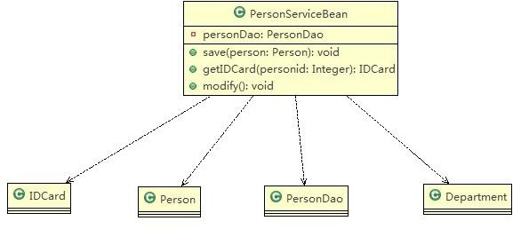
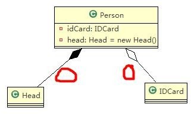

# 类与类之间的关系
---
## 泛化关系(generalization)
泛化关系==继承关系

代码示例
```java
public abstract class DaoSupport{
  public void save(Object entity){
  }
  public void delete(Object id){
  }
}

public class PersonServiceBean extends Daosupport{
}
```

---
## 实现关系（Implementation）
代码示例
```java
public interface PersonService {
  void delete(Interger id);
}
public class PersonServiceBean implements PersonService {
  public void delete(Interger id){
  }
}
```

---
## 依赖关系（Dependence）
只要是**在类中用到了对方**，那么他们之间就存在依赖关系。如果 **没有对方，连编绎都通过不了**。

依赖的5种情况
  1. 类中用到了对方
  2. 如果是类的成员属性
  3. 如果是方法的返回类型
  4. 是方法接收的参数类型
  5. 方法中使用到

代码示例
```java
public class PersonServiceBean {
  private PersonDao personDao;
  public void save(Person person){}
  public IDCard getIDCard(Integer personid){}
  public void modify(){
    Department department = new Department();
  }
}
public class PersonDao{}
public class IDCard{}
public class Person{}
public class Department{}
```


---
## 关联关系 (Association)
关联关系实际上就是 **类与类之间的联系**,**它是依赖关系的特例**

关联具有 **导航型**:即双向关系或单项关系

关系具有多重性:如"1"(表示有且仅有一个),"0..."(表示0个或者多个),"0,1"(表示0个或者1个),
    "n...m"(表示n个到m个都可以),"m..."(表示至少m个)

* 单项1对1关系
  ```java
  public class Person {
    private IDCard card;
  }
  ```

* 双向1对1关系
  ```java
  public class Person {
    private IDCard card;
  }
  public class IdCard {
    private Person person;
  }
  ```


---
## 聚合关系 (Aggregation)
聚合关系表示的是 **整体和部分** 的关系,**整体与部分可以分开**。聚合关系是关联关系的特例

举例说明
一台电脑由键盘(keyboard)、显示器(monitor)，鼠标等组成；组成电脑的各个配件是可以从电脑上分离出来的。

* 应用实例
```java
public class Computer {
  private Mouse mouse;
  private Monitor monitor;

  public void setMouse(Mouse mouse){
    this.mouse = mouse;
  }
  public void setMointer(Mointor mointor){
    this.mointor = mointor;
  }
}
```


---
## 组合关系(Composition)
组合关系：也是 **整体与部分的关系** ，但是 **整体与部分不可以分开** 。

* 举例：
  在程序中我们定义实体：`Person` 与 `IDCard` 、`Head`, 那么 `Head` 和 `Person` 就是 **组合**，`IDCard` 和 `Person` 就是 **聚合** 。
  但是如果在程序中 `Person` 实体中定义了对 `IDCard` 进行 **级联删除** ，即删除 `Person` 时连同 `IDCard` 一起删除，那么 `IDCard`  和 `Person` 就是 **组合** 了。

* 应用实例
  ```java
  public class Person{
    private IDCard card;
    private Head head = new Head();
  }
  public class IDCard{}
  public class Head{}
  ```
  

  ```java
  public class Computer {
      private Mouse mouse = new Mouse(); //鼠标可和 computer 不能分离
      private Moniter moniter = new Moniter();//显示器 和 Computer 不能分离
      public void setMouse(Mouse mouse) {
          this.mouse = mouse;
      }
      public void setMoniter(Moniter moniter) {
        this.moniter = moniter;
      }
      }
      public class Mouse {
      }
      public class Moniter {
      }
  ```
  
