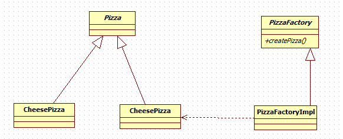

# 工厂方法模式
**定义了一个创建对象的抽象方法**，由子类决定要实例化的类。工厂方法模式 **将对象的实例化推迟到子类。**

---
## 应用实例
客户在订购披萨时， **客户可以选择到店取或者配送**

---
### 类图


---
### 代码实现
----
#### pizza工厂
```java
public abstract class PizzaFactory {
	// 抽象方法，由子类实现
	public abstract Pizza createPizza(String pizzaType);

	public void deliveries(String pizzaType, String deliveriesType) {
		// 创建pizza
		Pizza pizza = createPizza(pizzaType);

		if (pizza != null) { // 订购成功
			pizza.prepare();
			pizza.bake();
			pizza.cut();
			pizza.box();
			// 打包完成，进行配送
			System.out.println(deliveriesType);
		} else {
			System.err.println("订购披萨失败");
		}
	}
}
```

#### pizaa工厂实现
```java
public class PizzaFactoryImpl extends PizzaFactory{

	@Override
	public Pizza createPizza(String pizzaType) {
		Pizza pizza = null;
		if (pizzaType.equals("greek")) {
			pizza = new GreekPizza();
		} else if (pizzaType.equals("cheese")) {
			pizza = new CheesePizza();
		} else if (pizzaType.equals("pepper")) {
			pizza = new PepperPizza();
		}
		return pizza;
	}

}
```
