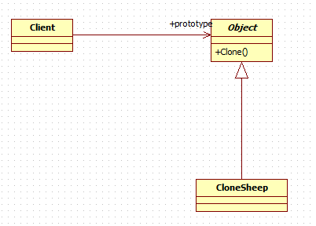

# 原型模式
用 **原型实例指定创建对象的种类，并且通过拷贝这些原型，创建新** 的对象

---
## 使用原型模式解决克隆羊问题
### 类图


### 代码实现
* CloneSheep
  ```java
  public class CloneSheep implements Cloneable{
  	private String name;

  	private int age;

  	private String color;

  	public String getName() {
  		return name;
  	}

  	public void setName(String name) {
  		this.name = name;
  	}

  	public int getAge() {
  		return age;
  	}

  	public void setAge(int age) {
  		this.age = age;
  	}

  	public String getColor() {
  		return color;
  	}

  	public void setColor(String color) {
  		this.color = color;
  	}

  	@Override
  	public String toString() {
  		return "CloneSheep [name=" + name + ", age=" + age + ", color=" + color + "]";
  	}

  	@Override
  	protected Object clone() throws CloneNotSupportedException {
  		return super.clone();
  	}
  }
  ```

---
## 深拷贝
假设克隆羊新加了一个 `private CloneSheep friend` 属性，我们会发现`friend`属性并没有拷贝，而只是将`friend`引用指向了同一个对象。因此，需要 **深拷贝**。

### 深拷贝的两种方式
#### 使用`clone`方法
```java
public class CloneSheep implements Cloneable{
	private String name;

	private int age;

	private String color;

	private CloneSheep friend;

	public String getName() {
		return name;
	}

	public void setName(String name) {
		this.name = name;
	}

	public int getAge() {
		return age;
	}

	public void setAge(int age) {
		this.age = age;
	}

	public String getColor() {
		return color;
	}

	public void setColor(String color) {
		this.color = color;
	}

	public CloneSheep getFriend() {
		return friend;
	}

	public void setFriend(CloneSheep friend) {
		this.friend = friend;
	}


	@Override
	public String toString() {
		return "CloneSheep [name=" + name
				+ ", age="
				+ age
				+ ", color="
				+ color
				+ ", friend="
				+ friend
				+ "]";
	}

	@Override
	protected Object clone() throws CloneNotSupportedException {
		CloneSheep cloneSheep = (CloneSheep) super.clone();
		// 深拷贝friend字段
		if (friend != null) {
			CloneSheep cloneFriend = (CloneSheep) friend.clone();
			cloneSheep.setFriend(cloneFriend);
		}
		return cloneSheep;
	}
}
```

#### 使用反序列化
```java
/**
 * 使用反序列化的方式进行克隆
 * @return
 */
protected CloneSheep deepClone() {
	ByteArrayOutputStream bos = null;
	ObjectOutputStream oos = null;
	ByteArrayInputStream bis = null;
	ObjectInputStream ois = null;
	try {
		// 序列化
		bos = new ByteArrayOutputStream();
		oos = new ObjectOutputStream(bos);
		oos.writeObject(this);

		// 反序列化
		bis = new ByteArrayInputStream(bos.toByteArray());
		ois = new ObjectInputStream(bis);
		return (CloneSheep) ois.readObject();
	} catch (Exception e) {
		e.printStackTrace();
		return null;
	} finally {
		try {
			if (ois != null) {
				ois.close();
			}
			if (bos != null) {
				bos.close();
			}
			if (oos != null) {
				oos.close();
			}
			if (bis != null) {
				bis.close();
			}
		} catch (IOException e) {
			e.printStackTrace();
		}
	}
}
```
