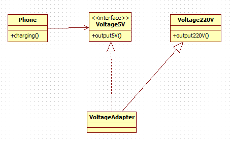
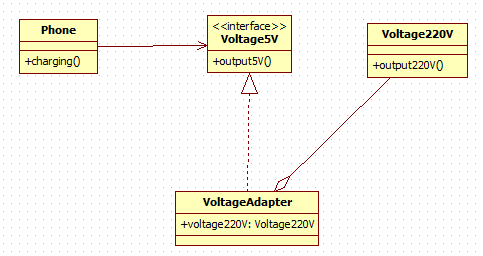
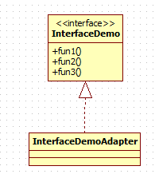
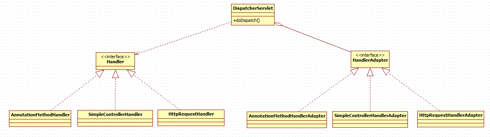

# 适配器模式
适配器模式(Adapter Pattern)将某个类的接口转换成客户端期望的另一个接口表示， **主的目的是兼容性** ，让原本因接口不匹配不能一起工作的两个类可以协同工作。其别名为 **包装器(Wrapper)**

适配器模式属于结构型模式

主要分为三类： **类适配器模式、对象适配器模式、接口适配器模式**

## 工作原理
1. 适配器模式：将一个类的接口转换成另一种接口。让原本接口不兼容的类可以兼容
2. 从用户的角度看不到被适配者，是解耦的
3. 用户调用适配器转化出来的目标接口方法，适配器再调用被适配者的相关接口方法
4. 用户收到反馈结果，感觉只是和目标接口交互

## 类适配器模式
### 类图


### 代码实现
* 5v电压接口
```java
public interface IVoltage5V {
	int output5V();
}
```

* 220V电压
```java
// 被适配的类
public class Voltage220V {
	// 输出220V的电压
	public int output220V() {
		int src = 220;
		System.out.println("电压=" + src + "伏");
		return src;
	}
}
```

* 电压适配器
```java
public class VoltageAdapter extends Voltage220V implements IVoltage5V {
	@Override
	public int output5V() {
		// 获取到220V电压
		int srcV = output220V();
		int dstV = srcV / 44; // 转成 5v
		return dstV;
	}
}
```

---
## 对象适配器模式
### 类图


### 代码实现
* 电压适配器
```java
public class VoltageAdapter implements IVoltage5V {
	private Voltage220V voltage220V;
	@Override
	public int output5V() {
		if (voltage220V != null) {
			// 获取到220V电压
			int srcV = voltage220V.output220V();
			int dstV = srcV / 44; // 转成 5v
			return dstV;
		} else {
			throw new RuntimeException("voltage220V is null");
		}
	}
}
```

---
## 接口适配器模式
### 类图


### 代码实现
```java
public interface InterfaceDemo {
	void fun1();

	void fun2();

	void fun3();
}

// 方法均为空实现
public class InterfaceDemoAdapter implements InterfaceDemo{
	@Override
	public void fun1() {
	}
	@Override
	public void fun2() {
	}
	@Override
	public void fun3() {
	}
}
```

---
## 适配器模式springmvc应用
### 类图


### 代码实现
* Handler
```java
public interface Handler {
}
public class HttpRequestHandler implements Handler {
}
```

* HandlerAdapter
```java
public interface HandlerAdapter {
	boolean support(Object handler);

	void hanle(Object handle);
}
public class HttpRequestHandlerAdapter implements HandlerAdapter{

	@Override
	public boolean support(Object handler) {
		return handler instanceof HttpRequestHandler;
	}

	@Override
	public void hanle(Object handle) {
		System.out.println("handle HttpRequest");
	}
}
```

* DispatcherServlet
```java
public class DispatcheServlet {
	private List<HandlerAdapter> handlerAdapters = new ArrayList<>();

	public DispatcheServlet() {
		handlerAdapters.add(new SimpleControllerHandlerAdapter());
		handlerAdapters.add(new AnnotationMethodHandlerAdapter());
		handlerAdapters.add(new HttpRequestHandlerAdapter());
	}

	public void doDispatch(Handler handler) {
		handlerAdapters.stream().forEach(handlerAdapter -> {
			if (handlerAdapter.support(handler)) {
				handlerAdapter.hanle(handler);
			}
		});
	}
}
```
