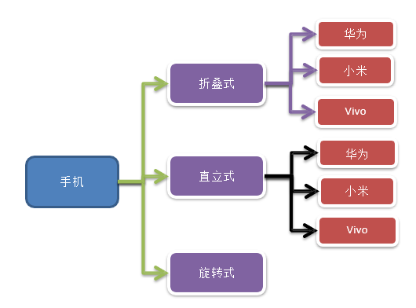
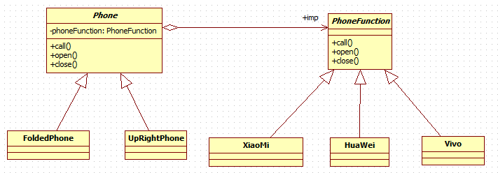
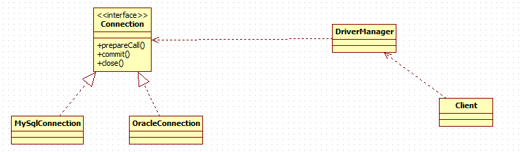

# 桥接模式
## 问题引入
现在对不同手机类型的不同品牌实现操作编程(比如:开机、关机、上网，打电话等)，如图:


解决方法：


**存在的问题**
**扩展性问题(类爆炸)** ，如果我们再增加手机的样式(旋转式)，就需要增加各个品牌手机的类，同样如果我们增加一个手机品牌，也要在各个手机样式类下增加。

违反了单一职责原则，当我们增加手机样式时，要同时增加所有品牌的手机，这样增加了代码维护成本.

## 桥接模式解决上述问题
### 类图


### 代码实现
* PhoneFunction
```java
public interface PhoneFunction {
	void open();

	void close();

	void call();
}

public class XiaoMi implements PhoneFunction {
	@Override
	public void open() {
		System.out.println(" 小米手机开机 ");
	}

	@Override
	public void close() {
		System.out.println(" 小米手机关机 ");
	}

	@Override
	public void call() {
		System.out.println(" 小米手机打电话 ");
	}
}
```

* Phone
```java
public abstract class Phone {
	private PhoneFunction phoneFunction;

	public Phone(PhoneFunction phoneFunction) {
		super();
		this.phoneFunction = phoneFunction;
	}

	protected void open() {
		phoneFunction.open();
	}

	protected void close() {
		phoneFunction.close();
	}

	protected void call() {
		phoneFunction.call();
	}
}

public class FoldedPhone extends Phone {

	// 构造器
	public FoldedPhone(PhoneFunction phoneFunction) {
		super(phoneFunction);
	}

	public void open() {
		super.open();
		System.out.println(" 直立样式手机 ");
	}

	public void close() {
		super.close();
		System.out.println(" 直立样式手机 ");
	}

	public void call() {
		super.call();
		System.out.println(" 直立样式手机 ");
	}
}
```

---
## JDBC桥接模式的应用


---
## 应用场景
对于那些 **不希望使用继承或因为多层次继承导致系统类的个数急剧增加的系统** ，桥接模式尤为适用。
