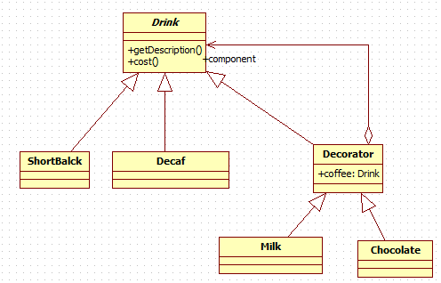

# 装饰者模式
星巴克咖啡订单项目（咖啡馆）：
1. 咖啡种类/单品咖啡：Espresso(意大利浓咖啡)、ShortBlack、LongBlack(美式咖啡)、Decaf(无因咖啡)
2. 调料：Milk、Soy(豆浆)、Chocolate
3. 要求在扩展 **新的咖啡种类** 时，具有良好的扩展性、改动方便、维护方便
4. 使用OO的来计算不同种类咖啡的 **费用** : 客户可以点 **单品咖啡** ，也可以 **单品咖啡+调料组合** 。

## 解决方案1

1. Drink 是一个抽象类，表示饮料
2. des就是对咖啡的描述, 比如咖啡的名字
3. cost() 方法就是计算费用，Drink 类中做成一个抽象方法.
4. Decaf 就是单品咖啡， 继承Drink, 并实现cost
5. Espress && Milk 就是单品咖啡+调料， 这个组合很多

问题：这样设计，会有很多类，当我们增加一个单品咖啡，或者一个新的调料，
类的数量就会倍增，就会出现 **类爆炸**

## 解决方案2
前面分析到方案1因为 **咖啡单品+调料** 组合会造成类的倍增，因此可以做改 进，将调料内置到Drink类，这样就 **不会造成类数量过多** 。从而提高项目的维护性。


1. 方案2可以控制类的数量，不至于造成很多的类
2. **在增加或者删除调料种类时，代码的维护量很大**

## 解决方案3(装饰者模式)
### 装饰者模式定义
装饰者模式： **动态的将新功能附加到对象上** 。在对象功能扩展方面，它比继承更 有弹性，装饰者模式也体现了开闭原则(ocp)

### 使用装饰者模式完成咖啡订单
#### 类图


#### 代码实现
* coffee相关
```java
public abstract class Drink {
	private String description;
	private float price = 0.0f;

	public String getDescription() {
		return description;
	}

	public void setDescription(String description) {
		this.description = description;
	}

	public float getPrice() {
		return price;
	}

	public void setPrice(float price) {
		this.price = price;
	}

	public abstract float cost();
}

public class Coffee extends Drink{

	@Override
	public float cost() {
		return super.getPrice();
	}
}

public class DeCaf extends Coffee {

	public DeCaf() {
		super();
		setDescription(" 无因咖啡 ");
		setPrice(1.0f);
	}
}
```

* decorator相关
```java
public class Decorator extends Drink{
	private Drink coffee;

	public Decorator(Drink coffee) {
		super();
		this.coffee = coffee;
	}

	@Override
	public float cost() {
		return super.getPrice() + this.coffee.cost();
	}

	@Override
	public String getDescription() {
		if (coffee instanceof Decorator) {
			return super.getDescription() + super.getPrice() + " && " + coffee.getDescription();
		} else {
			return super.getDescription() + super.getPrice() + " && " + coffee.getDescription() + coffee.getPrice();
		}
	}

}

public class Chocolate extends Decorator {

	public Chocolate(Drink coffee) {
		super(coffee);
		setPrice(0.6f);
		setDescription(" 巧克力 ");
	}
}
```

## 装饰者模式在Java IO中的使用

