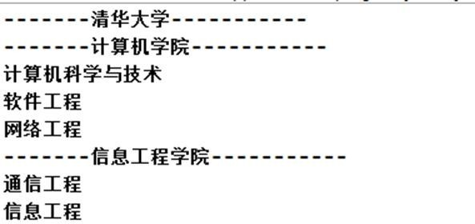
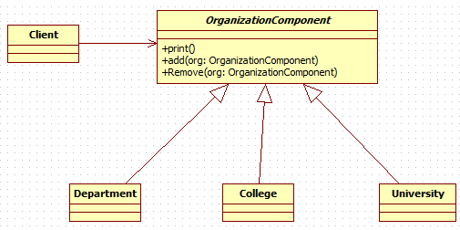

# 组合模式
## 学校院系展示
编写程序展示一个学校院系结构：需求是这样，要在一个页面中展示出学校的院系组成，一个学校有多个学院， 一个学院有多个系。如图：



---
## 使用组合模式实现院系管理
### 定义
组合模式（Composite Pattern），又叫部分整体模式，它创建了对象组的树形结构，将对象组合成树状结构以表示 **“整体-部分”** 的层次关系。

组合模式 **依据树形结构来组合对象** ，用来表示部分以及整体层次。

组合模式使得 **用户对单个对象和组合对象的访问具有一致性** ，即：组合能让客户以一致的方式处理个别对象以及组合对象

### 实现院系管理
#### 类图


#### 代码实现
* `OrganizationComponent`
```java
public abstract class OrganizationComponent {
	private String name; // 名字
	private String des; // 说明

	protected void add(OrganizationComponent organizationComponent) {
		// 默认实现
		throw new UnsupportedOperationException();
	}

	protected void remove(OrganizationComponent organizationComponent) {
		// 默认实现
		throw new UnsupportedOperationException();
	}

	// 构造器
	public OrganizationComponent(String name, String des) {
		super();
		this.name = name;
		this.des = des;
	}

	public String getName() {
		return name;
	}

	public void setName(String name) {
		this.name = name;
	}

	public String getDes() {
		return des;
	}

	public void setDes(String des) {
		this.des = des;
	}

	// 方法print, 做成抽象的, 子类都需要实现
	public abstract void print();

}
```

* `Department&College`
```java
public class Department extends OrganizationComponent{

	public Department(String name, String des) {
		super(name, des);
	}

	@Override
	public void print() {
		System.out.println(getName());
	}

}

public class College extends OrganizationComponent {

	private List<OrganizationComponent> departments = new ArrayList<OrganizationComponent>();

	public College(String name, String des) {
		super(name, des);
	}

	@Override
	public void add(OrganizationComponent organizationComponent) {
		departments.add(organizationComponent);
	}

	@Override
	public void remove(OrganizationComponent organizationComponent) {
		departments.remove(organizationComponent);
	}

	@Override
	public void print() {
		System.out.println("----------------" + getName() + "----------------");
		this.departments.forEach(department -> {
			department.print();
		});
	}

}
```

---
## HashMap中的组合模式

