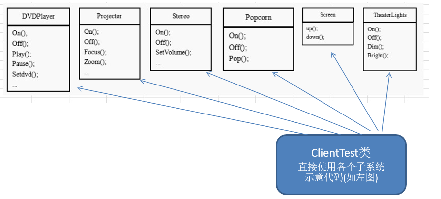
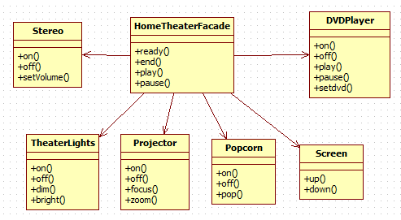
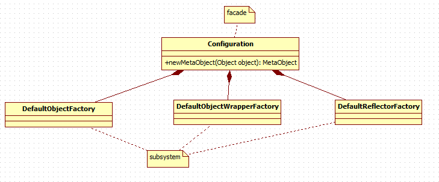

# 外观模式
## 需求
组建一个家庭影院：
	DVD 播放器、投影仪、自动屏幕、环绕立体声、爆米花机,要求完成使用家庭影院的功能

其过程为： 直接用遥控器：统筹各设备开关
	开爆米花机
	放下屏幕
	开投影仪
	开音响
	开 DVD，选 dvd
	去拿爆米花
	调暗灯光
	播放
	观影结束后
	关闭各种设备

---
## 传统解决方法


**问题**
在 `ClientTest ` 的 `main()` 方法中，创建各个子系统的对象，并直接去调用子系统(对象)  相关方法， **会造成调用过程混乱，没有清晰的过程**

不利于在ClientTest 中，去维护对子系统的操作

解决思路：定义一个高层接口，给子系统中的一组接口提供 **一个一致的界面(比如在高层接口提供四个方法ready, play, pause, end )** ，用来访问子系统中的 一群接口,也就是说 就是通过定义一个一致的接口(界面类)，用以屏蔽内部子系统的细节，使得调用端只需跟这个接口发生调用，而无需关心这个子系统的内部细节 => 外观模式

---
## 外观模式解决
### 定义
外观模式（Facade），也叫“过程模式：外观模式为子系统中的一组接口 **提供一个一致的界面** ，此模式定义了一个高层接口，这个接口使得这一子系统更加容易使用

外观模式通过定义一个一致的接口，用 **以屏蔽内部子系统的细节** ，使得 **调用端只需跟这个接口发生调用** ，而无需关心这个子系统的内部细节

### 类图


### 代码实现
```java
public class HomeTheaterFacade {

	// 定义各个子系统对象
	private TheaterLight theaterLight;
	private Popcorn popcorn;
	private Stereo stereo;
	private Projector projector;
	private Screen screen;
	private DVDPlayer dVDPlayer;

	// 构造器
	public HomeTheaterFacade() {
		super();
		this.theaterLight = TheaterLight.getInstance();
		this.popcorn = Popcorn.getInstance();
		this.stereo = Stereo.getInstance();
		this.projector = Projector.getInstance();
		this.screen = Screen.getInstance();
		this.dVDPlayer = DVDPlayer.getInstanc();
	}

	// 操作分成 4 步

	public void ready() {
		popcorn.on();
		popcorn.pop();
		screen.down();
		projector.on();
		stereo.on();
		dVDPlayer.on();
		theaterLight.dim();
	}

	public void play() {
		dVDPlayer.play();
	}

	public void pause() {
		dVDPlayer.pause();
	}

	public void end() {
		popcorn.off();
		theaterLight.bright();
		screen.up();
		projector.off();
		stereo.off();
		dVDPlayer.off();
	}
}
```

---
## 外观模式在Mybatis中的应用

