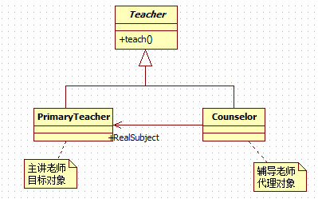
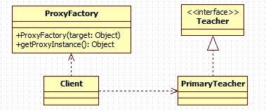
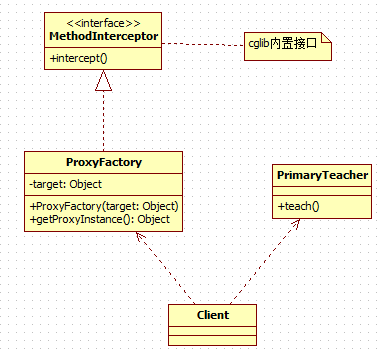

# 代理模式
## 需求
**主讲老师(主题)** 在上课前需要由 **辅导老师(代理)** 先为孩子们讲解作业，作业讲解完成后才开始由 **主讲老师** 上课。

## 代理模式

### 定义
1. 代理模式：为一个对象提供一个替身，以控制对这个对象的访问。即通过代理对象访问目标对象.这样做的好处是:可以在目标对象实现的基础上,增强额外的功能操作,即扩展目标对象的功能。
2. 被代理的对象可以是远程对象、创建开销大的对象或需要安全控制的对象
3. 代理模式有不同的形式, 主要有三种 **静态代理、动态代理 (JDK 代理、接口代理)和 Cglib 代理** (可以在内存动态的创建对象，而不需要实现接口， 他是属于动态代理的范畴) 。

### 静态代理
#### 类图


#### 代码
* Teacher接口
```java
public interface Teacher {
	void teach();
}
```

* PrimaryTeacher(目标对象)
```java
public class PrimaryTeacher implements Teacher{

	@Override
	public void teach() {
		System.out.println("正式上课");
	}

}
```

* Counselor(代理对象)
```java
public class Counselor implements Teacher {
	/**
	 * 主讲老师
	 */
	private Teacher primaryTeacher;

	public Counselor(Teacher primaryTeacher) {
		super();
		this.primaryTeacher = primaryTeacher;
	}

	@Override
	public void teach() {
		System.out.println("开始讲课前预习题目");
		System.out.println("讲解课前预习题目完毕");

		// 主讲老师正式上课
		primaryTeacher.teach();
	}
}
```

### 动态代理
#### 类图


#### 代码实现
* ProxyFacotry
```java
public class ProxyFacotry {
	/**
	 * 目标对象
	 */
	private Object target;

	public ProxyFacotry(Object target) {
		this.target = target;
	}

	public Object getProxyInstance() {
		Class<? extends Object> targetClass = target.getClass();
		return Proxy.newProxyInstance(targetClass.getClassLoader(), targetClass.getInterfaces(),
				new InvocationHandler() {
					@Override
					public Object invoke(Object proxy, Method method, Object[] args)
							throws Throwable {
						System.out.println("执行前........");
						Object returnValue = method.invoke(target, args);
						System.out.println("执行后........");
						return returnValue;
					}
				});
	}
}
```

### cglib
#### 类图


#### 代码实现
* ProxyFactory
```java
public class ProxyFactory implements MethodInterceptor{
	/**
	 * 目标对象
	 */
	private Object target;

	public ProxyFactory(Object target) {
		this.target = target;
	}

	public Object getProxyInstance() {
		Enhancer enhancer = new Enhancer();
		enhancer.setSuperclass(target.getClass());
		enhancer.setCallback(this);
		return enhancer.create();
	}

	@Override
	public Object intercept(Object proxy, Method method, Object[] args, MethodProxy methodProxy)
			throws Throwable {
		System.out.println("执行前...");
		Object returnValue = method.invoke(target, args);
		System.out.println("执行后...");
		return returnValue;
	}
}
```

## 代理模式和装饰者模式的异同
* 相同点
	1. 都是为了在不改变原有功能的基础上扩充功能。
* 不同点
	1. 目的不同，装饰者模式强调 **增强功能**，而代理模式强调 **控制访问**。
	2. 关系确定的时期不同，装饰者模式在 **运行时确定装饰者与被装饰者之间的关系**， 而代理模式则是在 **编译器就已经确定了代理者与目标对象之间的关系。**
