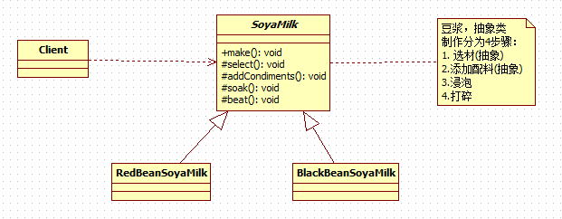
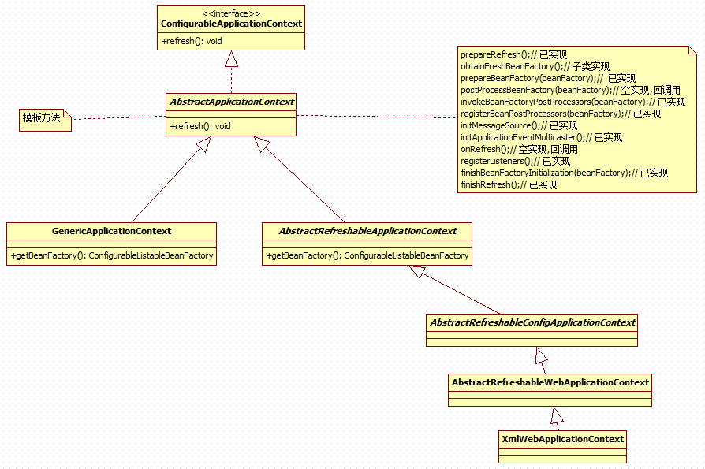

# 模板方法模式
---
## 需求
1. 制作豆浆的流程 **选材--->添加配料--->浸泡--->放到豆浆机打碎**
2. 通过添加不同的配料，可以制作出不同口味的豆浆
3.选材、浸泡和放到豆浆机打碎这几个步骤对于制作每种口味的豆浆都是一样的

---
## 解决上述需求(模板方法模式)
### 定义
1. 模板方法模式（Template Method Pattern），又叫模板模式(Template	Pattern)， **在一个抽象类公开定义了执行它的方法的模板。** 它的子类可以按需要重写方法实现，但调用将以抽象类中定义的方式进行。
2. 简单说，模板方法模式  **定义一个操作中的算法的骨架，而将一些步骤延迟到子类中，** 使得子类可以不改变一个算法的结构，就可以重定义该算法的某些特定步骤
3. 这种类型的设计模式 **属于行为型模式。**

### 类图


### 代码实现
* SoyaMilk
```java
public abstract class SoyaMilk {
	public final void make() {
		select();
		if (needsAddCondiments()) {
			addCondiments();
		}
		soak();
		beat();
	};

	/**
	 * 选材
	 */
	protected abstract void select();

	/**
	 * 添加配料
	 */
	protected void addCondiments() {
	}

	/**
	 * 浸泡
	 */
	protected void soak() {
		System.out.println("浸泡");
	};

	/**
	 * 打碎
	 */
	protected void beat() {
		System.out.println("放到豆浆机打碎");
	};

	protected abstract boolean needsAddCondiments();
}
```

* BlackBeanSoyaMilk
```java
public class BlackBeanSoyaMilk extends SoyaMilk {

	@Override
	protected void select() {
		System.out.println("选择黑豆");
	}

	@Override
	protected boolean needsAddCondiments() {
		return false;
	}

}
```

* RedBeanSoyaMilk
```java
public class RedBeanSoyaMilk extends SoyaMilk{

	@Override
	protected void select() {
		System.out.println("选择红豆");
	}

	@Override
	protected boolean needsAddCondiments() {
		return true;
	}

	@Override
	protected void addCondiments() {
		super.addCondiments();
		System.out.println("添加黑米");
	}

}
```

---
## 模板方法模式在Spring中的应用

