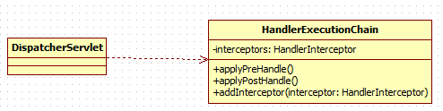

# 职责链模式
## 需求
**采购审批项目**
1. 如果金额 `x <= 5000`,  由 **系主任** 审批
2. 如果金额 `5000< x <=10000`,  由 **院长** 审批
3. 如果金额 `10000< x <=30000`,  由 **副校长** 审批
4. 如果金额 `30000 < x`，有 **校长** 审批

## 传统解决方案

接收到一个采购请求后，根据采购金额来调用对应的 Approver (审批人)完成审批。

### 存在的问题
 客户端这里会使用到 分支判断(比如 switch) 来对不同的采购请求处理， 这样就存在如下问题
 1. 如果各个级别的人员审批金额发生变化，在客户端的也需要变化
 2. 客户端必须明确的知道 有多少个审批级别和访问
 3. 这样 对一个采购请求进行处理 和 Approver (审批人) 就存在强耦合关系，不利于代码的扩展和维护

## 使用职责链模式解决
### 职责链模式基本介绍
1. 责链模式（Chain of Responsibility Pattern）, 又叫 责任链模式，为请求创建了一个接收者对象的链。这种模式对 **请求的发送者和接收者进行解耦** 。
2. 职责链模式通常每个接收者都包含对另一个接收者的引用。如果一个对象不能处理该请求，那么它会把相同的请求传给下一个接收者，依此类推。
3. 这种类型的设计模式属于行为型模式

### 类图


### 代码实现
* Approver
```java
public abstract class Approver {
	/**
	 * 上级审批人
	 */
	protected Approver upApprover;
	/**
	 * 名字
	 */
	protected String name;

	public Approver(String name) {
		this.name = name;
	}

	public void setApprover(Approver upApprover) {
		this.upApprover = upApprover;
	}

	// 处理审批请求的方法，得到一个请求, 处理是子类完成，因此该方法做成抽象
	public abstract void processRequest(PurchaseRequest purchaseRequest);
}

// 系主任
public class DepartmentApprover extends Approver {

	public DepartmentApprover(String name) {
		super(name);
	}

	@Override
	public void processRequest(PurchaseRequest purchaseRequest) {
		if (purchaseRequest.getPrice() <= 5000) {
			System.out.println(" 请求编号 id= " + purchaseRequest.getId() + " 被 " + this.name + " 处理");
		} else {
			upApprover.processRequest(purchaseRequest);
		}
	}

}

// 院长
public class CollegeApprover extends Approver {

	public CollegeApprover(String name) {
		super(name);
	}

	@Override
	public void processRequest(PurchaseRequest purchaseRequest) {
		if(purchaseRequest.getPrice() < 5000 && purchaseRequest.getPrice() <= 10000) {
			System.out.println(" 请求编号 id= " + purchaseRequest.getId() + " 被 " + this.name + " 处理");
		}else {
			upApprover.processRequest(purchaseRequest);
		}
	}
}

// 副校长
public class ViceSchoolMasterApprover extends Approver {

	public ViceSchoolMasterApprover(String name) {
		super(name);
	}

	@Override
	public void processRequest(PurchaseRequest purchaseRequest) {
		if(purchaseRequest.getPrice() < 10000 && purchaseRequest.getPrice() <= 30000) {
			System.out.println(" 请求编号 id= " + purchaseRequest.getId() + " 被 " + this.name + " 处理");
		}else {
			upApprover.processRequest(purchaseRequest);
		}
	}
}

// 校长
public class SchoolMasterApprover extends Approver {

	public SchoolMasterApprover(String name) {
		super(name);
	}

	@Override
	public void processRequest(PurchaseRequest purchaseRequest) {
		if(purchaseRequest.getPrice() > 30000) {
			System.out.println(" 请求编号 id= " + purchaseRequest.getId() + " 被 " + this.name + " 处理");
		}else {
			upApprover.processRequest(purchaseRequest);
		}
	}
}
```

* PurchaseRequest
```java
// 审批请求
public class PurchaseRequest {
	// 请求类型
	private int type = 0;
	// 请求金额
	private float price = 0.0f;
	// id
	private int id = 0;

	// 构造器
	public PurchaseRequest(int type, float price, int id) {
		this.type = type;
		this.price = price;
		this.id = id;
	}

	public int getType() {
		return type;
	}

	public float getPrice() {
		return price;
	}

	public int getId() {
		return id;
	}

}
```

* Client
```java
public class Client {
	public static void main(String[] args) {
		// 创建一个请求
		PurchaseRequest purchaseRequest = new PurchaseRequest(1, 31000, 1);

		// 创建相关的审批人
		DepartmentApprover departmentApprover = new DepartmentApprover("张主任");
		CollegeApprover collegeApprover = new CollegeApprover("李院长");
		ViceSchoolMasterApprover viceSchoolMasterApprover = new ViceSchoolMasterApprover("王副校");
		SchoolMasterApprover schoolMasterApprover = new SchoolMasterApprover("佟校长");

		// 需要将各个审批级别的下一个设置好 (处理人构成环形)
		departmentApprover.setApprover(collegeApprover);
		collegeApprover.setApprover(viceSchoolMasterApprover);
		viceSchoolMasterApprover.setApprover(schoolMasterApprover);
		schoolMasterApprover.setApprover(departmentApprover);

		departmentApprover.processRequest(purchaseRequest);
		viceSchoolMasterApprover.processRequest(purchaseRequest);
	}
}
```

## 职责链模式在spirngmvc中的应用


## 注意事项
1. 将请求和处理分开，实现解耦，提高系统的灵活性
2. 简化了对象，使对象不需要知道链的结构
3. 性能会受到影响，特别是在链比较长的时候，因此需控制链中最大节点数量，一般通过在 Handler 中设置一个最大节点数量，在 `setNext()` 方法中判断是否已经超过阀值，超过则不允许该链建立，避免出现超长链无意识地破坏系统性能
4. 调试不方便。采用了类似递归的方式，调试时逻辑可能比较复杂
5. 最佳应用场景：有多个对象可以处理同一个请求时，比如：多级请求、请假/加薪等审批流程、Java Web 中 Tomcat 对 Encoding 的处理、拦截器
