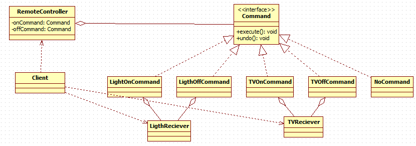
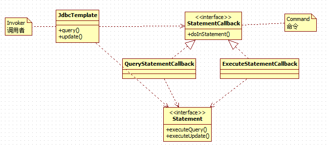

# 命令模式

---
## 需求
1. 我们买了一套智能家电，有照明灯、风扇、冰箱、洗衣机，我们 **只要在手机上安装 app 就可以控制对这些家电工作** 。
2. 这些智能家电来自不同的厂家，我们不想针对每一种家电都安装一个 App，分别控制， **我们希望只要一个 app就可以控制全部智能家电。**
3. 要实现一个 app 控制所有智能家电的需要，则每个智能家电厂家都要提供一个统一的接口给 app 调用，这时 就可以考虑使用命令模式。
4. 命令模式可 **将“动作的请求者”从“动作的执行者”对象中解耦出来。**
5. 在我们的例子中，动作的请求者是手机 app，动作的执行者是每个厂商的一个家电产品。

---
## 命令模式
### 基本介绍
1. 命令模式（Command Pattern）：在软件设计中，我们经常需要向某些对象发送请求，但是并不知道请求的接收者是谁，也不知道被请求的操作是哪个，我们只需在程序运行时指定具体的请求接收者即可，此时，可以使用命令模式来进行设计
2. 命名模式使得 **请求发送者与请求接收者消除彼此之间的耦合** ，让对象之间的调用关系更加灵活，实现解耦。
3. 	在命名模式中，会将一个请求封装为一个对象，以便使用不同参数来表示不同的请求(即命名)，同时命令模式也支持可撤销的操作。
4. 通俗易懂的理解：将军发布命令，士兵去执行。其中有几个角色：将军（命令发布者）、士兵（命令的具体执行者）、命令(连接将军和士兵)。
Invoker 是调用者（将军），Receiver 是被调用者（士兵），MyCommand 是命令，实现了 Command 接口，持有接收对象

### 类图


### 代码实现
* Command
```java
public interface Command {
	void execute();

	void undo();
}

public class LightOffCommand implements Command{
	/**
	 * 命令接受者,真正执行命令的人
	 */
	private LightReciver lightReciver;

	public LightOffCommand(LightReciver lightReciver) {
		super();
		this.lightReciver = lightReciver;
	}

	@Override
	public void execute() {
		lightReciver.off();
	}

	@Override
	public void undo() {
		lightReciver.on();
	}

}
public class LightOnCommand implements Command{
	/**
	 * 命令接受者,真正执行命令的人
	 */
	private LightReciver lightReciver;

	public LightOnCommand(LightReciver lightReciver) {
		super();
		this.lightReciver = lightReciver;
	}

	@Override
	public void execute() {
		lightReciver.on();
	}

	@Override
	public void undo() {
		lightReciver.off();
	}
}
public class NoCommand implements Command {

	@Override
	public void execute() {
		// Nothing to do
	}

	@Override
	public void undo() {
		// Nothing to do
	}

}
```

* Receiver
```java
public class LightReciver {
	public void on() {
		System.out.println(" 电灯打开了.. ");
	}

	public void off() {
		System.out.println(" 电灯关闭了.. ");
	}
}
```

* RemoteController
```java
public class RemoteController {
	/**
	 * 开命令
	 */
	private Command[] onCommands;

	/**
	 * 关命令
	 */
	private Command[] offCommands;

	/**
	 * 撤销命令
	 */
	private Command undoCommand;

	public RemoteController() {
		// 初始化为空命令
		onCommands = new Command[5];
		offCommands = new Command[5];
		for (int i = 0; i < 5; i++) {
			onCommands[i] = new NoCommand();
			offCommands[i] = new NoCommand();
		}
	}

	/**
	 * 设置命令
	 * @param no				编号
	 * @param onCommand			开命令
	 * @param offCommand		关命令
	 */
	public void setCommand(int no, Command onCommand, Command offCommand) {
		onCommands[no] = onCommand;
		offCommands[no] = offCommand;
	}

	/**
	 * 按下按钮no
	 * @param no	按钮编号
	 */
	public void onButtonWasPushed(int no) { // no 0
		// 找到你按下的开的按钮， 并调用对应方法
		onCommands[no].execute();
		// 记录这次的操作，用于撤销
		undoCommand = onCommands[no];

	}

	/**
	 * 按下关闭按钮no
	 * @param no	按钮编号
	 */
	public void offButtonWasPushed(int no) { // no 0
		// 找到你按下的关的按钮， 并调用对应方法
		offCommands[no].execute();
		// 记录这次的操作，用于撤销
		undoCommand = offCommands[no];

	}

	/**
	 * 按下撤销按钮
	 */
	public void undoButtonWasPushed() {
		undoCommand.undo();
	}
}
```

* Client
```java
public class Client {
	public static void main(String[] args) {
		// 初始化遥控器
		RemoteController remoteController = new RemoteController();
		LightReciver lightReciver = new LightReciver();
		remoteController.setCommand(0, new LightOnCommand(lightReciver),
				new LightOffCommand(lightReciver));
		TVReciver tvReciver = new TVReciver();
		remoteController.setCommand(1, new TVOnCommand(tvReciver), new TVOffCommand(tvReciver));

		// 打开灯
		System.out.println("---打开电灯---");
		remoteController.onButtonWasPushed(0);
		System.out.println();
		// 关闭灯
		System.out.println("---关闭电灯---");
		remoteController.offButtonWasPushed(0);
		System.out.println();

		// 打开电视
		System.out.println("---打开电视---");
		remoteController.onButtonWasPushed(1);
		System.out.println();
		// 关闭灯
		System.out.println("---关闭电视---");
		remoteController.offButtonWasPushed(1);
		System.out.println();

		// 撤销
		System.out.println("---撤销---");
		remoteController.undoButtonWasPushed();
	}
}
```

---
## 命令模式在JDBCTemplate中的应用


---
## 命令模式的优缺点
1.  **将发起请求的对象与执行请求的对象解耦** 。发起请求的对象是调用者，调用者只要调用命令对象的 `execute()` 方法就可以让接收者工作，而不必知道具体的接收者对象是谁、是如何实现的，命令对象会负责让接收者执行请求的动作，也就是说：”请求发起者”和“请求执行者”之间的解耦是通过命令对象实现的，命令对象起到了纽带桥梁的作用。
2. 容易设计一个命令队列。只要把命令对象放到列队，就可以多线程的执行命令。
3. 容易实现对请求的撤销和重做
4. 命令模式不足： **可能导致某些系统有过多的具体命令类，增加了系统的复杂度。**
5.  **空命令也是一种设计模式，它为我们省去了判空的操作。**
6. 命令模式经典的应用场景：界面的一个按钮都是一条命令、模拟 CMD（DOS 命令）订单的撤销/恢复、触发- 反馈机制
