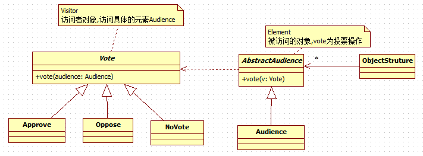

# 访问者模式

---
## 需求
现有一个投票系统，当一个歌手演唱完毕，需要对歌手进行投票，有 **赞成、反对** 两种。最终统计 **男人和女人** 赞成和反对的票数。

---
## 传统解决方案


### 存在的问题
如果新添加了一种 **弃权** 的操作，则需要改动 `Man` 和 `Woman`，违反了`OCP`原则


---
## 访问者模式
### 基本介绍
1. 访问者模式（Visitor Pattern），封装一些作用于某种数据结构的各元素的操作，它可以在不改变数据结构的前提下定义作用于这些元素的新的操作。
2. 主要将 **数据结构与数据操作分离** ，解决 数据结构和操作耦合性问题
3. 访问者模式的基本工作原理是：在被访问的类里面加一个对外提供接待访问者的接口
4. 访问者模式主要应用场景是：需要对一个对象结构中的对象进行很多不同操作(这些操作彼此没有关联)，同时需要避免让这些操作"污染"这些对象的类，可以选用访问者模式解决

### 类图


### 代码实现
* Audience(观众，被访问的元素)
```java
public abstract class AbstractAudience {
	/**
	 * 观众投票
	 * @param vote	选票,访问者
	 */
	public abstract void vote(Vote vote);
}

public class Audience extends AbstractAudience {
	private String gender;

	public Audience(String gender) {
		super();
		this.gender = gender;
	}

	public String getGender() {
		return gender;
	}

	@Override
	public void vote(Vote vote) {
		vote.vote(this);
		;
	}

}
```

* Vote(选票，访问者)
```java
public interface Vote {
	void vote(Audience audience);
}

public class Approve implements Vote {
	@Override
	public void vote(Audience audience) {
		System.out.println(String.format("性别：%s,投赞成票", audience.getGender()));
	}
}

public class Oppose implements Vote {
	@Override
	public void vote(Audience audience) {
		System.out.println(String.format("性别：%s,投反对票", audience.getGender()));
	}
}

public class NoVote implements Vote{
	@Override
	public void vote(Audience audience) {
		System.out.println(String.format("性别：%s,弃权", audience.getGender()));
	}
}
```

* Client
```java
public class Client {
	public static void main(String[] args) {
		AbstractAudience audience1 = new Audience("男");
		AbstractAudience audience2 = new Audience("女");
		AbstractAudience audience3 = new Audience("女");
		AbstractAudience audience4 = new Audience("男");
		AbstractAudience audience5 = new Audience("男");

		audience1.vote(new Approve());
		audience2.vote(new Approve());
		audience3.vote(new Approve());
		audience4.vote(new Oppose());
		audience5.vote(new NoVote());
	}
}
```
