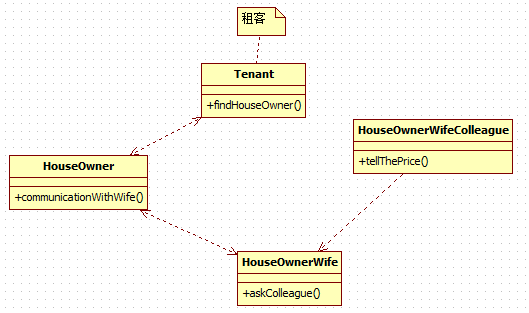
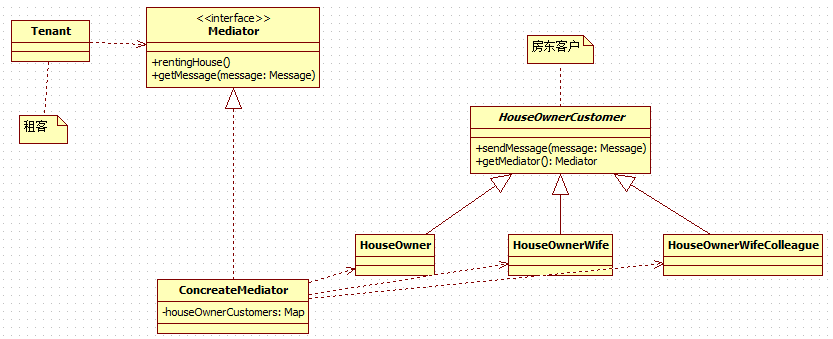

# 中介者模式
---
## 需求
现有一个人需要 **租房子**， 他找到了 **房东**， 房东需要和他的 **妻子** 商量租金，而房东的妻子也不了解市场价格， 房东的妻子又要想她的 **同事** 打听，最后确定价格后再和 **房客** 商量确定最终价格。

---
## 传统解决方案


1. 租客找到房东
2. 房东和妻子商议
3. 妻子询问同事价格
4. 妻子和房东商议合适的价格
5. 房东与租客商议决定最终的价格

### 存在的问题
1. 如果房东还需要和他的父母商议房租的价格，调用关系就更加复杂
2. 各个 **人员对象之间彼此关联，你中有我，我中有你，不利于松耦合**

---
## 使用中介者模式解决
### 基本介绍
1. 中介者模式（Mediator Pattern），用一个 **中介对象来封装一系列的对象交互** 。中介者使各个对象不需要显式地相互引用，从而使其 **耦合松散** ，而且可以独立地改变它们之间的交互
2. 中介者模式属于行为型模式，使代码易于维护
3. 比如 MVC 模式，C（Controller 控制器）是 M（Model 模型）和 V（View 视图）的中介者，在前后端交互时起到了中间人的作用

### 类图

1. 租客找到中介
2. 中介和所有房东客户沟通
3. 中介和租客商议最终价格

### 代码实现
* Mediator
```java
public interface Mediator {
	/**
	 * 租房
	 */
	void rentingHouse();

	/**
	 * 获得房东客户发送的小
	 * @param messageType	消息类型
	 */
	void getMessage(TMessageType messageType);
}

public class ConcreteMediator implements Mediator {
	private Map<String, HouseOwnerCustomer> houseOwnerCustomers =
			new HashMap<String, HouseOwnerCustomer>();

	public ConcreteMediator() {
		// 注册所有房东客户
		houseOwnerCustomers.put("HouseOwner", new HouseOwner(this));
		houseOwnerCustomers.put("HouseOwnerWife", new HouseOwnerWife(this));
		houseOwnerCustomers.put("HouseOwnerWifeColleague", new HouseOwnerWifeColleague(this));
	}

	@Override
	public void rentingHouse() {
		// 通知房东
		houseOwnerCustomers.get("HouseOwner").sendMessage(TMessageType.COMMUNICATION_WITH_WIFE);
		System.out.println("中介获取到价格，与租户沟通	");
	}

	@Override
	public void getMessage(TMessageType messageType) {
		if (TMessageType.COMMUNICATION_WITH_WIFE.equals(messageType)) {
			houseOwnerCustomers.get("HouseOwnerWife").sendMessage(TMessageType.ASK_COLLEGUE);
		} else if (TMessageType.ASK_COLLEGUE.equals(messageType)) {
			houseOwnerCustomers.get("HouseOwnerWifeColleague").sendMessage(TMessageType.TELL_THE_PRICE);
		} else if (TMessageType.TELL_THE_PRICE.equals(messageType)) {
			System.out.println("房东妻子获取到价格，告诉中介价格");
		} else {
			System.out.println("错误的消息类型");
		}
	}

}
```

* HouseOwnerCustomer
```java
/**
 * 房东客户
 *
 * @version 1.0.0.0
 * @author 王磊
 */
public abstract class HouseOwnerCustomer {
	/**
	 * 中介
	 */
	private Mediator mediator;

	protected Mediator getMediator() {
		return mediator;
	}

	public HouseOwnerCustomer(Mediator mediator) {
		super();
		this.mediator = mediator;
	}

	public abstract void sendMessage(TMessageType messageType);
}

public class HouseOwner extends HouseOwnerCustomer{

	public HouseOwner(Mediator mediator) {
		super(mediator);
	}

	@Override
	public void sendMessage(TMessageType messageType) {
		System.out.println("询问妻子");
		this.getMediator().getMessage(messageType);
	}
}

public class HouseOwnerWife extends HouseOwnerCustomer{

	public HouseOwnerWife(Mediator mediator) {
		super(mediator);
	}

	@Override
	public void sendMessage(TMessageType messageType) {
		System.out.println("咨询同事");
		this.getMediator().getMessage(messageType);
	}

}

public class HouseOwnerWifeColleague extends HouseOwnerCustomer {

	public HouseOwnerWifeColleague(Mediator mediator) {
		super(mediator);
	}

	@Override
	public void sendMessage(TMessageType messageType) {
		System.out.println("告诉房东妻子价格");
		this.getMediator().getMessage(messageType);
	}

}
```

* Tenant
```java
public class Tenant {
	public static void main(String[] args) {
		Mediator mediator = new ConcreteMediator();
		mediator.rentingHouse();
	}
}
```

---
## 中介者模式注意事项
1. 多个类相互耦合，会形成网状结构, 使用中介者模式将网状结构分离为星型结构，进行解耦
2. 减少类间依赖，降低了耦合，符合迪米特原则
3. `中介者` **承担了较多的责任，一旦中介者出现了问题，整个系统就会受到影响**
4. 如果设计不当，中介者对象本身变得过于复杂，这点在实际使用时，要特别注意
