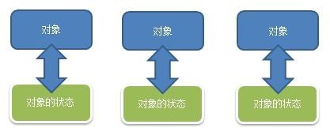
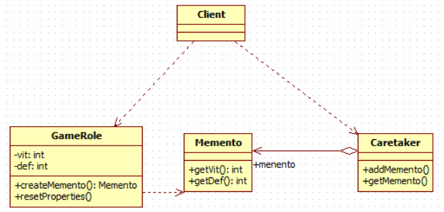

# 备忘录模式
---
## 需求
游戏角色有攻击力和防御力，在大战Boss 前保存自身的状态(攻击力和防御力)，当大战 Boss 后攻击力和防御力下降， **从备忘录对象恢复到大战前的状态**

---
## 传统解决方案


### 传统方案存在的问题
1. 一个对象，就对应一个保存对象状态的对象， 这样当我们游戏的对象很多时， **不利于管理，开销也很大**。
2. 传统的方式是简单地做备份，new 出另外一个对象出来，再把需要备份的数据放到这个新对象，但这就 **暴露了对象内部的细节**

---
## 备忘录模式解决
### 基本介绍
1. 备忘录模式（Memento Pattern）在 **不破坏封装性的前提下** ， **捕获一个对象的内部状态**，并在该 **对象之外保存这个状态** 。这样以后就可将该对象恢复到原先保存的状态
2. 可以这里理解备忘录模式：现实生活中的备忘录是用来记录某些要去做的事情，或者是记录已经达成的共同意见的事情，以防忘记了。而在软件层面，备忘录模式有着相同的含义， **备忘录对象主要用来记录一个对象的某种状态，或者某些数据，当要做回退时，可以从备忘录对象里获取原来的数据进行恢复操作**

### 类图


### 代码实现
* GameRole
```java
public class GameRole {
	/**
	 * 攻击力
	 */
	private int vit;

	/**
	 * 防御
	 */
	private int def;

	public int getVit() {
		return vit;
	}

	public void setVit(int vit) {
		this.vit = vit;
	}

	public int getDef() {
		return def;
	}

	public void setDef(int def) {
		this.def = def;
	}

	public Memento createMemento() {
		return new Memento(vit, def);
	}

	public void resetProperties(Memento memento) {
		this.vit = memento.getVit();
		this.def = memento.getDef();
	}

	public void displayProperties() {
		System.out.println(String.format("当前攻击力=%d,当前防御=%d", this.vit, this.def));
	}
}
```

* Memento
```java
public class Memento {
	/**
	 * 攻击力
	 */
	private int vit;

	/**
	 * 防御
	 */
	private int def;

	public Memento(int vit, int def) {
		super();
		this.vit = vit;
		this.def = def;
	}

	public int getVit() {
		return vit;
	}

	public int getDef() {
		return def;
	}

}
```

* Caretaker
```java
public class Caretaker {
	/**
	 * 保存的备忘录列表
	 */
	private List<Memento> mementos = new ArrayList<>();

	public void addMemento(int index, Memento memento) {
		this.mementos.add(index, memento);
	}

	public Memento getMemento(int index) {
		return this.mementos.get(index);
	}
}
```

* Client
```java
public class Client {
	public static void main(String[] args) {
		GameRole gameRole = new GameRole();
		gameRole.setVit(999);
		gameRole.setDef(300);

		System.out.println("打BOSS前英雄属性：");
		gameRole.displayProperties();

		// 保存状态
		Memento memento = gameRole.createMemento();
		Caretaker caretaker = new Caretaker();
		caretaker.addMemento(0, memento);

		System.out.println();
		gameRole.setVit(400);
		gameRole.setDef(12);
		System.out.println("英雄攻击完BOSS后属性：");
		gameRole.displayProperties();

		System.out.println();
		System.out.println("英雄属性恢复大攻击BOSS前：");
		gameRole.resetProperties(caretaker.getMemento(0));
		gameRole.displayProperties();
	}
}
```
