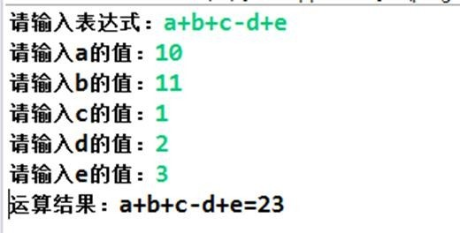
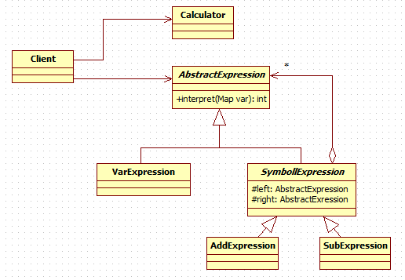
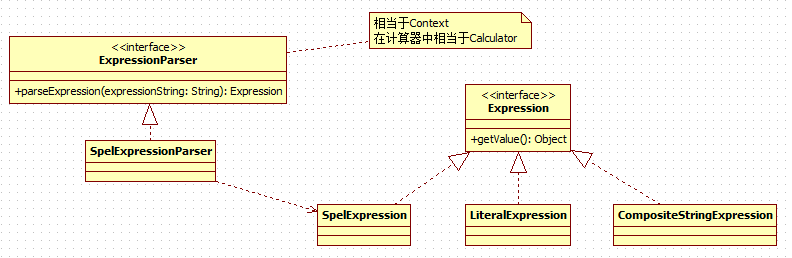

# 解释器模式
---
## 需求
通过解释器模式来实现四则运算，如计算 `a+b-c` 的值，具体要求
1. 输入表达式的形式，比如 `a+b+c-d+e`,要求表达式的字母不能重复
2. 再分别输入 `a ,b, c, d, e` 的值
3. 最后求出结果：如图


---
## 传统解决方案
1. 编写一个方法，接收表达式的形式，然后根据用户输入的数值进行解析，得到结果
2. 问题分析：如果加入新的运算符，比如 * / ( 等等，不利于扩展，另外让一个方法来解析会造成程序结构混乱， 不够清晰.
3. 解决方案：可以考虑使用解释器模式， 即： `表达式 ->	解释器(可以有多种)	->	结果`

---
## 解释器模式解决
### 基本介绍
1. 在编译原理中，一个算术表达式通过 **词法分析器** 形成 **词法单元** ，而后这些词法单元再通过 **语法分析器** 构建 **语法分析树** ，最终形成一颗抽象的语法分析树。这里的 **词法分析器和语法分析器都可以看做是解释器**
2. 解释器模式（Interpreter Pattern）：是指给定一个语言(表达式)，定义它的文法的一种表示，并定义一个解释器， 使用该解释器来解释语言中的句子(表达式)
3. 应用场景
    * 应用可以将一个需要解释执行的语言中的句子表示为一个抽象语法树
    * 一些重复出现的问题可以用一种简单的语言来表达
    * 一个简单语法需要解释的场景
4. 这样的例子还有，比如编译器、运算表达式计算、正则表达式、机器人等

### 类图


### 代码实现
* Exression
```java
public abstract class AbstractExression {
	public abstract int interpreter(Map<String, Integer> var);
}

public class VarExpression extends AbstractExression{
	private String varKey;

	public VarExpression(String varKey) {
		super();
		this.varKey = varKey;
	}

	@Override
	public int interpreter(Map<String, Integer> var) {
		return var.get(varKey);
	}

}

public abstract class SymbolExression extends AbstractExression {
	protected AbstractExression left;
	protected AbstractExression right;

	public SymbolExression(AbstractExression left, AbstractExression right) {
		super();
		this.left = left;
		this.right = right;
	}
}

public class AddExression extends SymbolExression{

	public AddExression(AbstractExression left, AbstractExression right) {
		super(left, right);
	}

	@Override
	public int interpreter(Map<String, Integer> var) {
		return left.interpreter(var) + right.interpreter(var);
	}

}

public class SubExpression extends SymbolExression {

	public SubExpression(AbstractExression left, AbstractExression right) {
		super(left, right);
	}

	@Override
	public int interpreter(Map<String, Integer> var) {
		return left.interpreter(var) - right.interpreter(var);
	}

}
```

* Caculator
```java
public class Caculator {
	/**
	 * 计算表达式的值
	 * @param expressionStr		表达式
	 * @param var				表达式变量对应的值
	 * @return					计算的结果
	 */
	public int compute(String expressionStr, Map<String, Integer> var) {
		char[] expChars = expressionStr.toCharArray();

		Stack<AbstractExression> stack = new Stack<>();
		// 构造表达式
		for (int i = 0; i < expChars.length; i++) {
			char currentExpChar = expChars[i];
			AbstractExression leftExression = null;
			AbstractExression rightExression = null;
			String nextVar = null;
			switch (currentExpChar) {
			case '+':
				leftExression = stack.pop();
				nextVar = String.valueOf(expChars[++i]);
				rightExression = new VarExpression(nextVar);
				stack.push(new AddExression(leftExression, rightExression));
				break;
			case '-':
				leftExression = stack.pop();
				nextVar = String.valueOf(expChars[++i]);
				rightExression = new VarExpression(nextVar);
				stack.push(new SubExpression(leftExression, rightExression));
				break;
			default:
				stack.push(new VarExpression(String.valueOf(currentExpChar)));
				break;
			}
		}
		AbstractExression exression = stack.pop();

		// 计算值
		return exression.interpreter(var);
	}
}
```

* Client
```java
public class Client {
	public static void main(String[] args) throws IOException {
		String expressionStr = getExpStr();// a+b-c
		Map<String, Integer> var = getValue(expressionStr);// {a=20,b=10,c=5}
		Caculator caculator = new Caculator();
		int result = caculator.compute(expressionStr, var);
		System.out.println(String.format("%s=%d", expressionStr, result));
	}

	// 获得表达式
	public static String getExpStr() throws IOException {
		System.out.print("请输入表达式：");
		return (new BufferedReader(new InputStreamReader(System.in))).readLine();
	}

	// 获得值映射
	public static Map<String, Integer> getValue(String expressionStr) throws IOException {
		Map<String, Integer> map = new HashMap<>();

		for (char ch : expressionStr.toCharArray()) {
			if (ch != '+' && ch != '-') {
				if (!map.containsKey(String.valueOf(ch))) {
					System.out.print("请输入" + String.valueOf(ch) + "的值：");
					String in = (new BufferedReader(new InputStreamReader(System.in))).readLine();
					map.put(String.valueOf(ch), Integer.valueOf(in));
				}
			}
		}

		return map;
	}
}
```

---
## 解释器模式在spring中的应用


---
## 注意事项
1. 当有一个语言需要解释执行，可将该语言中的句子表示为一个抽象语法树，就可以考虑使用解释器模式，让程序具有良好的扩展性
2. 应用场景：编译器、运算表达式计算、正则表达式、机器人等
3. 使用解释器可能带来的问题：解释器模式会引起类膨胀、解释器模式采用递归调用方法，将会导致调试非常复杂、效率可能降低.
