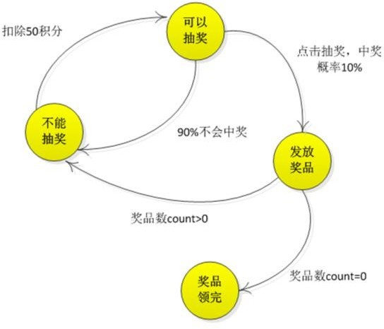
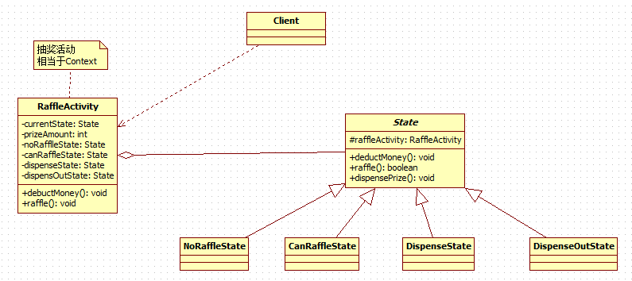

# 状态模式
## 需求
**APP 抽奖活动问题**
具体要求如下:
1. 假如每参加一次这个活动要扣除用户 50 积分，中奖概率是 10%
2. 奖品数量固定，抽完就不能抽奖
3. 活动有四个状态: 可以抽奖、不能抽奖、发放奖品和奖品领完
4. 活动的四个状态转换关系图


## 使用状态模式解决
### 基本介绍
1. 状态模式（State Pattern）：它主要用来解决对象在 **多种状态转换时** ，需要 **对外输出不同的行为** 的问题。状态和行为是一一对应的，状态之间可以相互转换
2. 当一个 **对象的内在状态改变时，允许改变其行为** ，这个对象看起来像是改变了其类

### 类图


### 代码实现
* State
```java
public abstract class State {
	// 抽奖活动
	protected RaffleActivity raffleActivity;

	public State(RaffleActivity raffleActivity) {
		super();
		this.raffleActivity = raffleActivity;
	}

	// 扣除积分 - 50
	public abstract void deductMoney();

	// 抽奖
	public abstract boolean raffle();

	// 发放奖品
	public abstract void dispensePrize();
}

// 不能抽奖状态
public class NoRaffleState extends State {

	public NoRaffleState(RaffleActivity raffleActivity) {
		super(raffleActivity);
	}

	@Override
	public void deductMoney() {
		System.out.println("积分-50");
		this.raffleActivity.setCurrentState(this.raffleActivity.getCanRaffleState());
	}

	@Override
	public boolean raffle() {
		System.out.println("未扣除积分,不能抽奖");
		return false;
	}

	@Override
	public void dispensePrize() {
		System.out.println("未中奖,不能发放奖品");
	}

}

// 可以抽奖状态
public class CanRaffleState extends State {

	public CanRaffleState(RaffleActivity raffleActivity) {
		super(raffleActivity);
	}

	@Override
	public void deductMoney() {
		System.out.println("已经扣取过了积分");
	}

	@Override
	public boolean raffle() {
		System.out.println("正在抽奖，请稍等！");
		Random r = new Random();
		int num = r.nextInt(10);
		// 10%中奖机会
		if (num == 0) {
			// 改变活动状态为发放奖品 context
			this.raffleActivity.setCurrentState(this.raffleActivity.getDispenseState());
			return true;
		} else {
			System.out.println("很遗憾没有抽中奖品！");
			// 改变状态为不能抽奖
			this.raffleActivity.setCurrentState(this.raffleActivity.getNoRafflleState());
			return false;
		}
	}

	@Override
	public void dispensePrize() {
		System.out.println("未中奖,不能发放奖品");
	}

}

// 发放奖品状态
public class DispenseState extends State {

	public DispenseState(RaffleActivity raffleActivity) {
		super(raffleActivity);
	}

	@Override
	public void deductMoney() {
		System.out.println("已经扣取过了积分");
	}

	@Override
	public boolean raffle() {
		System.out.println("正在发放奖品,不能抽奖");
		return false;
	}

	@Override
	public void dispensePrize() {
		if (this.raffleActivity.getPrizeAmount() > 0) {
			System.out.println("恭喜中奖了");
			// 改变状态为不能抽奖
			this.raffleActivity.setCurrentState(this.raffleActivity.getNoRafflleState());
		} else {
			System.out.println("很遗憾，奖品发送完了");
			// 改变状态为奖品发送完毕, 后面我们就不可以抽奖
			this.raffleActivity.setCurrentState(this.raffleActivity.getDispensOutState());
			System.out.println("抽奖活动结束");
			System.exit(0);
		}
	}

}

// 奖品发放完毕状态
public class DispenseOutState extends State {

	public DispenseOutState(RaffleActivity raffleActivity) {
		super(raffleActivity);
	}

	@Override
	public void deductMoney() {
		System.out.println("奖品发送完了，请下次再参加");
	}

	@Override
	public boolean raffle() {
		System.out.println("奖品发送完了，请下次再参加");
		return false;
	}

	@Override
	public void dispensePrize() {
		System.out.println("奖品发送完了，请下次再参加");
	}

}
```

* RaffleActivity
```java
// 抽奖活动类,相当于context
public class RaffleActivity {
	// 当前状态
	private State currentState;

	// 奖品数量
	private int prizeAmount;

	// 4种状态
	private State noRafflleState = new NoRaffleState(this);
	private State canRaffleState = new CanRaffleState(this);
	private State dispenseState = new DispenseState(this);
	private State dispensOutState = new DispenseOutState(this);

	public RaffleActivity(int prizeAmount) {
		super();
		this.prizeAmount = prizeAmount;
		this.currentState = getNoRafflleState();
	}

	// 扣积分
	public void debuctMoney() {
		currentState.deductMoney();
	}

	// 抽奖
	public void raffle() {
		// 如果当前的状态是抽奖成功
		if (currentState.raffle()) {
			// 领取奖品
			currentState.dispensePrize();
			this.prizeAmount--;
		}
	}

	public State getCurrentState() {
		return currentState;
	}

	public void setCurrentState(State currentState) {
		this.currentState = currentState;
	}

	public int getPrizeAmount() {
		return prizeAmount;
	}

	public void setPrizeAmount(int prizeAmount) {
		this.prizeAmount = prizeAmount;
	}

	public State getNoRafflleState() {
		return noRafflleState;
	}

	public void setNoRafflleState(State noRafflleState) {
		this.noRafflleState = noRafflleState;
	}

	public State getCanRaffleState() {
		return canRaffleState;
	}

	public void setCanRaffleState(State canRaffleState) {
		this.canRaffleState = canRaffleState;
	}

	public State getDispenseState() {
		return dispenseState;
	}

	public void setDispenseState(State dispenseState) {
		this.dispenseState = dispenseState;
	}

	public State getDispensOutState() {
		return dispensOutState;
	}

	public void setDispensOutState(State dispensOutState) {
		this.dispensOutState = dispensOutState;
	}
}
```
* Client
```java
public class Client {
	public static void main(String[] args) {
		// 两个奖品
		RaffleActivity activity = new RaffleActivity(2);

		// 连续抽50次奖
		for (int i = 0; i < 50; i++) {
			System.out.println("--------第" + (i + 1) + "次抽奖----------");
			// 参加抽奖，第一步点击扣除积分
			activity.debuctMoney();

			// 第二步抽奖
			activity.raffle();
			System.out.println();
		}
	}
}
```

## 注意事项&存在的问题
1. 代码有很强的 **可读性** 。状态模式将每个状态的行为封装到对应的一个类中
2. **方便维护** 。将容易产生问题的 if-else 语句删除了，如果把每个状态的行为都放到一个类中，每次调用方法时都要判断当前是什么状态，不但会产出很多 if-else 语句，而且容易出错
3. 符合“开闭原则”。容易增删状态
4. 会产生很多类。每个状态都要一个对应的类，当状态过多时会产生很多类，加大维护难度
5. 应用场景：当一个事件或者对象有很多种状态，状态之间会相互转换，对不同的状态要求有不同的行为的时候， 可以考虑使用状态模式
