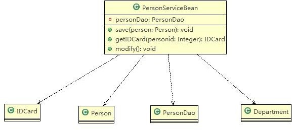
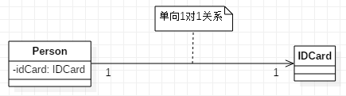
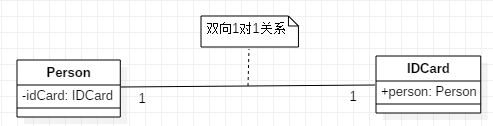
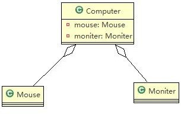
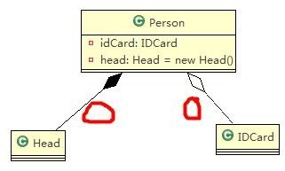
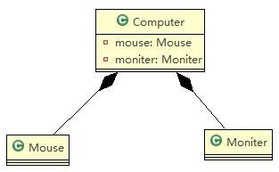
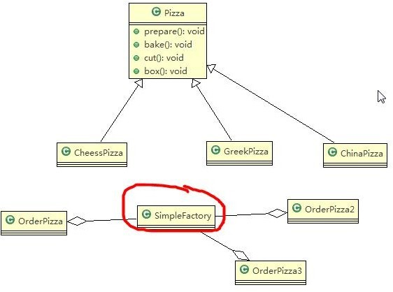
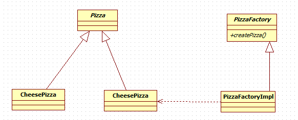
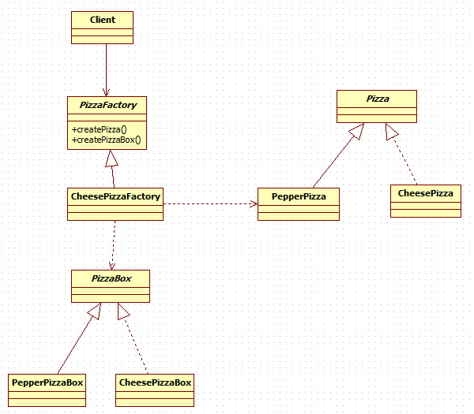
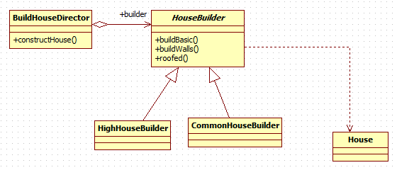

# 1.七大设计原则
---
## 单一职责原则
对类来说,一个类应该 **只负责一项职责**。

---
## 接口隔离原则
客户端 **不应该依赖它不需要的接口**，即一个类对另一个类的依赖应该建立在最小的接口上

**通俗解释：** 尽量将接口的方法按照功能拆分。

---
## 依赖导致原则
**定义:**
1. 高层模块不应该依赖低层模块， **二者都应该依赖其抽象**
2. 抽象不应该依赖细节，细节应该依赖抽象
3. 依赖倒转(倒置)的中心思想是面向接口编程

**通俗解释:** 面向接口编程。

---
## 里氏替换原则
所有引用 **基类** 的地方必须能 **透明地使用其子类** 的对象。

**通俗解释：** **尽量不要重写父类已经实现的方法**, 如果必须要使用到父类已实现的方法,可以使用 **聚合、组合** 的方式 **代替继承**。

---
## 开闭原则
对 **扩展开放**,对 **修改封闭**

**通俗解释:** 扩充功能时尽量不修改原来的代码,而是通过添加的方式来扩充功能。

**遵循其他的原则是做到开闭原则的基础。**

---
## 迪米特法则
又叫 **最少知道原则**,即一个类对自己依赖的类知道的越少越好。也就是说，对于被依赖的类不管多么复杂，都尽量将逻辑封装在类的内部。对外除了提供的`public`方法，不对外泄露任何信息。

**通俗解释：** 只与直接的朋友通信。

**直接朋友**
我们称出现在类A中的 **成员变量**，**方法参数**， **方法返回值** 为类A的直接朋友，而出现在 **局部变量中的类不是直接的朋友**。也就是说，陌生的类最好不要以局部变量的形式出现在类的内部。

---
## 合成复用原则
原则是尽量使用 **合成**, **聚合** 的方式，而 **不是使用继承**

---

# 2.类与类之间的关系
---
## 泛化关系(generalization)
泛化关系==继承关系

代码示例
```java
public abstract class DaoSupport{
  public void save(Object entity){
  }
  public void delete(Object id){
  }
}

public class PersonServiceBean extends Daosupport{
}
```

---
## 实现关系（Implementation）
代码示例
```java
public interface PersonService {
  void delete(Interger id);
}
public class PersonServiceBean implements PersonService {
  public void delete(Interger id){
  }
}
```

---
## 依赖关系（Dependence）
只要是**在类中用到了对方**，那么他们之间就存在依赖关系。如果 **没有对方，连编绎都通过不了**。

依赖的5种情况
  1. 类中用到了对方
  2. 如果是类的成员属性
  3. 如果是方法的返回类型
  4. 是方法接收的参数类型
  5. 方法中使用到

代码示例
```java
public class PersonServiceBean {
  private PersonDao personDao;
  public void save(Person person){}
  public IDCard getIDCard(Integer personid){}
  public void modify(){
    Department department = new Department();
  }
}
public class PersonDao{}
public class IDCard{}
public class Person{}
public class Department{}
```


---
## 关联关系 (Association)
关联关系实际上就是 **类与类之间的联系**,**它是依赖关系的特例**

关联具有 **导航型**:即双向关系或单项关系

关系具有多重性:如"1"(表示有且仅有一个),"0..."(表示0个或者多个),"0,1"(表示0个或者1个),
    "n...m"(表示n个到m个都可以),"m..."(表示至少m个)

* 单项1对1关系
  ```java
  public class Person {
    private IDCard card;
  }
  ```

* 双向1对1关系
  ```java
  public class Person {
    private IDCard card;
  }
  public class IdCard {
    private Person person;
  }
  ```


---
## 聚合关系 (Aggregation)
聚合关系表示的是 **整体和部分** 的关系,**整体与部分可以分开**。聚合关系是关联关系的特例

举例说明
一台电脑由键盘(keyboard)、显示器(monitor)，鼠标等组成；组成电脑的各个配件是可以从电脑上分离出来的。

* 应用实例
```java
public class Computer {
  private Mouse mouse;
  private Monitor monitor;

  public void setMouse(Mouse mouse){
    this.mouse = mouse;
  }
  public void setMointer(Mointor mointor){
    this.mointor = mointor;
  }
}
```


---
## 组合关系(Composition)
组合关系：也是 **整体与部分的关系** ，但是 **整体与部分不可以分开** 。

* 举例：
  在程序中我们定义实体：`Person` 与 `IDCard` 、`Head`, 那么 `Head` 和 `Person` 就是 **组合**，`IDCard` 和 `Person` 就是 **聚合** 。
  但是如果在程序中 `Person` 实体中定义了对 `IDCard` 进行 **级联删除** ，即删除 `Person` 时连同 `IDCard` 一起删除，那么 `IDCard`  和 `Person` 就是 **组合** 了。

* 应用实例
  ```java
  public class Person{
    private IDCard card;
    private Head head = new Head();
  }
  public class IDCard{}
  public class Head{}
  ```
  

  ```java
  public class Computer {
      private Mouse mouse = new Mouse(); //鼠标可和 computer 不能分离
      private Moniter moniter = new Moniter();//显示器 和 Computer 不能分离
      public void setMouse(Mouse mouse) {
          this.mouse = mouse;
      }
      public void setMoniter(Moniter moniter) {
        this.moniter = moniter;
      }
      }
      public class Mouse {
      }
      public class Moniter {
      }
  ```
  

---
# 3.1.单例模式
所谓类的单例设计模式，就是 **采取一定的方法保证在整个的软件系统中，对某个类只能存在一个对象实例**

---
## 单例模式的实现
---
### 饿汉式
```java
public class HungrySingleton {
	private HungrySingleton() {
	}

	/**
	 * 实例
	 */
	private static final HungrySingleton INSTANCE = new HungrySingleton();

	/**
	 * 获取实例
	 * @return	实例
	 */
	public static HungrySingleton getInstance() {
		return INSTANCE;
	}
}
```
* 优点
  简单
* 缺点
  **可能造成内存浪费**

---
### 饱汉式
```java
public class FullSingleton {
	private FullSingleton() {
	}

	private static FullSingleton instance;

	// 线程不安全
	public static FullSingleton getInstance() {
		if (instance == null) {
			instance = new FullSingleton();
		}
		return instance;
	}
}
```
* 优点
  实现了 **懒加载**，不会造成内存浪费
* 缺点
  存在多线程安全问题

---
### 同步锁方式
```java
public class FullSingletonThreadSafety {
	private FullSingletonThreadSafety() {
	}

	private static FullSingletonThreadSafety instance;

	// 线程安全，性能不好
	public static synchronized FullSingletonThreadSafety getInstance() {
		if (instance == null) {
			instance = new FullSingletonThreadSafety();
		}
		return instance;
	}
}
```
* 优点
  解决了 **线程安全问题和内存浪费问题**
* 缺点
  性能不好

---
### 双重检查方式
```java
public class FullSingletonDoubleCheck {
	private FullSingletonDoubleCheck() {
	}

	private static volatile FullSingletonDoubleCheck instance;

	// 线程安全，性能好
	public static FullSingletonDoubleCheck getInstance() {
		if (instance == null) {
			synchronized (FullSingletonDoubleCheck.class) {
				if (instance == null) {
					instance = new FullSingletonDoubleCheck();
				}
			}
		}
		return instance;
	}
}
```
* 优点
  解决了 **线程安全问题和内存浪费问题**
  性能好
* 缺点
  实现稍微复杂

---
### 静态内部类方式
```java
public class StaticInnerClassSingleton {
	private StaticInnerClassSingleton() {
	}

	private static class InnerClass {
		private static final StaticInnerClassSingleton INSTANCE = new StaticInnerClassSingleton();
	}

	public static StaticInnerClassSingleton getInstance() {
		return InnerClass.INSTANCE;
	}
}
```
* 优点
  解决了 **线程安全问题和内存浪费问题**
  性能好

---
### 枚举方式
```java
public enum EnumSingleton {
	INSTANCE;

	public void method1() {
		System.out.println("method1");
	}
}
```
* 优点
  解决了 **线程安全问题和内存浪费问题**
  性能好
* 缺点
  对于其他调用此API的程序来讲，这样实现不友好

---
# 3.2.简单工厂模式
定义了一个创建对象的类，由这个类来 **封装实例化对象的行为**

## 应用实例
使用简单工厂模式实现披萨订购

### 类图


### 代码实现
---
#### pizza工厂
```java
public class PizzaFactory {
	/**
	 * 根据Pizza类型创建pizza
	 * @param pizzaType	pizza类型
	 * @return		pizza
	 */
	public Pizza createPizza(String pizzaType) {
		Pizza pizza = null;
		if (pizzaType.equals("greek")) {
			pizza = new GreekPizza();
		} else if (pizzaType.equals("cheese")) {
			pizza = new CheesePizza();
		} else if (pizzaType.equals("pepper")) {
			pizza = new PepperPizza();
		}
		return pizza;
	}
}
````

#### pizaa订单
```java
public class PizzaOrder {
	private PizzaFactory pizzaFactory;

	public PizzaOrder(PizzaFactory pizzaFactory) {
		this.pizzaFactory = pizzaFactory;
	}

	public void working() {
		order();
	}

	/**
	 * 订购
	 */
	private void order() {
		do {
			// 获取订购类型
			String orderType = getType();
			Pizza pizza = this.pizzaFactory.createPizza(orderType);

			// 输出pizza
			if (pizza != null) { // 订购成功
				pizza.prepare();
				pizza.bake();
				pizza.cut();
				pizza.box();
			} else {
				System.err.println("订购披萨失败");
				break;
			}
		} while (true);
	}

	/**
	 * 获取用户输入的订购类型
	 * @return	订购类型
	 */
	private String getType() {
		try {
			BufferedReader strin = new BufferedReader(new InputStreamReader(System.in));
			System.out.println("input pizza 种类:");
			String str = strin.readLine();
			return str;
		} catch (IOException e) {
			e.printStackTrace();
			return "";
		}
	}
}
```

---
# 3.3.工厂方法模式
**定义了一个创建对象的抽象方法**，由子类决定要实例化的类。工厂方法模式 **将对象的实例化推迟到子类。**

---
## 应用实例
客户在订购披萨时， **客户可以选择到店取或者配送**

---
### 类图


---
### 代码实现
----
#### pizza工厂
```java
public abstract class PizzaFactory {
	// 抽象方法，由子类实现
	public abstract Pizza createPizza(String pizzaType);

	public void deliveries(String pizzaType, String deliveriesType) {
		// 创建pizza
		Pizza pizza = createPizza(pizzaType);

		if (pizza != null) { // 订购成功
			pizza.prepare();
			pizza.bake();
			pizza.cut();
			pizza.box();
			// 打包完成，进行配送
			System.out.println(deliveriesType);
		} else {
			System.err.println("订购披萨失败");
		}
	}
}
```

#### pizaa工厂实现
```java
public class PizzaFactoryImpl extends PizzaFactory{

	@Override
	public Pizza createPizza(String pizzaType) {
		Pizza pizza = null;
		if (pizzaType.equals("greek")) {
			pizza = new GreekPizza();
		} else if (pizzaType.equals("cheese")) {
			pizza = new CheesePizza();
		} else if (pizzaType.equals("pepper")) {
			pizza = new PepperPizza();
		}
		return pizza;
	}

}
```
---
# 3.4.抽象工厂模式
抽象工厂模式提供一个 **创建一系列相关或相互依赖对象的接口** ，无须指定它们具体的类。
简而言之就是 **创建一个产品族**

## 应用实例
现在需要对不同的pizza采用不同的打包方式。

---
### 类图


---
### 代码实现
----
#### 抽象工厂
```java
public abstract class PizzaFactory {
	public abstract Pizza createPizza();

	public abstract PizzaBox createPizzaBox();

}
```

#### 奶酪Pizza工厂
```java
public class CheesePizzaFactory extends PizzaFactory{

	@Override
	public Pizza createPizza() {
		return new CheesePizza();
	}

	@Override
	public PizzaBox createPizzaBox() {
		return new CheesePizzaBox();
	}

}
```

---
## 工厂方法总结
**将实例化对象的代码提取出来** ，放到一个类中统一管理和维护，达到和主项目的依赖关系的解耦。从而提高项目的扩展和维护性。

* JDK中的应用
```java
private static Calendar createCalendar(TimeZone zone,
                                         Locale aLocale)
  {
      CalendarProvider provider =
          LocaleProviderAdapter.getAdapter(CalendarProvider.class, aLocale)
                               .getCalendarProvider();
      if (provider != null) {
          try {
              return provider.getInstance(zone, aLocale);
          } catch (IllegalArgumentException iae) {
              // fall back to the default instantiation
          }
      }

      Calendar cal = null;

      if (aLocale.hasExtensions()) {
	  // 此处使用到了简单工厂模式
          String caltype = aLocale.getUnicodeLocaleType("ca");
          if (caltype != null) {
              switch (caltype) {
              case "buddhist":
              cal = new BuddhistCalendar(zone, aLocale);
                  break;
              case "japanese":
                  cal = new JapaneseImperialCalendar(zone, aLocale);
                  break;
              case "gregory":
                  cal = new GregorianCalendar(zone, aLocale);
                  break;
              }
          }
      }
      if (cal == null) {
          // If no known calendar type is explicitly specified,
          // perform the traditional way to create a Calendar:
          // create a BuddhistCalendar for th_TH locale,
          // a JapaneseImperialCalendar for ja_JP_JP locale, or
          // a GregorianCalendar for any other locales.
          // NOTE: The language, country and variant strings are interned.
          if (aLocale.getLanguage() == "th" && aLocale.getCountry() == "TH") {
              cal = new BuddhistCalendar(zone, aLocale);
          } else if (aLocale.getVariant() == "JP" && aLocale.getLanguage() == "ja"
                     && aLocale.getCountry() == "JP") {
              cal = new JapaneseImperialCalendar(zone, aLocale);
          } else {
              cal = new GregorianCalendar(zone, aLocale);
          }
      }
      return cal;
  }
```

---
# 3.5.原型模式
用 **原型实例指定创建对象的种类，并且通过拷贝这些原型，创建新** 的对象

---
## 使用原型模式解决克隆羊问题
### 类图


### 代码实现
* CloneSheep
  ```java
  public class CloneSheep implements Cloneable{
  	private String name;

  	private int age;

  	private String color;

  	public String getName() {
  		return name;
  	}

  	public void setName(String name) {
  		this.name = name;
  	}

  	public int getAge() {
  		return age;
  	}

  	public void setAge(int age) {
  		this.age = age;
  	}

  	public String getColor() {
  		return color;
  	}

  	public void setColor(String color) {
  		this.color = color;
  	}

  	@Override
  	public String toString() {
  		return "CloneSheep [name=" + name + ", age=" + age + ", color=" + color + "]";
  	}

  	@Override
  	protected Object clone() throws CloneNotSupportedException {
  		return super.clone();
  	}
  }
  ```

---
## 深拷贝
假设克隆羊新加了一个 `private CloneSheep friend` 属性，我们会发现`friend`属性并没有拷贝，而只是将`friend`引用指向了同一个对象。因此，需要 **深拷贝**。

### 深拷贝的两种方式
#### 使用`clone`方法
```java
public class CloneSheep implements Cloneable{
	private String name;

	private int age;

	private String color;

	private CloneSheep friend;

	public String getName() {
		return name;
	}

	public void setName(String name) {
		this.name = name;
	}

	public int getAge() {
		return age;
	}

	public void setAge(int age) {
		this.age = age;
	}

	public String getColor() {
		return color;
	}

	public void setColor(String color) {
		this.color = color;
	}

	public CloneSheep getFriend() {
		return friend;
	}

	public void setFriend(CloneSheep friend) {
		this.friend = friend;
	}


	@Override
	public String toString() {
		return "CloneSheep [name=" + name
				+ ", age="
				+ age
				+ ", color="
				+ color
				+ ", friend="
				+ friend
				+ "]";
	}

	@Override
	protected Object clone() throws CloneNotSupportedException {
		CloneSheep cloneSheep = (CloneSheep) super.clone();
		// 深拷贝friend字段
		if (friend != null) {
			CloneSheep cloneFriend = (CloneSheep) friend.clone();
			cloneSheep.setFriend(cloneFriend);
		}
		return cloneSheep;
	}
}
```

#### 使用反序列化
```java
/**
 * 使用反序列化的方式进行克隆
 * @return
 */
protected CloneSheep deepClone() {
	ByteArrayOutputStream bos = null;
	ObjectOutputStream oos = null;
	ByteArrayInputStream bis = null;
	ObjectInputStream ois = null;
	try {
		// 序列化
		bos = new ByteArrayOutputStream();
		oos = new ObjectOutputStream(bos);
		oos.writeObject(this);

		// 反序列化
		bis = new ByteArrayInputStream(bos.toByteArray());
		ois = new ObjectInputStream(bis);
		return (CloneSheep) ois.readObject();
	} catch (Exception e) {
		e.printStackTrace();
		return null;
	} finally {
		try {
			if (ois != null) {
				ois.close();
			}
			if (bos != null) {
				bos.close();
			}
			if (oos != null) {
				oos.close();
			}
			if (bis != null) {
				bis.close();
			}
		} catch (IOException e) {
			e.printStackTrace();
		}
	}
}
```
---
# 3.6.建造者模式
建造者模式（ **Builder Pattern** ） 又叫 **生成器模式** ，是一种 **对象构建模式** 。它可以 **将复杂对象的建造过程抽象出来** （抽象类别），使这个 **抽象过程的不同实现方法可以构造出不同表现** （属性）的对象

## 使用实例
### 类图


### 代码实现
* **HouseBuilder**
```java
public abstract class HouseBuilder {

	protected House house = new House();

	/**
	 * 打地基
	 */
	public abstract void buildBasic();

	/**
	 * 砌墙
	 */
	public abstract void buildWalls();

	/**
	 * 封顶
	 */
	public abstract void roofed();

	/**
	 * 构建房子
	 * @return	房子
	 */
	public House buildHouse() {
		return house;
	}

}
```

* **HighHouseBuilder**
```java
public class HighHouseBuilder extends HouseBuilder {

	@Override
	public void buildBasic() {
		System.out.println(" 高楼的打地基100米 ");
	}

	@Override
	public void buildWalls() {
		System.out.println(" 高楼的砌墙20cm ");
	}

	@Override
	public void roofed() {
		System.out.println(" 高楼的透明屋顶 ");
	}

}
```

* **BuildHouseDirector**
```java
public class BuildHouseDirector {
	private HouseBuilder houseBuilder;

	public BuildHouseDirector(HouseBuilder houseBuilder) {
		this.houseBuilder = houseBuilder;
	}

	public House constructHouse() {
		houseBuilder.buildBasic();
		houseBuilder.buildWalls();
		houseBuilder.roofed();
		return houseBuilder.buildHouse();
	}
}
```

---
## StringBuilder源码分析


其中`StringBuilder`既是`Director`又是`Builder`。

产品是`char[]`。

`StringBuilder`的`toString()`实际上就是`Director`的`construct`方法
