# 1.七大设计原则
---
## 单一职责原则
对类来说,一个类应该 **只负责一项职责**。

---
## 接口隔离原则
客户端 **不应该依赖它不需要的接口**，即一个类对另一个类的依赖应该建立在最小的接口上

**通俗解释：** 尽量将接口的方法按照功能拆分。

---
## 依赖倒置原则
**定义:**
1. 高层模块不应该依赖低层模块， **二者都应该依赖其抽象**
2. 抽象不应该依赖细节，细节应该依赖抽象
3. 依赖倒转(倒置)的中心思想是面向接口编程

**通俗解释:** 面向接口编程。

---
## 里氏替换原则
所有引用 **基类** 的地方必须能 **透明地使用其子类** 的对象。

**通俗解释：** **尽量不要重写父类已经实现的方法**, 如果必须要使用到父类已实现的方法,可以使用 **聚合、组合** 的方式 **代替继承**。

---
## 开闭原则
对 **扩展开放**,对 **修改封闭**

**通俗解释:** 扩充功能时尽量不修改原来的代码,而是通过添加的方式来扩充功能。

**遵循其他的原则是做到开闭原则的基础。**

---
## 迪米特法则
又叫 **最少知道原则**,即一个类对自己依赖的类知道的越少越好。也就是说，对于被依赖的类不管多么复杂，都尽量将逻辑封装在类的内部。对外除了提供的`public`方法，不对外泄露任何信息。

**通俗解释：** 只与直接的朋友通信。

**直接朋友**
我们称出现在类A中的 **成员变量**，**方法参数**， **方法返回值** 为类A的直接朋友，而出现在 **局部变量中的类不是直接的朋友**。也就是说，陌生的类最好不要以局部变量的形式出现在类的内部。

---
## 合成复用原则
原则是尽量使用 **合成**, **聚合** 的方式，而 **不是使用继承**

---

# 2.类与类之间的关系
---
## 泛化关系(generalization)
泛化关系==继承关系

代码示例
```java
public abstract class DaoSupport{
  public void save(Object entity){
  }
  public void delete(Object id){
  }
}

public class PersonServiceBean extends Daosupport{
}
```

---
## 实现关系（Implementation）
代码示例
```java
public interface PersonService {
  void delete(Interger id);
}
public class PersonServiceBean implements PersonService {
  public void delete(Interger id){
  }
}
```

---
## 依赖关系（Dependence）
只要是**在类中用到了对方**，那么他们之间就存在依赖关系。如果 **没有对方，连编绎都通过不了**。

依赖的5种情况
  1. 类中用到了对方
  2. 如果是类的成员属性
  3. 如果是方法的返回类型
  4. 是方法接收的参数类型
  5. 方法中使用到

代码示例
```java
public class PersonServiceBean {
  private PersonDao personDao;
  public void save(Person person){}
  public IDCard getIDCard(Integer personid){}
  public void modify(){
    Department department = new Department();
  }
}
public class PersonDao{}
public class IDCard{}
public class Person{}
public class Department{}
```


---
## 关联关系 (Association)
关联关系实际上就是 **类与类之间的联系**,**它是依赖关系的特例**

关联具有 **导航型**:即双向关系或单项关系

关系具有多重性:如"1"(表示有且仅有一个),"0..."(表示0个或者多个),"0,1"(表示0个或者1个),
    "n...m"(表示n个到m个都可以),"m..."(表示至少m个)

* 单项1对1关系
  ```java
  public class Person {
    private IDCard card;
  }
  ```

* 双向1对1关系
  ```java
  public class Person {
    private IDCard card;
  }
  public class IdCard {
    private Person person;
  }
  ```


---
## 聚合关系 (Aggregation)
聚合关系表示的是 **整体和部分** 的关系,**整体与部分可以分开**。聚合关系是关联关系的特例

举例说明
一台电脑由键盘(keyboard)、显示器(monitor)，鼠标等组成；组成电脑的各个配件是可以从电脑上分离出来的。

* 应用实例
```java
public class Computer {
  private Mouse mouse;
  private Monitor monitor;

  public void setMouse(Mouse mouse){
    this.mouse = mouse;
  }
  public void setMointer(Mointor mointor){
    this.mointor = mointor;
  }
}
```


---
## 组合关系(Composition)
组合关系：也是 **整体与部分的关系** ，但是 **整体与部分不可以分开** 。

* 举例：
  在程序中我们定义实体：`Person` 与 `IDCard` 、`Head`, 那么 `Head` 和 `Person` 就是 **组合**，`IDCard` 和 `Person` 就是 **聚合** 。
  但是如果在程序中 `Person` 实体中定义了对 `IDCard` 进行 **级联删除** ，即删除 `Person` 时连同 `IDCard` 一起删除，那么 `IDCard`  和 `Person` 就是 **组合** 了。

* 应用实例
  ```java
  public class Person{
    private IDCard card;
    private Head head = new Head();
  }
  public class IDCard{}
  public class Head{}
  ```
  

  ```java
  public class Computer {
      private Mouse mouse = new Mouse(); //鼠标可和 computer 不能分离
      private Moniter moniter = new Moniter();//显示器 和 Computer 不能分离
      public void setMouse(Mouse mouse) {
          this.mouse = mouse;
      }
      public void setMoniter(Moniter moniter) {
        this.moniter = moniter;
      }
      }
      public class Mouse {
      }
      public class Moniter {
      }
  ```
  

---
# 3.1.单例模式
所谓类的单例设计模式，就是 **采取一定的方法保证在整个的软件系统中，对某个类只能存在一个对象实例**

---
## 单例模式的实现
---
### 饿汉式
```java
public class HungrySingleton {
	private HungrySingleton() {
	}

	/**
	 * 实例
	 */
	private static final HungrySingleton INSTANCE = new HungrySingleton();

	/**
	 * 获取实例
	 * @return	实例
	 */
	public static HungrySingleton getInstance() {
		return INSTANCE;
	}
}
```
* 优点
  简单
* 缺点
  **可能造成内存浪费**

---
### 饱汉式
```java
public class FullSingleton {
	private FullSingleton() {
	}

	private static FullSingleton instance;

	// 线程不安全
	public static FullSingleton getInstance() {
		if (instance == null) {
			instance = new FullSingleton();
		}
		return instance;
	}
}
```
* 优点
  实现了 **懒加载**，不会造成内存浪费
* 缺点
  存在多线程安全问题

---
### 同步锁方式
```java
public class FullSingletonThreadSafety {
	private FullSingletonThreadSafety() {
	}

	private static FullSingletonThreadSafety instance;

	// 线程安全，性能不好
	public static synchronized FullSingletonThreadSafety getInstance() {
		if (instance == null) {
			instance = new FullSingletonThreadSafety();
		}
		return instance;
	}
}
```
* 优点
  解决了 **线程安全问题和内存浪费问题**
* 缺点
  性能不好

---
### 双重检查方式
```java
public class FullSingletonDoubleCheck {
	private FullSingletonDoubleCheck() {
	}

	private static volatile FullSingletonDoubleCheck instance;

	// 线程安全，性能好
	public static FullSingletonDoubleCheck getInstance() {
		if (instance == null) {
			synchronized (FullSingletonDoubleCheck.class) {
				if (instance == null) {
					instance = new FullSingletonDoubleCheck();
				}
			}
		}
		return instance;
	}
}
```
* 优点
  解决了 **线程安全问题和内存浪费问题**
  性能好
* 缺点
  实现稍微复杂

---
### 静态内部类方式
```java
public class StaticInnerClassSingleton {
	private StaticInnerClassSingleton() {
	}

	private static class InnerClass {
		private static final StaticInnerClassSingleton INSTANCE = new StaticInnerClassSingleton();
	}

	public static StaticInnerClassSingleton getInstance() {
		return InnerClass.INSTANCE;
	}
}
```
* 优点
  解决了 **线程安全问题和内存浪费问题**
  性能好

---
### 枚举方式
```java
public enum EnumSingleton {
	INSTANCE;

	public void method1() {
		System.out.println("method1");
	}
}
```
* 优点
  解决了 **线程安全问题和内存浪费问题**
  性能好
* 缺点
  对于其他调用此API的程序来讲，这样实现不友好

---
# 3.2.简单工厂模式
定义了一个创建对象的类，由这个类来 **封装实例化对象的行为**

## 应用实例
使用简单工厂模式实现披萨订购

### 类图


### 代码实现
---
#### pizza工厂
```java
public class PizzaFactory {
	/**
	 * 根据Pizza类型创建pizza
	 * @param pizzaType	pizza类型
	 * @return		pizza
	 */
	public Pizza createPizza(String pizzaType) {
		Pizza pizza = null;
		if (pizzaType.equals("greek")) {
			pizza = new GreekPizza();
		} else if (pizzaType.equals("cheese")) {
			pizza = new CheesePizza();
		} else if (pizzaType.equals("pepper")) {
			pizza = new PepperPizza();
		}
		return pizza;
	}
}
````

#### pizaa订单
```java
public class PizzaOrder {
	private PizzaFactory pizzaFactory;

	public PizzaOrder(PizzaFactory pizzaFactory) {
		this.pizzaFactory = pizzaFactory;
	}

	public void working() {
		order();
	}

	/**
	 * 订购
	 */
	private void order() {
		do {
			// 获取订购类型
			String orderType = getType();
			Pizza pizza = this.pizzaFactory.createPizza(orderType);

			// 输出pizza
			if (pizza != null) { // 订购成功
				pizza.prepare();
				pizza.bake();
				pizza.cut();
				pizza.box();
			} else {
				System.err.println("订购披萨失败");
				break;
			}
		} while (true);
	}

	/**
	 * 获取用户输入的订购类型
	 * @return	订购类型
	 */
	private String getType() {
		try {
			BufferedReader strin = new BufferedReader(new InputStreamReader(System.in));
			System.out.println("input pizza 种类:");
			String str = strin.readLine();
			return str;
		} catch (IOException e) {
			e.printStackTrace();
			return "";
		}
	}
}
```

---
# 3.3.工厂方法模式
**定义了一个创建对象的抽象方法**，由子类决定要实例化的类。工厂方法模式 **将对象的实例化推迟到子类。**

---
## 应用实例
客户在订购披萨时， **客户可以选择到店取或者配送**

---
### 类图


---
### 代码实现
----
#### pizza工厂
```java
public abstract class PizzaFactory {
	// 抽象方法，由子类实现
	public abstract Pizza createPizza(String pizzaType);

	public void deliveries(String pizzaType, String deliveriesType) {
		// 创建pizza
		Pizza pizza = createPizza(pizzaType);

		if (pizza != null) { // 订购成功
			pizza.prepare();
			pizza.bake();
			pizza.cut();
			pizza.box();
			// 打包完成，进行配送
			System.out.println(deliveriesType);
		} else {
			System.err.println("订购披萨失败");
		}
	}
}
```

#### pizaa工厂实现
```java
public class PizzaFactoryImpl extends PizzaFactory{

	@Override
	public Pizza createPizza(String pizzaType) {
		Pizza pizza = null;
		if (pizzaType.equals("greek")) {
			pizza = new GreekPizza();
		} else if (pizzaType.equals("cheese")) {
			pizza = new CheesePizza();
		} else if (pizzaType.equals("pepper")) {
			pizza = new PepperPizza();
		}
		return pizza;
	}

}
```
---
# 3.4.抽象工厂模式
抽象工厂模式提供一个 **创建一系列相关或相互依赖对象的接口** ，无须指定它们具体的类。
简而言之就是 **创建一个产品族**

## 应用实例
现在需要对不同的pizza采用不同的打包方式。

---
### 类图


---
### 代码实现
----
#### 抽象工厂
```java
public abstract class PizzaFactory {
	public abstract Pizza createPizza();

	public abstract PizzaBox createPizzaBox();

}
```

#### 奶酪Pizza工厂
```java
public class CheesePizzaFactory extends PizzaFactory{

	@Override
	public Pizza createPizza() {
		return new CheesePizza();
	}

	@Override
	public PizzaBox createPizzaBox() {
		return new CheesePizzaBox();
	}

}
```

---
## 工厂方法总结
**将实例化对象的代码提取出来** ，放到一个类中统一管理和维护，达到和主项目的依赖关系的解耦。从而提高项目的扩展和维护性。

* JDK中的应用
```java
private static Calendar createCalendar(TimeZone zone,
                                         Locale aLocale)
  {
      CalendarProvider provider =
          LocaleProviderAdapter.getAdapter(CalendarProvider.class, aLocale)
                               .getCalendarProvider();
      if (provider != null) {
          try {
              return provider.getInstance(zone, aLocale);
          } catch (IllegalArgumentException iae) {
              // fall back to the default instantiation
          }
      }

      Calendar cal = null;

      if (aLocale.hasExtensions()) {
	  // 此处使用到了简单工厂模式
          String caltype = aLocale.getUnicodeLocaleType("ca");
          if (caltype != null) {
              switch (caltype) {
              case "buddhist":
              cal = new BuddhistCalendar(zone, aLocale);
                  break;
              case "japanese":
                  cal = new JapaneseImperialCalendar(zone, aLocale);
                  break;
              case "gregory":
                  cal = new GregorianCalendar(zone, aLocale);
                  break;
              }
          }
      }
      if (cal == null) {
          // If no known calendar type is explicitly specified,
          // perform the traditional way to create a Calendar:
          // create a BuddhistCalendar for th_TH locale,
          // a JapaneseImperialCalendar for ja_JP_JP locale, or
          // a GregorianCalendar for any other locales.
          // NOTE: The language, country and variant strings are interned.
          if (aLocale.getLanguage() == "th" && aLocale.getCountry() == "TH") {
              cal = new BuddhistCalendar(zone, aLocale);
          } else if (aLocale.getVariant() == "JP" && aLocale.getLanguage() == "ja"
                     && aLocale.getCountry() == "JP") {
              cal = new JapaneseImperialCalendar(zone, aLocale);
          } else {
              cal = new GregorianCalendar(zone, aLocale);
          }
      }
      return cal;
  }
```

---
# 3.5.原型模式
用 **原型实例指定创建对象的种类，并且通过拷贝这些原型，创建新** 的对象

---
## 使用原型模式解决克隆羊问题
### 类图


### 代码实现
* CloneSheep
  ```java
  public class CloneSheep implements Cloneable{
  	private String name;

  	private int age;

  	private String color;

  	public String getName() {
  		return name;
  	}

  	public void setName(String name) {
  		this.name = name;
  	}

  	public int getAge() {
  		return age;
  	}

  	public void setAge(int age) {
  		this.age = age;
  	}

  	public String getColor() {
  		return color;
  	}

  	public void setColor(String color) {
  		this.color = color;
  	}

  	@Override
  	public String toString() {
  		return "CloneSheep [name=" + name + ", age=" + age + ", color=" + color + "]";
  	}

  	@Override
  	protected Object clone() throws CloneNotSupportedException {
  		return super.clone();
  	}
  }
  ```

---
## 深拷贝
假设克隆羊新加了一个 `private CloneSheep friend` 属性，我们会发现`friend`属性并没有拷贝，而只是将`friend`引用指向了同一个对象。因此，需要 **深拷贝**。

### 深拷贝的两种方式
#### 使用`clone`方法
```java
public class CloneSheep implements Cloneable{
	private String name;

	private int age;

	private String color;

	private CloneSheep friend;

	public String getName() {
		return name;
	}

	public void setName(String name) {
		this.name = name;
	}

	public int getAge() {
		return age;
	}

	public void setAge(int age) {
		this.age = age;
	}

	public String getColor() {
		return color;
	}

	public void setColor(String color) {
		this.color = color;
	}

	public CloneSheep getFriend() {
		return friend;
	}

	public void setFriend(CloneSheep friend) {
		this.friend = friend;
	}


	@Override
	public String toString() {
		return "CloneSheep [name=" + name
				+ ", age="
				+ age
				+ ", color="
				+ color
				+ ", friend="
				+ friend
				+ "]";
	}

	@Override
	protected Object clone() throws CloneNotSupportedException {
		CloneSheep cloneSheep = (CloneSheep) super.clone();
		// 深拷贝friend字段
		if (friend != null) {
			CloneSheep cloneFriend = (CloneSheep) friend.clone();
			cloneSheep.setFriend(cloneFriend);
		}
		return cloneSheep;
	}
}
```

#### 使用反序列化
```java
/**
 * 使用反序列化的方式进行克隆
 * @return
 */
protected CloneSheep deepClone() {
	ByteArrayOutputStream bos = null;
	ObjectOutputStream oos = null;
	ByteArrayInputStream bis = null;
	ObjectInputStream ois = null;
	try {
		// 序列化
		bos = new ByteArrayOutputStream();
		oos = new ObjectOutputStream(bos);
		oos.writeObject(this);

		// 反序列化
		bis = new ByteArrayInputStream(bos.toByteArray());
		ois = new ObjectInputStream(bis);
		return (CloneSheep) ois.readObject();
	} catch (Exception e) {
		e.printStackTrace();
		return null;
	} finally {
		try {
			if (ois != null) {
				ois.close();
			}
			if (bos != null) {
				bos.close();
			}
			if (oos != null) {
				oos.close();
			}
			if (bis != null) {
				bis.close();
			}
		} catch (IOException e) {
			e.printStackTrace();
		}
	}
}
```
---
# 3.6.建造者模式
建造者模式（ **Builder Pattern** ） 又叫 **生成器模式** ，是一种 **对象构建模式** 。它可以 **将复杂对象的建造过程抽象出来** （抽象类别），使这个 **抽象过程的不同实现方法可以构造出不同表现** （属性）的对象

## 使用实例
### 类图


### 代码实现
* **HouseBuilder**
```java
public abstract class HouseBuilder {

	protected House house = new House();

	/**
	 * 打地基
	 */
	public abstract void buildBasic();

	/**
	 * 砌墙
	 */
	public abstract void buildWalls();

	/**
	 * 封顶
	 */
	public abstract void roofed();

	/**
	 * 构建房子
	 * @return	房子
	 */
	public House buildHouse() {
		return house;
	}

}
```

* **HighHouseBuilder**
```java
public class HighHouseBuilder extends HouseBuilder {

	@Override
	public void buildBasic() {
		System.out.println(" 高楼的打地基100米 ");
	}

	@Override
	public void buildWalls() {
		System.out.println(" 高楼的砌墙20cm ");
	}

	@Override
	public void roofed() {
		System.out.println(" 高楼的透明屋顶 ");
	}

}
```

* **BuildHouseDirector**
```java
public class BuildHouseDirector {
	private HouseBuilder houseBuilder;

	public BuildHouseDirector(HouseBuilder houseBuilder) {
		this.houseBuilder = houseBuilder;
	}

	public House constructHouse() {
		houseBuilder.buildBasic();
		houseBuilder.buildWalls();
		houseBuilder.roofed();
		return houseBuilder.buildHouse();
	}
}
```

---
## StringBuilder源码分析


其中`StringBuilder`既是`Director`又是`Builder`。

产品是`char[]`。

`StringBuilder`的`toString()`实际上就是`Director`的`construct`方法

---
# 适配器模式
适配器模式(Adapter Pattern)将某个类的接口转换成客户端期望的另一个接口表示， **主的目的是兼容性** ，让原本因接口不匹配不能一起工作的两个类可以协同工作。其别名为 **包装器(Wrapper)**

适配器模式属于结构型模式

主要分为三类： **类适配器模式、对象适配器模式、接口适配器模式**

## 工作原理
1. 适配器模式：将一个类的接口转换成另一种接口。让原本接口不兼容的类可以兼容
2. 从用户的角度看不到被适配者，是解耦的
3. 用户调用适配器转化出来的目标接口方法，适配器再调用被适配者的相关接口方法
4. 用户收到反馈结果，感觉只是和目标接口交互

## 类适配器模式
### 类图
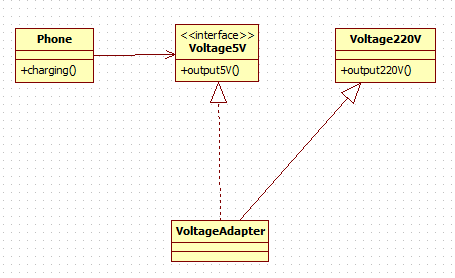

### 代码实现
* 5v电压接口
```java
public interface IVoltage5V {
	int output5V();
}
```

* 220V电压
```java
// 被适配的类
public class Voltage220V {
	// 输出220V的电压
	public int output220V() {
		int src = 220;
		System.out.println("电压=" + src + "伏");
		return src;
	}
}
```

* 电压适配器
```java
public class VoltageAdapter extends Voltage220V implements IVoltage5V {
	@Override
	public int output5V() {
		// 获取到220V电压
		int srcV = output220V();
		int dstV = srcV / 44; // 转成 5v
		return dstV;
	}
}
```

---
## 对象适配器模式
### 类图
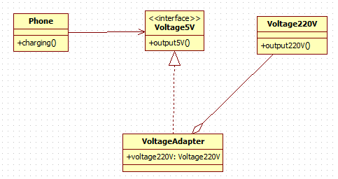

### 代码实现
* 电压适配器
```java
public class VoltageAdapter implements IVoltage5V {
	private Voltage220V voltage220V;
	@Override
	public int output5V() {
		if (voltage220V != null) {
			// 获取到220V电压
			int srcV = voltage220V.output220V();
			int dstV = srcV / 44; // 转成 5v
			return dstV;
		} else {
			throw new RuntimeException("voltage220V is null");
		}
	}
}
```

---
## 接口适配器模式
### 类图
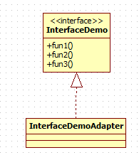

### 代码实现
```java
public interface InterfaceDemo {
	void fun1();

	void fun2();

	void fun3();
}

// 方法均为空实现
public class InterfaceDemoAdapter implements InterfaceDemo{
	@Override
	public void fun1() {
	}
	@Override
	public void fun2() {
	}
	@Override
	public void fun3() {
	}
}
```

---
## 适配器模式springmvc应用
### 类图


### 代码实现
* Handler
```java
public interface Handler {
}
public class HttpRequestHandler implements Handler {
}
```

* HandlerAdapter
```java
public interface HandlerAdapter {
	boolean support(Object handler);

	void hanle(Object handle);
}
public class HttpRequestHandlerAdapter implements HandlerAdapter{

	@Override
	public boolean support(Object handler) {
		return handler instanceof HttpRequestHandler;
	}

	@Override
	public void hanle(Object handle) {
		System.out.println("handle HttpRequest");
	}
}
```

* DispatcherServlet
```java
public class DispatcheServlet {
	private List<HandlerAdapter> handlerAdapters = new ArrayList<>();

	public DispatcheServlet() {
		handlerAdapters.add(new SimpleControllerHandlerAdapter());
		handlerAdapters.add(new AnnotationMethodHandlerAdapter());
		handlerAdapters.add(new HttpRequestHandlerAdapter());
	}

	public void doDispatch(Handler handler) {
		handlerAdapters.stream().forEach(handlerAdapter -> {
			if (handlerAdapter.support(handler)) {
				handlerAdapter.hanle(handler);
			}
		});
	}
}
```

---
# 桥接模式
## 问题引入
现在对不同手机类型的不同品牌实现操作编程(比如:开机、关机、上网，打电话等)，如图:


解决方法：
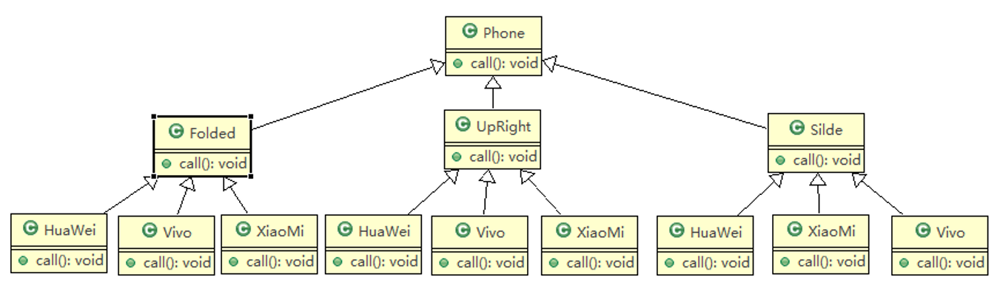

**存在的问题**
**扩展性问题(类爆炸)** ，如果我们再增加手机的样式(旋转式)，就需要增加各个品牌手机的类，同样如果我们增加一个手机品牌，也要在各个手机样式类下增加。

违反了单一职责原则，当我们增加手机样式时，要同时增加所有品牌的手机，这样增加了代码维护成本.

## 桥接模式解决上述问题
### 类图
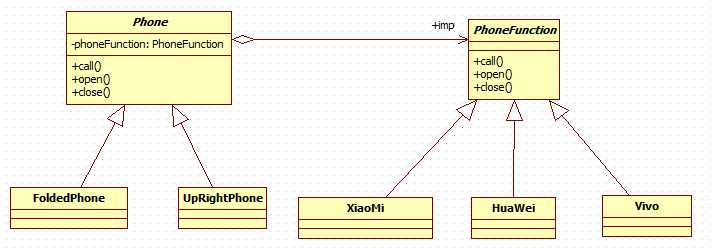

### 代码实现
* PhoneFunction
```java
public interface PhoneFunction {
	void open();

	void close();

	void call();
}

public class XiaoMi implements PhoneFunction {
	@Override
	public void open() {
		System.out.println(" 小米手机开机 ");
	}

	@Override
	public void close() {
		System.out.println(" 小米手机关机 ");
	}

	@Override
	public void call() {
		System.out.println(" 小米手机打电话 ");
	}
}
```

* Phone
```java
public abstract class Phone {
	private PhoneFunction phoneFunction;

	public Phone(PhoneFunction phoneFunction) {
		super();
		this.phoneFunction = phoneFunction;
	}

	protected void open() {
		phoneFunction.open();
	}

	protected void close() {
		phoneFunction.close();
	}

	protected void call() {
		phoneFunction.call();
	}
}

public class FoldedPhone extends Phone {

	// 构造器
	public FoldedPhone(PhoneFunction phoneFunction) {
		super(phoneFunction);
	}

	public void open() {
		super.open();
		System.out.println(" 直立样式手机 ");
	}

	public void close() {
		super.close();
		System.out.println(" 直立样式手机 ");
	}

	public void call() {
		super.call();
		System.out.println(" 直立样式手机 ");
	}
}
```

---
## JDBC桥接模式的应用


---
## 应用场景
对于那些 **不希望使用继承或因为多层次继承导致系统类的个数急剧增加的系统** ，桥接模式尤为适用。

---
# 装饰者模式
星巴克咖啡订单项目（咖啡馆）：
1. 咖啡种类/单品咖啡：Espresso(意大利浓咖啡)、ShortBlack、LongBlack(美式咖啡)、Decaf(无因咖啡)
2. 调料：Milk、Soy(豆浆)、Chocolate
3. 要求在扩展 **新的咖啡种类** 时，具有良好的扩展性、改动方便、维护方便
4. 使用OO的来计算不同种类咖啡的 **费用** : 客户可以点 **单品咖啡** ，也可以 **单品咖啡+调料组合** 。

## 解决方案1
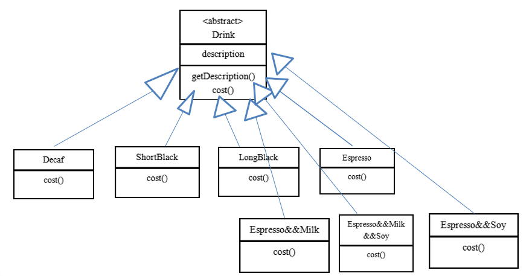
1. Drink 是一个抽象类，表示饮料
2. des就是对咖啡的描述, 比如咖啡的名字
3. cost() 方法就是计算费用，Drink 类中做成一个抽象方法.
4. Decaf 就是单品咖啡， 继承Drink, 并实现cost
5. Espress && Milk 就是单品咖啡+调料， 这个组合很多

问题：这样设计，会有很多类，当我们增加一个单品咖啡，或者一个新的调料，
类的数量就会倍增，就会出现 **类爆炸**

## 解决方案2
前面分析到方案1因为 **咖啡单品+调料** 组合会造成类的倍增，因此可以做改 进，将调料内置到Drink类，这样就 **不会造成类数量过多** 。从而提高项目的维护性。


1. 方案2可以控制类的数量，不至于造成很多的类
2. **在增加或者删除调料种类时，代码的维护量很大**

## 解决方案3(装饰者模式)
### 装饰者模式定义
装饰者模式： **动态的将新功能附加到对象上** 。在对象功能扩展方面，它比继承更 有弹性，装饰者模式也体现了开闭原则(ocp)

### 使用装饰者模式完成咖啡订单
#### 类图


#### 代码实现
* coffee相关
```java
public abstract class Drink {
	private String description;
	private float price = 0.0f;

	public String getDescription() {
		return description;
	}

	public void setDescription(String description) {
		this.description = description;
	}

	public float getPrice() {
		return price;
	}

	public void setPrice(float price) {
		this.price = price;
	}

	public abstract float cost();
}

public class Coffee extends Drink{

	@Override
	public float cost() {
		return super.getPrice();
	}
}

public class DeCaf extends Coffee {

	public DeCaf() {
		super();
		setDescription(" 无因咖啡 ");
		setPrice(1.0f);
	}
}
```

* decorator相关
```java
public class Decorator extends Drink{
	private Drink coffee;

	public Decorator(Drink coffee) {
		super();
		this.coffee = coffee;
	}

	@Override
	public float cost() {
		return super.getPrice() + this.coffee.cost();
	}

	@Override
	public String getDescription() {
		if (coffee instanceof Decorator) {
			return super.getDescription() + super.getPrice() + " && " + coffee.getDescription();
		} else {
			return super.getDescription() + super.getPrice() + " && " + coffee.getDescription() + coffee.getPrice();
		}
	}

}

public class Chocolate extends Decorator {

	public Chocolate(Drink coffee) {
		super(coffee);
		setPrice(0.6f);
		setDescription(" 巧克力 ");
	}
}
```

## 装饰者模式在Java IO中的使用
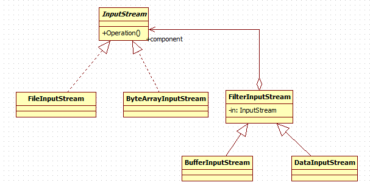

---
# 组合模式
## 学校院系展示
编写程序展示一个学校院系结构：需求是这样，要在一个页面中展示出学校的院系组成，一个学校有多个学院， 一个学院有多个系。如图：

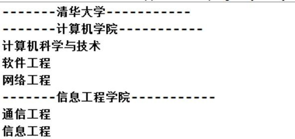

---
## 使用组合模式实现院系管理
### 定义
组合模式（Composite Pattern），又叫部分整体模式，它创建了对象组的树形结构，将对象组合成树状结构以表示 **“整体-部分”** 的层次关系。

组合模式 **依据树形结构来组合对象** ，用来表示部分以及整体层次。

组合模式使得 **用户对单个对象和组合对象的访问具有一致性** ，即：组合能让客户以一致的方式处理个别对象以及组合对象

### 实现院系管理
#### 类图


#### 代码实现
* `OrganizationComponent`
```java
public abstract class OrganizationComponent {
	private String name; // 名字
	private String des; // 说明

	protected void add(OrganizationComponent organizationComponent) {
		// 默认实现
		throw new UnsupportedOperationException();
	}

	protected void remove(OrganizationComponent organizationComponent) {
		// 默认实现
		throw new UnsupportedOperationException();
	}

	// 构造器
	public OrganizationComponent(String name, String des) {
		super();
		this.name = name;
		this.des = des;
	}

	public String getName() {
		return name;
	}

	public void setName(String name) {
		this.name = name;
	}

	public String getDes() {
		return des;
	}

	public void setDes(String des) {
		this.des = des;
	}

	// 方法print, 做成抽象的, 子类都需要实现
	public abstract void print();

}
```

* `Department&College`
```java
public class Department extends OrganizationComponent{

	public Department(String name, String des) {
		super(name, des);
	}

	@Override
	public void print() {
		System.out.println(getName());
	}

}

public class College extends OrganizationComponent {

	private List<OrganizationComponent> departments = new ArrayList<OrganizationComponent>();

	public College(String name, String des) {
		super(name, des);
	}

	@Override
	public void add(OrganizationComponent organizationComponent) {
		departments.add(organizationComponent);
	}

	@Override
	public void remove(OrganizationComponent organizationComponent) {
		departments.remove(organizationComponent);
	}

	@Override
	public void print() {
		System.out.println("----------------" + getName() + "----------------");
		this.departments.forEach(department -> {
			department.print();
		});
	}

}
```

---
## HashMap中的组合模式


---
# 外观模式
## 需求
组建一个家庭影院：
DVD 播放器、投影仪、自动屏幕、环绕立体声、爆米花机,要求完成使用家庭影院的功能，其过程为： 直接用遥控器：统筹各设备开关
开爆米花机
放下屏幕
开投影仪
开音响
开 DVD，选 dvd
去拿爆米花
调暗灯光
播放
观影结束后
关闭各种设备

---
## 传统解决方法
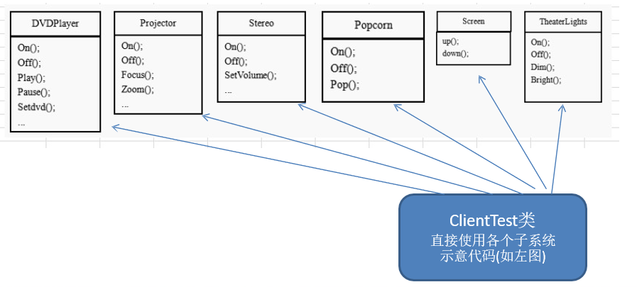

**问题**
在 `ClientTest ` 的 `main()` 方法中，创建各个子系统的对象，并直接去调用子系统(对象)  相关方法， **会造成调用过程混乱，没有清晰的过程**

不利于在ClientTest 中，去维护对子系统的操作

解决思路：定义一个高层接口，给子系统中的一组接口提供 **一个一致的界面(比如在高层接口提供四个方法ready, play, pause, end )** ，用来访问子系统中的 一群接口,也就是说 就是通过定义一个一致的接口(界面类)，用以屏蔽内部子系统的细节，使得调用端只需跟这个接口发生调用，而无需关心这个子系统的内部细节 => 外观模式

---
## 外观模式解决
### 定义
外观模式（Facade），也叫“过程模式：外观模式为子系统中的一组接口 **提供一个一致的界面** ，此模式定义了一个高层接口，这个接口使得这一子系统更加容易使用

外观模式通过定义一个一致的接口，用 **以屏蔽内部子系统的细节** ，使得 **调用端只需跟这个接口发生调用** ，而无需关心这个子系统的内部细节

### 类图


### 代码实现
```java
public class HomeTheaterFacade {

	// 定义各个子系统对象
	private TheaterLight theaterLight;
	private Popcorn popcorn;
	private Stereo stereo;
	private Projector projector;
	private Screen screen;
	private DVDPlayer dVDPlayer;

	// 构造器
	public HomeTheaterFacade() {
		super();
		this.theaterLight = TheaterLight.getInstance();
		this.popcorn = Popcorn.getInstance();
		this.stereo = Stereo.getInstance();
		this.projector = Projector.getInstance();
		this.screen = Screen.getInstance();
		this.dVDPlayer = DVDPlayer.getInstanc();
	}

	// 操作分成 4 步

	public void ready() {
		popcorn.on();
		popcorn.pop();
		screen.down();
		projector.on();
		stereo.on();
		dVDPlayer.on();
		theaterLight.dim();
	}

	public void play() {
		dVDPlayer.play();
	}

	public void pause() {
		dVDPlayer.pause();
	}

	public void end() {
		popcorn.off();
		theaterLight.bright();
		screen.up();
		projector.off();
		stereo.off();
		dVDPlayer.off();
	}
}
```

---
## 外观模式在Mybatis中的应用
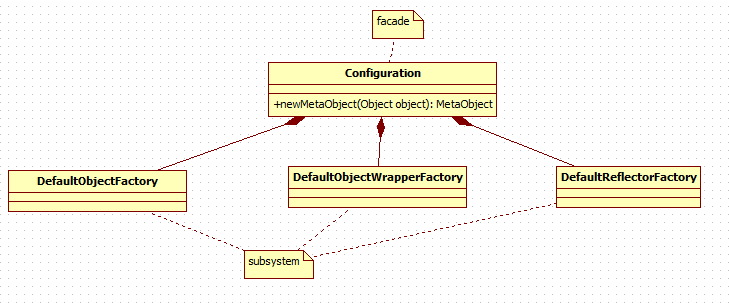

---
# 享元模式
---
## 需求
小型的外包项目，给客户 A 做一个产品展示网站，客户 A 的朋友感觉效果不错，也希望做这样的产品展示网站，但是要求都有些不同：
1. 有客户要求以新闻的形式发布
2. 有客户要求以博客的形式发布
3. 有客户希望以微信公众号的形式发布

---
## 传统解决方案
1. 直接复制粘贴一份，然后根据客户不同要求，进行定制修改
2. 给每个网站租用一个空间
3. 方案设计示意图


**问题：**
1.	需要的网站结构相似度很高，而且都不是高访问量网站， **如果分成多个虚拟空间来处理，相当于一个相同网站的实例对象很多，造成服务器的资源浪费**
2.	解决思路：整合到一个网站中，共享其相关的代码和数据，对于硬盘、内存、CPU、数据库空间等服务器资源都可以达成共享，减少服务器资源
3.	对于代码来说，由于是一份实例，维护和扩展都更加容易
4.	上面的解决思路就可以使用 享元模式 来解决

---
## 享元模式
### 定义
1. 享元模式（Flyweight Pattern） 也叫 蝇量模式: **运用共享技术有效地支持大量细粒度的对象**
2. 常用于系统底层开发，解决系统的性能问题。像数据库连接池，里面都是创建好的连接对象，在这些连接对象中有我们需要的则直接拿来用，避免重新创建，如果没有我们需要的，则创建一个
3. 享元模式 **能够解决重复对象的内存浪费的问题** ，当系统中有大量相似对象，需要缓冲池时。不需总是创建新对象，可以从缓冲池里拿。这样可以降低系统内存，同时提高效率
4. 享元模式经典的应用场景就是 **池技术** 了，String 常量池、数据库连接池、缓冲池等等都是享元模式的应用，享元模式是池技术的重要实现方式

### 类图


### 代码实现
* WebSite
```java
public abstract class WebSite {
	/**
	 * 网站类型(erp/crm)
	 */
	private String type;

	public String getType() {
		return type;
	}

	public WebSite(String type) {
		this.type = type;
	}

	public abstract void use();

	public abstract void setUI(String ui);
}

public class ConcreteWebSite extends WebSite {

	private String ui;

	public ConcreteWebSite(String type) {
		super(type);
	}

	@Override
	public void use() {
		System.out.println(String.format("网站类型：[%s]，网站UI：[%s]", this.getType(), ui));
	}

	@Override
	public void setUI(String ui) {
		this.ui = ui;
	}
}
```

* WebSiteFactory
```java
public class WebSiteFactory {
	private Map<String, WebSite> webSites = new HashMap<>();

	public WebSite getWebSite(String type) {
		WebSite webSite = webSites.get(type);
		if (webSite == null) {
			webSite = new ConcreteWebSite(type);
			webSites.put(type, webSite);
		}

		return webSite;
	}

	public int webSiteCount() {
		return webSites.size();
	}
}
```

---
# 代理模式
---
## 需求
**主讲老师(主题)** 在上课前需要由 **辅导老师(代理)** 先为孩子们讲解作业，作业讲解完成后才开始由 **主讲老师** 上课。

---
## 代理模式

### 定义
1. 代理模式：为一个对象提供一个替身，以控制对这个对象的访问。即通过代理对象访问目标对象.这样做的好处是:可以在目标对象实现的基础上,增强额外的功能操作,即扩展目标对象的功能。
2. 被代理的对象可以是远程对象、创建开销大的对象或需要安全控制的对象
3. 代理模式有不同的形式, 主要有三种 **静态代理、动态代理 (JDK 代理、接口代理)和 Cglib 代理** (可以在内存动态的创建对象，而不需要实现接口， 他是属于动态代理的范畴) 。

  ---
### 静态代理
#### 类图


#### 代码
* Teacher接口
```java
public interface Teacher {
	void teach();
}
```

* PrimaryTeacher(目标对象)
```java
public class PrimaryTeacher implements Teacher{

	@Override
	public void teach() {
		System.out.println("正式上课");
	}

}
```

* Counselor(代理对象)
```java
public class Counselor implements Teacher {
	/**
	 * 主讲老师
	 */
	private Teacher primaryTeacher;

	public Counselor(Teacher primaryTeacher) {
		super();
		this.primaryTeacher = primaryTeacher;
	}

	@Override
	public void teach() {
		System.out.println("开始讲课前预习题目");
		System.out.println("讲解课前预习题目完毕");

		// 主讲老师正式上课
		primaryTeacher.teach();
	}
}
```

---
### 动态代理
#### 类图


#### 代码实现
* ProxyFacotry
```java
public class ProxyFacotry {
	/**
	 * 目标对象
	 */
	private Object target;

	public ProxyFacotry(Object target) {
		this.target = target;
	}

	public Object getProxyInstance() {
		Class<? extends Object> targetClass = target.getClass();
		return Proxy.newProxyInstance(targetClass.getClassLoader(), targetClass.getInterfaces(),
				new InvocationHandler() {
					@Override
					public Object invoke(Object proxy, Method method, Object[] args)
							throws Throwable {
						System.out.println("执行前........");
						Object returnValue = method.invoke(target, args);
						System.out.println("执行后........");
						return returnValue;
					}
				});
	}
}
```

---
### cglib
#### 类图
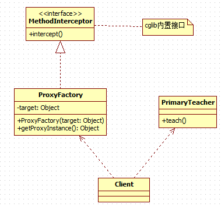

#### 代码实现
* ProxyFactory
```java
public class ProxyFactory implements MethodInterceptor{
	/**
	 * 目标对象
	 */
	private Object target;

	public ProxyFactory(Object target) {
		this.target = target;
	}

	public Object getProxyInstance() {
		Enhancer enhancer = new Enhancer();
		enhancer.setSuperclass(target.getClass());
		enhancer.setCallback(this);
		return enhancer.create();
	}

	@Override
	public Object intercept(Object proxy, Method method, Object[] args, MethodProxy methodProxy)
			throws Throwable {
		System.out.println("执行前...");
		Object returnValue = method.invoke(target, args);
		System.out.println("执行后...");
		return returnValue;
	}
}
```

---
## 代理模式和装饰者模式的异同
* 相同点
	1. 都是为了在不改变原有功能的基础上扩充功能。
* 不同点
	1. 目的不同，装饰者模式强调 **增强功能**，而代理模式强调 **控制访问**。
	2. 关系确定的时期不同，装饰者模式在 **运行时确定装饰者与被装饰者之间的关系**， 而代理模式则是在 **编译器就已经确定了代理者与目标对象之间的关系。**

---
# 模板方法模式
---
## 需求
1. 制作豆浆的流程 **选材--->添加配料--->浸泡--->放到豆浆机打碎**
2. 通过添加不同的配料，可以制作出不同口味的豆浆
3.选材、浸泡和放到豆浆机打碎这几个步骤对于制作每种口味的豆浆都是一样的

---
## 解决上述需求(模板方法模式)
### 定义
1. 模板方法模式（Template Method Pattern），又叫模板模式(Template	Pattern)， **在一个抽象类公开定义了执行它的方法的模板。** 它的子类可以按需要重写方法实现，但调用将以抽象类中定义的方式进行。
2. 简单说，模板方法模式  **定义一个操作中的算法的骨架，而将一些步骤延迟到子类中，** 使得子类可以不改变一个算法的结构，就可以重定义该算法的某些特定步骤
3. 这种类型的设计模式 **属于行为型模式。**

### 类图
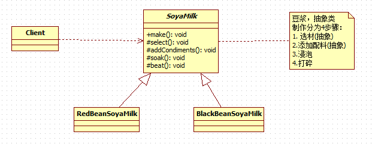

### 代码实现
* SoyaMilk
```java
public abstract class SoyaMilk {
	public final void make() {
		select();
		if (needsAddCondiments()) {
			addCondiments();
		}
		soak();
		beat();
	};

	/**
	 * 选材
	 */
	protected abstract void select();

	/**
	 * 添加配料
	 */
	protected void addCondiments() {
	}

	/**
	 * 浸泡
	 */
	protected void soak() {
		System.out.println("浸泡");
	};

	/**
	 * 打碎
	 */
	protected void beat() {
		System.out.println("放到豆浆机打碎");
	};

	protected abstract boolean needsAddCondiments();
}
```

* BlackBeanSoyaMilk
```java
public class BlackBeanSoyaMilk extends SoyaMilk {

	@Override
	protected void select() {
		System.out.println("选择黑豆");
	}

	@Override
	protected boolean needsAddCondiments() {
		return false;
	}

}
```

* RedBeanSoyaMilk
```java
public class RedBeanSoyaMilk extends SoyaMilk{

	@Override
	protected void select() {
		System.out.println("选择红豆");
	}

	@Override
	protected boolean needsAddCondiments() {
		return true;
	}

	@Override
	protected void addCondiments() {
		super.addCondiments();
		System.out.println("添加黑米");
	}

}
```

---
## 模板方法模式在Spring中的应用


---
# 命令模式

---
## 需求
1. 我们买了一套智能家电，有照明灯、风扇、冰箱、洗衣机，我们 **只要在手机上安装 app 就可以控制对这些家电工作** 。
2. 这些智能家电来自不同的厂家，我们不想针对每一种家电都安装一个 App，分别控制， **我们希望只要一个 app就可以控制全部智能家电。**
3. 要实现一个 app 控制所有智能家电的需要，则每个智能家电厂家都要提供一个统一的接口给 app 调用，这时 就可以考虑使用命令模式。
4. 命令模式可 **将“动作的请求者”从“动作的执行者”对象中解耦出来。**
5. 在我们的例子中，动作的请求者是手机 app，动作的执行者是每个厂商的一个家电产品。

---
## 命令模式
### 基本介绍
1. 命令模式（Command Pattern）：在软件设计中，我们经常需要向某些对象发送请求，但是并不知道请求的接收者是谁，也不知道被请求的操作是哪个，我们只需在程序运行时指定具体的请求接收者即可，此时，可以使用命令模式来进行设计
2. 命名模式使得 **请求发送者与请求接收者消除彼此之间的耦合** ，让对象之间的调用关系更加灵活，实现解耦。
3. 	在命名模式中，会将一个请求封装为一个对象，以便使用不同参数来表示不同的请求(即命名)，同时命令模式也支持可撤销的操作。
4. 通俗易懂的理解：将军发布命令，士兵去执行。其中有几个角色：将军（命令发布者）、士兵（命令的具体执行者）、命令(连接将军和士兵)。
Invoker 是调用者（将军），Receiver 是被调用者（士兵），MyCommand 是命令，实现了 Command 接口，持有接收对象

### 类图


### 代码实现
* Command
```java
public interface Command {
	void execute();

	void undo();
}

public class LightOffCommand implements Command{
	/**
	 * 命令接受者,真正执行命令的人
	 */
	private LightReciver lightReciver;

	public LightOffCommand(LightReciver lightReciver) {
		super();
		this.lightReciver = lightReciver;
	}

	@Override
	public void execute() {
		lightReciver.off();
	}

	@Override
	public void undo() {
		lightReciver.on();
	}

}
public class LightOnCommand implements Command{
	/**
	 * 命令接受者,真正执行命令的人
	 */
	private LightReciver lightReciver;

	public LightOnCommand(LightReciver lightReciver) {
		super();
		this.lightReciver = lightReciver;
	}

	@Override
	public void execute() {
		lightReciver.on();
	}

	@Override
	public void undo() {
		lightReciver.off();
	}
}
public class NoCommand implements Command {

	@Override
	public void execute() {
		// Nothing to do
	}

	@Override
	public void undo() {
		// Nothing to do
	}

}
```

* Receiver
```java
public class LightReciver {
	public void on() {
		System.out.println(" 电灯打开了.. ");
	}

	public void off() {
		System.out.println(" 电灯关闭了.. ");
	}
}
```

* RemoteController
```java
public class RemoteController {
	/**
	 * 开命令
	 */
	private Command[] onCommands;

	/**
	 * 关命令
	 */
	private Command[] offCommands;

	/**
	 * 撤销命令
	 */
	private Command undoCommand;

	public RemoteController() {
		// 初始化为空命令
		onCommands = new Command[5];
		offCommands = new Command[5];
		for (int i = 0; i < 5; i++) {
			onCommands[i] = new NoCommand();
			offCommands[i] = new NoCommand();
		}
	}

	/**
	 * 设置命令
	 * @param no				编号
	 * @param onCommand			开命令
	 * @param offCommand		关命令
	 */
	public void setCommand(int no, Command onCommand, Command offCommand) {
		onCommands[no] = onCommand;
		offCommands[no] = offCommand;
	}

	/**
	 * 按下按钮no
	 * @param no	按钮编号
	 */
	public void onButtonWasPushed(int no) { // no 0
		// 找到你按下的开的按钮， 并调用对应方法
		onCommands[no].execute();
		// 记录这次的操作，用于撤销
		undoCommand = onCommands[no];

	}

	/**
	 * 按下关闭按钮no
	 * @param no	按钮编号
	 */
	public void offButtonWasPushed(int no) { // no 0
		// 找到你按下的关的按钮， 并调用对应方法
		offCommands[no].execute();
		// 记录这次的操作，用于撤销
		undoCommand = offCommands[no];

	}

	/**
	 * 按下撤销按钮
	 */
	public void undoButtonWasPushed() {
		undoCommand.undo();
	}
}
```

* Client
```java
public class Client {
	public static void main(String[] args) {
		// 初始化遥控器
		RemoteController remoteController = new RemoteController();
		LightReciver lightReciver = new LightReciver();
		remoteController.setCommand(0, new LightOnCommand(lightReciver),
				new LightOffCommand(lightReciver));
		TVReciver tvReciver = new TVReciver();
		remoteController.setCommand(1, new TVOnCommand(tvReciver), new TVOffCommand(tvReciver));

		// 打开灯
		System.out.println("---打开电灯---");
		remoteController.onButtonWasPushed(0);
		System.out.println();
		// 关闭灯
		System.out.println("---关闭电灯---");
		remoteController.offButtonWasPushed(0);
		System.out.println();

		// 打开电视
		System.out.println("---打开电视---");
		remoteController.onButtonWasPushed(1);
		System.out.println();
		// 关闭灯
		System.out.println("---关闭电视---");
		remoteController.offButtonWasPushed(1);
		System.out.println();

		// 撤销
		System.out.println("---撤销---");
		remoteController.undoButtonWasPushed();
	}
}
```

---
## 命令模式在JDBCTemplate中的应用
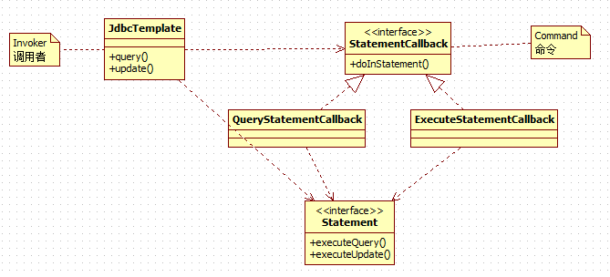

---
## 命令模式的优缺点
1.  **将发起请求的对象与执行请求的对象解耦** 。发起请求的对象是调用者，调用者只要调用命令对象的 `execute()` 方法就可以让接收者工作，而不必知道具体的接收者对象是谁、是如何实现的，命令对象会负责让接收者执行请求的动作，也就是说：”请求发起者”和“请求执行者”之间的解耦是通过命令对象实现的，命令对象起到了纽带桥梁的作用。
2. 容易设计一个命令队列。只要把命令对象放到列队，就可以多线程的执行命令。
3. 容易实现对请求的撤销和重做
4. 命令模式不足： **可能导致某些系统有过多的具体命令类，增加了系统的复杂度。**
5.  **空命令也是一种设计模式，它为我们省去了判空的操作。**
6. 命令模式经典的应用场景：界面的一个按钮都是一条命令、模拟 CMD（DOS 命令）订单的撤销/恢复、触发- 反馈机制

---
# 访问者模式

---
## 需求
现有一个投票系统，当一个歌手演唱完毕，需要对歌手进行投票，有 **赞成、反对** 两种。最终统计 **男人和女人** 赞成和反对的票数。

---
## 传统解决方案
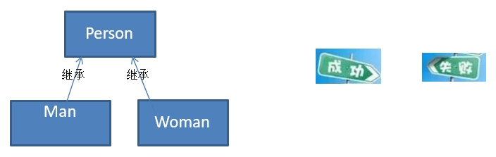

### 存在的问题
如果新添加了一种 **弃权** 的操作，则需要改动 `Man` 和 `Woman`，违反了`OCP`原则


---
## 访问者模式
### 基本介绍
1. 访问者模式（Visitor Pattern），封装一些作用于某种数据结构的各元素的操作，它可以在不改变数据结构的前提下定义作用于这些元素的新的操作。
2. 主要将 **数据结构与数据操作分离** ，解决 数据结构和操作耦合性问题
3. 访问者模式的基本工作原理是：在被访问的类里面加一个对外提供接待访问者的接口
4. 访问者模式主要应用场景是：需要对一个对象结构中的对象进行很多不同操作(这些操作彼此没有关联)，同时需要避免让这些操作"污染"这些对象的类，可以选用访问者模式解决

### 类图


### 代码实现
* Audience(观众，被访问的元素)
```java
public abstract class AbstractAudience {
	/**
	 * 观众投票
	 * @param vote	选票,访问者
	 */
	public abstract void vote(Vote vote);
}

public class Audience extends AbstractAudience {
	private String gender;

	public Audience(String gender) {
		super();
		this.gender = gender;
	}

	public String getGender() {
		return gender;
	}

	@Override
	public void vote(Vote vote) {
		vote.vote(this);
		;
	}

}
```

* Vote(选票，访问者)
```java
public interface Vote {
	void vote(Audience audience);
}

public class Approve implements Vote {
	@Override
	public void vote(Audience audience) {
		System.out.println(String.format("性别：%s,投赞成票", audience.getGender()));
	}
}

public class Oppose implements Vote {
	@Override
	public void vote(Audience audience) {
		System.out.println(String.format("性别：%s,投反对票", audience.getGender()));
	}
}

public class NoVote implements Vote{
	@Override
	public void vote(Audience audience) {
		System.out.println(String.format("性别：%s,弃权", audience.getGender()));
	}
}
```

* Client
```java
public class Client {
	public static void main(String[] args) {
		AbstractAudience audience1 = new Audience("男");
		AbstractAudience audience2 = new Audience("女");
		AbstractAudience audience3 = new Audience("女");
		AbstractAudience audience4 = new Audience("男");
		AbstractAudience audience5 = new Audience("男");

		audience1.vote(new Approve());
		audience2.vote(new Approve());
		audience3.vote(new Approve());
		audience4.vote(new Oppose());
		audience5.vote(new NoVote());
	}
}
```

---
# 迭代器模式
---
## 需求
使用 **同一种方式** 打印一个学院下的所有系，一个学院 **保存其所有系的方式可能不同(数组或List)**

---
## 使用迭代器模式解决
### 迭代器模式基本介绍
1. 迭代器模式（Iterator Pattern）是常用的设计模式，属于 **行为型模式**
2. 如果我们的集合元素是用不同的方式实现的，有数组，还有 java 的集合类，或者还有其他方式，当客户端要遍历这些集合元素的时候就要使用多种遍历方式，而且还会暴露元素的内部结构，可以考虑使用迭代器模式解决。
3. 迭代器模式， **提供一种遍历集合元素的统一接口** ，用 **一致的方法遍历集合元素** ， **不需要知道集合对象的底层表示** ，即：不暴露其内部的结构。

### 类图


### 代码实现
* Iterator
```java
public class ComputerColleageIterator implements Iterator<Department> {
	private Department[] departments;

	public ComputerColleageIterator(Department[] departments) {
		this.departments = departments;
	}

	private int index = 0;

	@Override
	public boolean hasNext() {
		return index < departments.length;
	}

	@Override
	public Department next() {
		Department department = departments[index];
		index += 1;
		return department;
	}

}

public class InfoColleageIterator implements Iterator<Department> {
	private List<Department> departments;

	public InfoColleageIterator(List<Department> departments) {
		super();
		this.departments = departments;
	}

	private int index = 0;

	@Override
	public boolean hasNext() {
		return index < departments.size();
	}

	@Override
	public Department next() {
		Department department = departments.get(index);
		index += 1;
		return department;
	}

}
```

* Colleage
```java
public abstract class Colleage {
	public abstract Iterator<Department> createIterator();
}

public class InfoColleage extends Colleage {
	private List<Department> departments = new ArrayList<>();

	public InfoColleage() {
		departments.add(new Department("信管系", ""));
		departments.add(new Department("统计系", ""));
	}

	@Override
	public Iterator<Department> createIterator() {
		return new InfoColleageIterator(departments);
	}

}

public class ComputerColleage extends Colleage {
	private Department[] departments = { new Department("计算机系", ""), new Department("网络工程系", "") };

	@Override
	public Iterator<Department> createIterator() {
		return new ComputerColleageIterator(departments);
	}

}
```

* Client
```java
public class Client {
	public static void main(String[] args) {
		Colleage computer = new ComputerColleage();
		Colleage info = new InfoColleage();

		System.out.println("计算机学院的系");
		Iterator<Department> computerIterator = computer.createIterator();
		while (computerIterator.hasNext()) {
			System.out.println("    " + computerIterator.next().toString());
		}
		System.out.println();

		System.out.println("信息学院的系");
		Iterator<Department> infoIterator = info.createIterator();
		while (infoIterator.hasNext()) {
			System.out.println("    " + infoIterator.next().toString());
		}
	}
}
```

---
## 迭代器模式的优缺点
###	优点
1. 提供一个统一的方法遍历对象，客户不用再考虑聚合的类型，使用一种方法就可以遍历对象了。
2. 隐藏了聚合的内部结构，客户端要遍历聚合的时候只能取到迭代器，而不会知道聚合的具体组成。
3. 提供了一种设计思想，就是一个类应该只有一个引起变化的原因（叫做单一责任原则）。在聚合类中，我们把迭代器分开，就是要 **把管理对象集合和遍历对象集合的责任分开** ，这样一来集合改变的话，只影响到聚合对象。而如果遍历方式改变的话，只影响到了迭代器。
4. 当要展示一组相似对象，或者遍历一组相同对象时使用, 适合使用迭代器模式

###	缺点
1. 每个聚合对象都要一个迭代器，会生成多个迭代器不好管理类

---
# 观察者模式
---
## 需求
1. 气象站可以将每天测量到的温度，湿度，气压等等以公告的形式发布出去(比如发布到自己的网站或第三方)。
2. 需要 **设计开放型API，** 便于 **其他第三方也能接入气象站获取数据。**
3. 提供温度、气压和湿度的接口
4. 测量数据更新时，要能实时的通知给第三方

---
## 传统解决方案
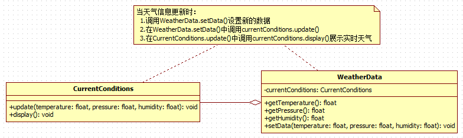

### 存在的问题
1. 其他第三方接入气象站获取数据的问题
2. 无法在运行时动态的添加第三方

---
## 观察者模式解决

### 定义
观察者模式是对象之间 **多对一依赖** 的一种设计方案，被依赖的对象为 `Subject`，依赖的对象为 `Observer`，`Subject`通知 `Observer` 变化,比如这里的 `WeatherData` 是 `Subject`，是 1 的一方。第三方网站是 `Observer`，是多的一方。

### 类图


### 代码实现
* Observer
```java
public interface Observer {
	/**
	 * 更新天气信息
	 * @param temperature	温度
	 * @param pressure		气压
	 * @param humidity		湿度
	 */
	void update(float temperature, float pressure, float humidity);
}

public class CurrentConditions implements Observer{

	@Override
	public void update(float temperature, float pressure, float humidity) {
		display(temperature, pressure, humidity);
	}

	public void display(float temperature, float pressure, float humidity) {
		System.out.println("当前温度=" + temperature);
		System.out.println("当前气压=" + pressure);
		System.out.println("当前湿度=" + humidity);
	}
}

public class BaiduSite implements Observer {

	@Override
	public void update(float temperature, float pressure, float humidity) {
		display(temperature, pressure, humidity);
	}

	public void display(float temperature, float pressure, float humidity) {
		System.out.println("百度提示您，当前温度=" + temperature);
		System.out.println("百度提示您，当前气压=" + pressure);
		System.out.println("百度提示您，当前湿度=" + humidity);
	}
}
```

* Subject
```java
public interface Subject {
	void registerObserver(Observer o);

	void removeObserver(Observer o);

	void notifyObservers();
}

public class WeatherData implements Subject {
	/**
	 * 所有观察者
	 */
	private List<Observer> observers = new ArrayList<>();

	/**
	 * 湿度
	 */
	private float humidity;

	/**
	 * 气压
	 */
	private float pressure;

	/**
	 * 温度
	 */
	private float temperature;

	@Override
	public void registerObserver(Observer o) {
		observers.add(o);
	}

	@Override
	public void removeObserver(Observer o) {
		observers.remove(o);
	}

	@Override
	public void notifyObservers() {
		observers.forEach(observer -> {
			observer.update(temperature, pressure, humidity);
		});
	}

	public void setData(float temperature, float pressure, float humidity) {
		this.pressure = pressure;
		this.temperature = temperature;
		this.humidity = humidity;
		notifyObservers();
	}
}
```

---
# 中介者模式
---
## 需求
现有一个人需要 **租房子**， 他找到了 **房东**， 房东需要和他的 **妻子** 商量租金，而房东的妻子也不了解市场价格， 房东的妻子又要想她的 **同事** 打听，最后确定价格后再和 **房客** 商量确定最终价格。

---
## 传统解决方案
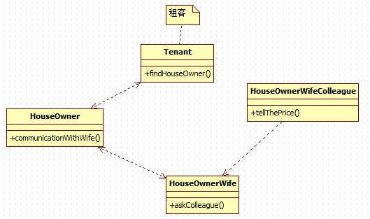

1. 租客找到房东
2. 房东和妻子商议
3. 妻子询问同事价格
4. 妻子和房东商议合适的价格
5. 房东与租客商议决定最终的价格

### 存在的问题
1. 如果房东还需要和他的父母商议房租的价格，调用关系就更加复杂
2. 各个 **人员对象之间彼此关联，你中有我，我中有你，不利于松耦合**

---
## 使用中介者模式解决
### 基本介绍
1. 中介者模式（Mediator Pattern），用一个 **中介对象来封装一系列的对象交互** 。中介者使各个对象不需要显式地相互引用，从而使其 **耦合松散** ，而且可以独立地改变它们之间的交互
2. 中介者模式属于行为型模式，使代码易于维护
3. 比如 MVC 模式，C（Controller 控制器）是 M（Model 模型）和 V（View 视图）的中介者，在前后端交互时起到了中间人的作用

### 类图
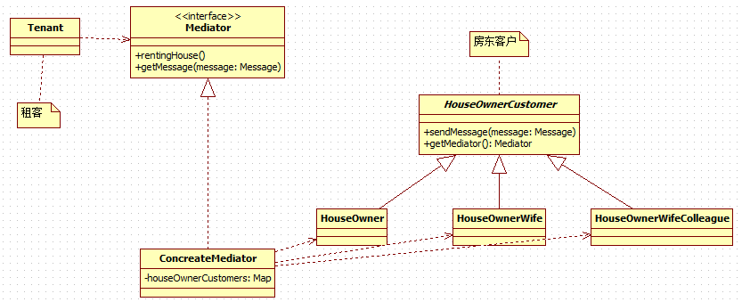
1. 租客找到中介
2. 中介和所有房东客户沟通
3. 中介和租客商议最终价格

### 代码实现
* Mediator
```java
public interface Mediator {
	/**
	 * 租房
	 */
	void rentingHouse();

	/**
	 * 获得房东客户发送的小
	 * @param messageType	消息类型
	 */
	void getMessage(TMessageType messageType);
}

public class ConcreteMediator implements Mediator {
	private Map<String, HouseOwnerCustomer> houseOwnerCustomers =
			new HashMap<String, HouseOwnerCustomer>();

	public ConcreteMediator() {
		// 注册所有房东客户
		houseOwnerCustomers.put("HouseOwner", new HouseOwner(this));
		houseOwnerCustomers.put("HouseOwnerWife", new HouseOwnerWife(this));
		houseOwnerCustomers.put("HouseOwnerWifeColleague", new HouseOwnerWifeColleague(this));
	}

	@Override
	public void rentingHouse() {
		// 通知房东
		houseOwnerCustomers.get("HouseOwner").sendMessage(TMessageType.COMMUNICATION_WITH_WIFE);
		System.out.println("中介获取到价格，与租户沟通	");
	}

	@Override
	public void getMessage(TMessageType messageType) {
		if (TMessageType.COMMUNICATION_WITH_WIFE.equals(messageType)) {
			houseOwnerCustomers.get("HouseOwnerWife").sendMessage(TMessageType.ASK_COLLEGUE);
		} else if (TMessageType.ASK_COLLEGUE.equals(messageType)) {
			houseOwnerCustomers.get("HouseOwnerWifeColleague").sendMessage(TMessageType.TELL_THE_PRICE);
		} else if (TMessageType.TELL_THE_PRICE.equals(messageType)) {
			System.out.println("房东妻子获取到价格，告诉中介价格");
		} else {
			System.out.println("错误的消息类型");
		}
	}

}
```

* HouseOwnerCustomer
```java
/**
 * 房东客户
 *
 * @version 1.0.0.0
 * @author 王磊
 */
public abstract class HouseOwnerCustomer {
	/**
	 * 中介
	 */
	private Mediator mediator;

	protected Mediator getMediator() {
		return mediator;
	}

	public HouseOwnerCustomer(Mediator mediator) {
		super();
		this.mediator = mediator;
	}

	public abstract void sendMessage(TMessageType messageType);
}

public class HouseOwner extends HouseOwnerCustomer{

	public HouseOwner(Mediator mediator) {
		super(mediator);
	}

	@Override
	public void sendMessage(TMessageType messageType) {
		System.out.println("询问妻子");
		this.getMediator().getMessage(messageType);
	}
}

public class HouseOwnerWife extends HouseOwnerCustomer{

	public HouseOwnerWife(Mediator mediator) {
		super(mediator);
	}

	@Override
	public void sendMessage(TMessageType messageType) {
		System.out.println("咨询同事");
		this.getMediator().getMessage(messageType);
	}

}

public class HouseOwnerWifeColleague extends HouseOwnerCustomer {

	public HouseOwnerWifeColleague(Mediator mediator) {
		super(mediator);
	}

	@Override
	public void sendMessage(TMessageType messageType) {
		System.out.println("告诉房东妻子价格");
		this.getMediator().getMessage(messageType);
	}

}
```

* Tenant
```java
public class Tenant {
	public static void main(String[] args) {
		Mediator mediator = new ConcreteMediator();
		mediator.rentingHouse();
	}
}
```

---
## 中介者模式注意事项
1. 多个类相互耦合，会形成网状结构, 使用中介者模式将网状结构分离为星型结构，进行解耦
2. 减少类间依赖，降低了耦合，符合迪米特原则
3. `中介者` **承担了较多的责任，一旦中介者出现了问题，整个系统就会受到影响**
4. 如果设计不当，中介者对象本身变得过于复杂，这点在实际使用时，要特别注意

---
# 备忘录模式
---
## 需求
游戏角色有攻击力和防御力，在大战Boss 前保存自身的状态(攻击力和防御力)，当大战 Boss 后攻击力和防御力下降， **从备忘录对象恢复到大战前的状态**

---
## 传统解决方案
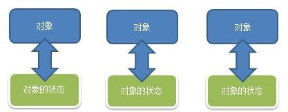

### 传统方案存在的问题
1. 一个对象，就对应一个保存对象状态的对象， 这样当我们游戏的对象很多时， **不利于管理，开销也很大**。
2. 传统的方式是简单地做备份，new 出另外一个对象出来，再把需要备份的数据放到这个新对象，但这就 **暴露了对象内部的细节**

---
## 备忘录模式解决
### 基本介绍
1. 备忘录模式（Memento Pattern）在 **不破坏封装性的前提下** ， **捕获一个对象的内部状态**，并在该 **对象之外保存这个状态** 。这样以后就可将该对象恢复到原先保存的状态
2. 可以这里理解备忘录模式：现实生活中的备忘录是用来记录某些要去做的事情，或者是记录已经达成的共同意见的事情，以防忘记了。而在软件层面，备忘录模式有着相同的含义， **备忘录对象主要用来记录一个对象的某种状态，或者某些数据，当要做回退时，可以从备忘录对象里获取原来的数据进行恢复操作**

### 类图


### 代码实现
* GameRole
```java
public class GameRole {
	/**
	 * 攻击力
	 */
	private int vit;

	/**
	 * 防御
	 */
	private int def;

	public int getVit() {
		return vit;
	}

	public void setVit(int vit) {
		this.vit = vit;
	}

	public int getDef() {
		return def;
	}

	public void setDef(int def) {
		this.def = def;
	}

	public Memento createMemento() {
		return new Memento(vit, def);
	}

	public void resetProperties(Memento memento) {
		this.vit = memento.getVit();
		this.def = memento.getDef();
	}

	public void displayProperties() {
		System.out.println(String.format("当前攻击力=%d,当前防御=%d", this.vit, this.def));
	}
}
```

* Memento
```java
public class Memento {
	/**
	 * 攻击力
	 */
	private int vit;

	/**
	 * 防御
	 */
	private int def;

	public Memento(int vit, int def) {
		super();
		this.vit = vit;
		this.def = def;
	}

	public int getVit() {
		return vit;
	}

	public int getDef() {
		return def;
	}

}
```

* Caretaker
```java
public class Caretaker {
	/**
	 * 保存的备忘录列表
	 */
	private List<Memento> mementos = new ArrayList<>();

	public void addMemento(int index, Memento memento) {
		this.mementos.add(index, memento);
	}

	public Memento getMemento(int index) {
		return this.mementos.get(index);
	}
}
```

* Client
```java
public class Client {
	public static void main(String[] args) {
		GameRole gameRole = new GameRole();
		gameRole.setVit(999);
		gameRole.setDef(300);

		System.out.println("打BOSS前英雄属性：");
		gameRole.displayProperties();

		// 保存状态
		Memento memento = gameRole.createMemento();
		Caretaker caretaker = new Caretaker();
		caretaker.addMemento(0, memento);

		System.out.println();
		gameRole.setVit(400);
		gameRole.setDef(12);
		System.out.println("英雄攻击完BOSS后属性：");
		gameRole.displayProperties();

		System.out.println();
		System.out.println("英雄属性恢复大攻击BOSS前：");
		gameRole.resetProperties(caretaker.getMemento(0));
		gameRole.displayProperties();
	}
}
```

---
# 解释器模式
---
## 需求
通过解释器模式来实现四则运算，如计算 `a+b-c` 的值，具体要求
1. 输入表达式的形式，比如 `a+b+c-d+e`,要求表达式的字母不能重复
2. 再分别输入 `a ,b, c, d, e` 的值
3. 最后求出结果：如图
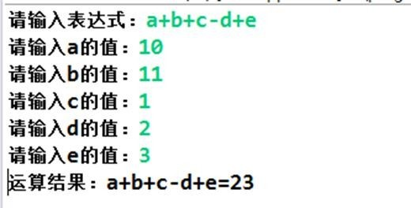

---
## 传统解决方案
1. 编写一个方法，接收表达式的形式，然后根据用户输入的数值进行解析，得到结果
2. 问题分析：如果加入新的运算符，比如 * / ( 等等，不利于扩展，另外让一个方法来解析会造成程序结构混乱， 不够清晰.
3. 解决方案：可以考虑使用解释器模式， 即： `表达式 ->	解释器(可以有多种)	->	结果`

---
## 解释器模式解决
### 基本介绍
1. 在编译原理中，一个算术表达式通过 **词法分析器** 形成 **词法单元** ，而后这些词法单元再通过 **语法分析器** 构建 **语法分析树** ，最终形成一颗抽象的语法分析树。这里的 **词法分析器和语法分析器都可以看做是解释器**
2. 解释器模式（Interpreter Pattern）：是指给定一个语言(表达式)，定义它的文法的一种表示，并定义一个解释器， 使用该解释器来解释语言中的句子(表达式)
3. 应用场景
    * 应用可以将一个需要解释执行的语言中的句子表示为一个抽象语法树
    * 一些重复出现的问题可以用一种简单的语言来表达
    * 一个简单语法需要解释的场景
4. 这样的例子还有，比如编译器、运算表达式计算、正则表达式、机器人等

### 类图
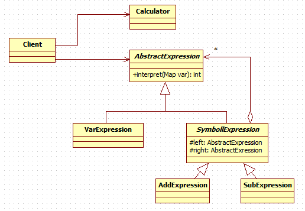

### 代码实现
* Exression
```java
public abstract class AbstractExression {
	public abstract int interpreter(Map<String, Integer> var);
}

public class VarExpression extends AbstractExression{
	private String varKey;

	public VarExpression(String varKey) {
		super();
		this.varKey = varKey;
	}

	@Override
	public int interpreter(Map<String, Integer> var) {
		return var.get(varKey);
	}

}

public abstract class SymbolExression extends AbstractExression {
	protected AbstractExression left;
	protected AbstractExression right;

	public SymbolExression(AbstractExression left, AbstractExression right) {
		super();
		this.left = left;
		this.right = right;
	}
}

public class AddExression extends SymbolExression{

	public AddExression(AbstractExression left, AbstractExression right) {
		super(left, right);
	}

	@Override
	public int interpreter(Map<String, Integer> var) {
		return left.interpreter(var) + right.interpreter(var);
	}

}

public class SubExpression extends SymbolExression {

	public SubExpression(AbstractExression left, AbstractExression right) {
		super(left, right);
	}

	@Override
	public int interpreter(Map<String, Integer> var) {
		return left.interpreter(var) - right.interpreter(var);
	}

}
```

* Caculator
```java
public class Caculator {
	/**
	 * 计算表达式的值
	 * @param expressionStr		表达式
	 * @param var				表达式变量对应的值
	 * @return					计算的结果
	 */
	public int compute(String expressionStr, Map<String, Integer> var) {
		char[] expChars = expressionStr.toCharArray();

		Stack<AbstractExression> stack = new Stack<>();
		// 构造表达式
		for (int i = 0; i < expChars.length; i++) {
			char currentExpChar = expChars[i];
			AbstractExression leftExression = null;
			AbstractExression rightExression = null;
			String nextVar = null;
			switch (currentExpChar) {
			case '+':
				leftExression = stack.pop();
				nextVar = String.valueOf(expChars[++i]);
				rightExression = new VarExpression(nextVar);
				stack.push(new AddExression(leftExression, rightExression));
				break;
			case '-':
				leftExression = stack.pop();
				nextVar = String.valueOf(expChars[++i]);
				rightExression = new VarExpression(nextVar);
				stack.push(new SubExpression(leftExression, rightExression));
				break;
			default:
				stack.push(new VarExpression(String.valueOf(currentExpChar)));
				break;
			}
		}
		AbstractExression exression = stack.pop();

		// 计算值
		return exression.interpreter(var);
	}
}
```

* Client
```java
public class Client {
	public static void main(String[] args) throws IOException {
		String expressionStr = getExpStr();// a+b-c
		Map<String, Integer> var = getValue(expressionStr);// {a=20,b=10,c=5}
		Caculator caculator = new Caculator();
		int result = caculator.compute(expressionStr, var);
		System.out.println(String.format("%s=%d", expressionStr, result));
	}

	// 获得表达式
	public static String getExpStr() throws IOException {
		System.out.print("请输入表达式：");
		return (new BufferedReader(new InputStreamReader(System.in))).readLine();
	}

	// 获得值映射
	public static Map<String, Integer> getValue(String expressionStr) throws IOException {
		Map<String, Integer> map = new HashMap<>();

		for (char ch : expressionStr.toCharArray()) {
			if (ch != '+' && ch != '-') {
				if (!map.containsKey(String.valueOf(ch))) {
					System.out.print("请输入" + String.valueOf(ch) + "的值：");
					String in = (new BufferedReader(new InputStreamReader(System.in))).readLine();
					map.put(String.valueOf(ch), Integer.valueOf(in));
				}
			}
		}

		return map;
	}
}
```

---
## 解释器模式在spring中的应用
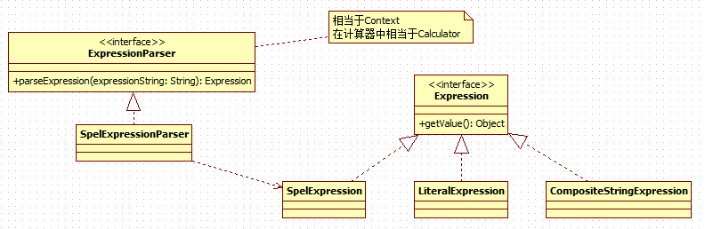

---
## 注意事项
1. 当有一个语言需要解释执行，可将该语言中的句子表示为一个抽象语法树，就可以考虑使用解释器模式，让程序具有良好的扩展性
2. 应用场景：编译器、运算表达式计算、正则表达式、机器人等
3. 使用解释器可能带来的问题：解释器模式会引起类膨胀、解释器模式采用递归调用方法，将会导致调试非常复杂、效率可能降低.

---
# 状态模式
---
## 需求
**APP 抽奖活动问题**
具体要求如下:
1. 假如每参加一次这个活动要扣除用户 50 积分，中奖概率是 10%
2. 奖品数量固定，抽完就不能抽奖
3. 活动有四个状态: 可以抽奖、不能抽奖、发放奖品和奖品领完
4. 活动的四个状态转换关系图
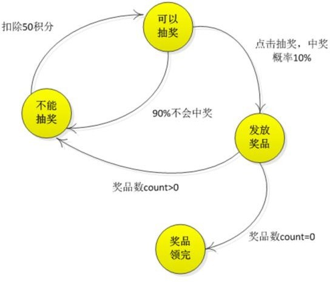

---
## 使用状态模式解决
### 基本介绍
1. 状态模式（State Pattern）：它主要用来解决对象在 **多种状态转换时** ，需要 **对外输出不同的行为** 的问题。状态和行为是一一对应的，状态之间可以相互转换
2. 当一个 **对象的内在状态改变时，允许改变其行为** ，这个对象看起来像是改变了其类

### 类图


### 代码实现
* State
```java
public abstract class State {
	// 抽奖活动
	protected RaffleActivity raffleActivity;

	public State(RaffleActivity raffleActivity) {
		super();
		this.raffleActivity = raffleActivity;
	}

	// 扣除积分 - 50
	public abstract void deductMoney();

	// 抽奖
	public abstract boolean raffle();

	// 发放奖品
	public abstract void dispensePrize();
}

// 不能抽奖状态
public class NoRaffleState extends State {

	public NoRaffleState(RaffleActivity raffleActivity) {
		super(raffleActivity);
	}

	@Override
	public void deductMoney() {
		System.out.println("积分-50");
		this.raffleActivity.setCurrentState(this.raffleActivity.getCanRaffleState());
	}

	@Override
	public boolean raffle() {
		System.out.println("未扣除积分,不能抽奖");
		return false;
	}

	@Override
	public void dispensePrize() {
		System.out.println("未中奖,不能发放奖品");
	}

}

// 可以抽奖状态
public class CanRaffleState extends State {

	public CanRaffleState(RaffleActivity raffleActivity) {
		super(raffleActivity);
	}

	@Override
	public void deductMoney() {
		System.out.println("已经扣取过了积分");
	}

	@Override
	public boolean raffle() {
		System.out.println("正在抽奖，请稍等！");
		Random r = new Random();
		int num = r.nextInt(10);
		// 10%中奖机会
		if (num == 0) {
			// 改变活动状态为发放奖品 context
			this.raffleActivity.setCurrentState(this.raffleActivity.getDispenseState());
			return true;
		} else {
			System.out.println("很遗憾没有抽中奖品！");
			// 改变状态为不能抽奖
			this.raffleActivity.setCurrentState(this.raffleActivity.getNoRafflleState());
			return false;
		}
	}

	@Override
	public void dispensePrize() {
		System.out.println("未中奖,不能发放奖品");
	}

}

// 发放奖品状态
public class DispenseState extends State {

	public DispenseState(RaffleActivity raffleActivity) {
		super(raffleActivity);
	}

	@Override
	public void deductMoney() {
		System.out.println("已经扣取过了积分");
	}

	@Override
	public boolean raffle() {
		System.out.println("正在发放奖品,不能抽奖");
		return false;
	}

	@Override
	public void dispensePrize() {
		if (this.raffleActivity.getPrizeAmount() > 0) {
			System.out.println("恭喜中奖了");
			// 改变状态为不能抽奖
			this.raffleActivity.setCurrentState(this.raffleActivity.getNoRafflleState());
		} else {
			System.out.println("很遗憾，奖品发送完了");
			// 改变状态为奖品发送完毕, 后面我们就不可以抽奖
			this.raffleActivity.setCurrentState(this.raffleActivity.getDispensOutState());
			System.out.println("抽奖活动结束");
			System.exit(0);
		}
	}

}

// 奖品发放完毕状态
public class DispenseOutState extends State {

	public DispenseOutState(RaffleActivity raffleActivity) {
		super(raffleActivity);
	}

	@Override
	public void deductMoney() {
		System.out.println("奖品发送完了，请下次再参加");
	}

	@Override
	public boolean raffle() {
		System.out.println("奖品发送完了，请下次再参加");
		return false;
	}

	@Override
	public void dispensePrize() {
		System.out.println("奖品发送完了，请下次再参加");
	}

}
```

* RaffleActivity
```java
// 抽奖活动类,相当于context
public class RaffleActivity {
	// 当前状态
	private State currentState;

	// 奖品数量
	private int prizeAmount;

	// 4种状态
	private State noRafflleState = new NoRaffleState(this);
	private State canRaffleState = new CanRaffleState(this);
	private State dispenseState = new DispenseState(this);
	private State dispensOutState = new DispenseOutState(this);

	public RaffleActivity(int prizeAmount) {
		super();
		this.prizeAmount = prizeAmount;
		this.currentState = getNoRafflleState();
	}

	// 扣积分
	public void debuctMoney() {
		currentState.deductMoney();
	}

	// 抽奖
	public void raffle() {
		// 如果当前的状态是抽奖成功
		if (currentState.raffle()) {
			// 领取奖品
			currentState.dispensePrize();
			this.prizeAmount--;
		}
	}

	public State getCurrentState() {
		return currentState;
	}

	public void setCurrentState(State currentState) {
		this.currentState = currentState;
	}

	public int getPrizeAmount() {
		return prizeAmount;
	}

	public void setPrizeAmount(int prizeAmount) {
		this.prizeAmount = prizeAmount;
	}

	public State getNoRafflleState() {
		return noRafflleState;
	}

	public void setNoRafflleState(State noRafflleState) {
		this.noRafflleState = noRafflleState;
	}

	public State getCanRaffleState() {
		return canRaffleState;
	}

	public void setCanRaffleState(State canRaffleState) {
		this.canRaffleState = canRaffleState;
	}

	public State getDispenseState() {
		return dispenseState;
	}

	public void setDispenseState(State dispenseState) {
		this.dispenseState = dispenseState;
	}

	public State getDispensOutState() {
		return dispensOutState;
	}

	public void setDispensOutState(State dispensOutState) {
		this.dispensOutState = dispensOutState;
	}
}
```
* Client
```java
public class Client {
	public static void main(String[] args) {
		// 两个奖品
		RaffleActivity activity = new RaffleActivity(2);

		// 连续抽50次奖
		for (int i = 0; i < 50; i++) {
			System.out.println("--------第" + (i + 1) + "次抽奖----------");
			// 参加抽奖，第一步点击扣除积分
			activity.debuctMoney();

			// 第二步抽奖
			activity.raffle();
			System.out.println();
		}
	}
}
```

---
## 注意事项&存在的问题
1. 代码有很强的 **可读性** 。状态模式将每个状态的行为封装到对应的一个类中
2. **方便维护** 。将容易产生问题的 if-else 语句删除了，如果把每个状态的行为都放到一个类中，每次调用方法时都要判断当前是什么状态，不但会产出很多 if-else 语句，而且容易出错
3. 符合“开闭原则”。容易增删状态
4. 会产生很多类。每个状态都要一个对应的类，当状态过多时会产生很多类，加大维护难度
5. 应用场景：当一个事件或者对象有很多种状态，状态之间会相互转换，对不同的状态要求有不同的行为的时候， 可以考虑使用状态模式

---
# 策略模式
---
## 需求
**展示鸭子**，具体需求如下：
1. 有各种鸭子(比如 野鸭、北京鸭、水鸭等， 鸭子有各种行为，比如 叫、飞行等)
2. 显示鸭子的信息

---
## 传统解决方案
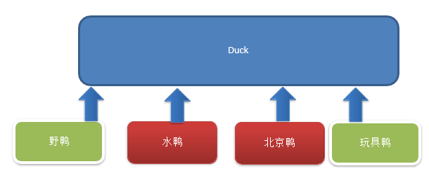

### 存在的问题
1. 其它鸭子，都继承了 Duck 类，所以 fly 让所有子类都会飞了，这是不正确的
2. 对类的局部改动，尤其超类的局部改动，会影响其他部分。会有溢出效应
3. 如果我们有一个玩具鸭子 `ToyDuck`, 这样就需要 `ToyDuck` 去 **重写** `Duck` 的所有实现的方法

---
## 使用策略模式解决
### 基本介绍
1. 策略模式（Strategy Pattern）中，定义 **算法族（策略组）** ，分别封装起来，让他们之间可以互相替换，此模式让 **算法的变化独立于使用算法的客户**
2. 这算法体现了几个设计原则，第一、把变化的代码从不变的代码中分离出来；第二、针对接口编程而不是具体类（定义了策略接口）；第三、多用组合/聚合，少用继承（客户通过组合方式使用策略）。

### 类图


### 代码实现
* FlyBehavior
```java
public interface FlyBehavior {
	void fly();
}

public class GoodFlyBehavior implements FlyBehavior {

	@Override
	public void fly() {
		System.out.println("飞翔技术超高");
	}

}

public class NoFlyBehavior implements FlyBehavior{

	@Override
	public void fly() {
		System.out.println("不会飞翔");
	}

}

public class BadFlyBehavior implements FlyBehavior{

	@Override
	public void fly() {
		System.out.println("飞翔技术一般");
	}

}
```

* QuackBehavior
```java
public interface QuackBehavior {
	void quack();
}
```

* Duck
```java
public abstract class Duck {
	// 属性, 策略接口
	protected FlyBehavior flyBehavior;
	// 其它属性<->策略接口
	protected QuackBehavior quackBehavior;

	public Duck() {

	}

	// 显示鸭子信息
	public abstract void display();

	public void quack() {
		System.out.println("鸭子嘎嘎叫~~");
	}

	public void swim() {
		System.out.println("鸭子会游泳~~");
	}

	public void fly() {
		// 改进
		if (flyBehavior != null) {
			flyBehavior.fly();
		}
	}

	public void setFlyBehavior(FlyBehavior flyBehavior) {
		this.flyBehavior = flyBehavior;
	}

	public void setQuackBehavior(QuackBehavior quackBehavior) {
		this.quackBehavior = quackBehavior;
	}
}

public class WildDuck extends Duck {

	// 构造器，传入FlyBehavor 的对象
	public WildDuck() {
		flyBehavior = new GoodFlyBehavior();
	}

	@Override
	public void display() {
		System.out.println(" 这是野鸭 ");
	}

}

public class PekingDuck extends Duck {
	// 假如北京鸭可以飞翔，但是飞翔技术一般
	public PekingDuck() {
		flyBehavior = new BadFlyBehavior();

	}

	@Override
	public void display() {
		System.out.println("~~北京鸭~~~");
	}
}

public class ToyDuck extends Duck {

	public ToyDuck() {
		flyBehavior = new NoFlyBehavior();
	}

	@Override
	public void display() {
		System.out.println("玩具鸭");
	}

	// 需要重写父类的所有方法
	public void quack() {
		System.out.println("玩具鸭不能叫~~");
	}

	public void swim() {
		System.out.println("玩具鸭不会游泳~~");
	}
}
```

* Client
```java
public class Client {
	public static void main(String[] args) {
		WildDuck wildDuck = new WildDuck();
		wildDuck.display();
		wildDuck.fly();

		System.out.println();
		ToyDuck toyDuck = new ToyDuck();
		toyDuck.display();
		toyDuck.fly();

		System.out.println();
		PekingDuck pekingDuck = new PekingDuck();
		pekingDuck.display();
		pekingDuck.fly();

		// 动态改变某个对象的行为, 北京鸭 不能飞
		pekingDuck.setFlyBehavior(new NoFlyBehavior());
		System.out.println("北京鸭的实际飞翔能力");
		pekingDuck.fly();
	}
}
```

---
## 策略模式注意细节
1. 策略模式的关键是：分析项目中变化部分与不变部分
2. 策略模式的核心思想是：多用组合/聚合 少用继承；用行为类组合，而不是行为的继承。更有弹性
3. 体现了“对修改关闭，对扩展开放”原则，客户端增加行为不用修改原有代码，只要添加一种策略（或者行为） 即可，避免了使用多重转移语句（if..else if..else）
4. 提供了可以替换继承关系的办法： 策略模式将算法封装在独立的Strategy 类中使得你可以独立于其Context 改变它，使它易于切换、易于理解、易于扩展
5. 需要注意的是：每添加一个策略就要增加一个类，当策略过多是会导致类数目庞

---
# 职责链模式
---
## 需求
**采购审批项目**
1. 如果金额 `x <= 5000`,  由 **系主任** 审批
2. 如果金额 `5000< x <=10000`,  由 **院长** 审批
3. 如果金额 `10000< x <=30000`,  由 **副校长** 审批
4. 如果金额 `30000 < x`，有 **校长** 审批

---
## 传统解决方案

接收到一个采购请求后，根据采购金额来调用对应的 Approver (审批人)完成审批。

### 存在的问题
 客户端这里会使用到 分支判断(比如 switch) 来对不同的采购请求处理， 这样就存在如下问题
 1. 如果各个级别的人员审批金额发生变化，在客户端的也需要变化
 2. 客户端必须明确的知道 有多少个审批级别和访问
 3. 这样 对一个采购请求进行处理 和 Approver (审批人) 就存在强耦合关系，不利于代码的扩展和维护

---
## 使用职责链模式解决
### 职责链模式基本介绍
1. 责链模式（Chain of Responsibility Pattern）, 又叫 责任链模式，为请求创建了一个接收者对象的链。这种模式对 **请求的发送者和接收者进行解耦** 。
2. 职责链模式通常每个接收者都包含对另一个接收者的引用。如果一个对象不能处理该请求，那么它会把相同的请求传给下一个接收者，依此类推。
3. 这种类型的设计模式属于行为型模式

### 类图


### 代码实现
* Approver
```java
public abstract class Approver {
	/**
	 * 上级审批人
	 */
	protected Approver upApprover;
	/**
	 * 名字
	 */
	protected String name;

	public Approver(String name) {
		this.name = name;
	}

	public void setApprover(Approver upApprover) {
		this.upApprover = upApprover;
	}

	// 处理审批请求的方法，得到一个请求, 处理是子类完成，因此该方法做成抽象
	public abstract void processRequest(PurchaseRequest purchaseRequest);
}

// 系主任
public class DepartmentApprover extends Approver {

	public DepartmentApprover(String name) {
		super(name);
	}

	@Override
	public void processRequest(PurchaseRequest purchaseRequest) {
		if (purchaseRequest.getPrice() <= 5000) {
			System.out.println(" 请求编号 id= " + purchaseRequest.getId() + " 被 " + this.name + " 处理");
		} else {
			upApprover.processRequest(purchaseRequest);
		}
	}

}

// 院长
public class CollegeApprover extends Approver {

	public CollegeApprover(String name) {
		super(name);
	}

	@Override
	public void processRequest(PurchaseRequest purchaseRequest) {
		if(purchaseRequest.getPrice() < 5000 && purchaseRequest.getPrice() <= 10000) {
			System.out.println(" 请求编号 id= " + purchaseRequest.getId() + " 被 " + this.name + " 处理");
		}else {
			upApprover.processRequest(purchaseRequest);
		}
	}
}

// 副校长
public class ViceSchoolMasterApprover extends Approver {

	public ViceSchoolMasterApprover(String name) {
		super(name);
	}

	@Override
	public void processRequest(PurchaseRequest purchaseRequest) {
		if(purchaseRequest.getPrice() < 10000 && purchaseRequest.getPrice() <= 30000) {
			System.out.println(" 请求编号 id= " + purchaseRequest.getId() + " 被 " + this.name + " 处理");
		}else {
			upApprover.processRequest(purchaseRequest);
		}
	}
}

// 校长
public class SchoolMasterApprover extends Approver {

	public SchoolMasterApprover(String name) {
		super(name);
	}

	@Override
	public void processRequest(PurchaseRequest purchaseRequest) {
		if(purchaseRequest.getPrice() > 30000) {
			System.out.println(" 请求编号 id= " + purchaseRequest.getId() + " 被 " + this.name + " 处理");
		}else {
			upApprover.processRequest(purchaseRequest);
		}
	}
}
```

* PurchaseRequest
```java
// 审批请求
public class PurchaseRequest {
	// 请求类型
	private int type = 0;
	// 请求金额
	private float price = 0.0f;
	// id
	private int id = 0;

	// 构造器
	public PurchaseRequest(int type, float price, int id) {
		this.type = type;
		this.price = price;
		this.id = id;
	}

	public int getType() {
		return type;
	}

	public float getPrice() {
		return price;
	}

	public int getId() {
		return id;
	}

}
```

* Client
```java
public class Client {
	public static void main(String[] args) {
		// 创建一个请求
		PurchaseRequest purchaseRequest = new PurchaseRequest(1, 31000, 1);

		// 创建相关的审批人
		DepartmentApprover departmentApprover = new DepartmentApprover("张主任");
		CollegeApprover collegeApprover = new CollegeApprover("李院长");
		ViceSchoolMasterApprover viceSchoolMasterApprover = new ViceSchoolMasterApprover("王副校");
		SchoolMasterApprover schoolMasterApprover = new SchoolMasterApprover("佟校长");

		// 需要将各个审批级别的下一个设置好 (处理人构成环形)
		departmentApprover.setApprover(collegeApprover);
		collegeApprover.setApprover(viceSchoolMasterApprover);
		viceSchoolMasterApprover.setApprover(schoolMasterApprover);
		schoolMasterApprover.setApprover(departmentApprover);

		departmentApprover.processRequest(purchaseRequest);
		viceSchoolMasterApprover.processRequest(purchaseRequest);
	}
}
```

---
## 职责链模式在spirngmvc中的应用


---
## 注意事项
1. 将请求和处理分开，实现解耦，提高系统的灵活性
2. 简化了对象，使对象不需要知道链的结构
3. 性能会受到影响，特别是在链比较长的时候，因此需控制链中最大节点数量，一般通过在 Handler 中设置一个最大节点数量，在 `setNext()` 方法中判断是否已经超过阀值，超过则不允许该链建立，避免出现超长链无意识地破坏系统性能
4. 调试不方便。采用了类似递归的方式，调试时逻辑可能比较复杂
5. 最佳应用场景：有多个对象可以处理同一个请求时，比如：多级请求、请假/加薪等审批流程、Java Web 中 Tomcat 对 Encoding 的处理、拦截器
