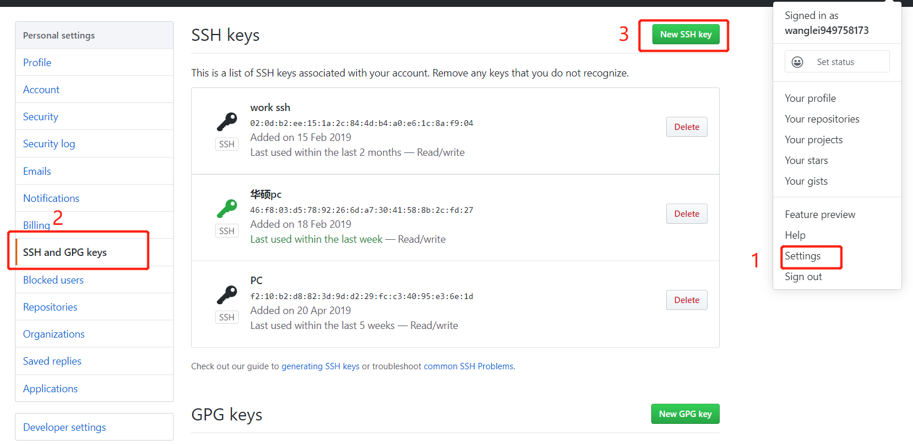

# 创建SSH Key
```
ssh-keygen -t rsa -C "youremail@example.com"
```

# 设置GitHub
登陆GitHub，进行如下操作


将`C:\Users\用户\.ssh\id_rsa.pub`中的内容填写到key中。

# Git全局配置
```
git config --global user.email "you@example.com"
git config --global user.name "Your Name"
```

# git bash 显示中文
```
git config --global core.quotepath false
```
