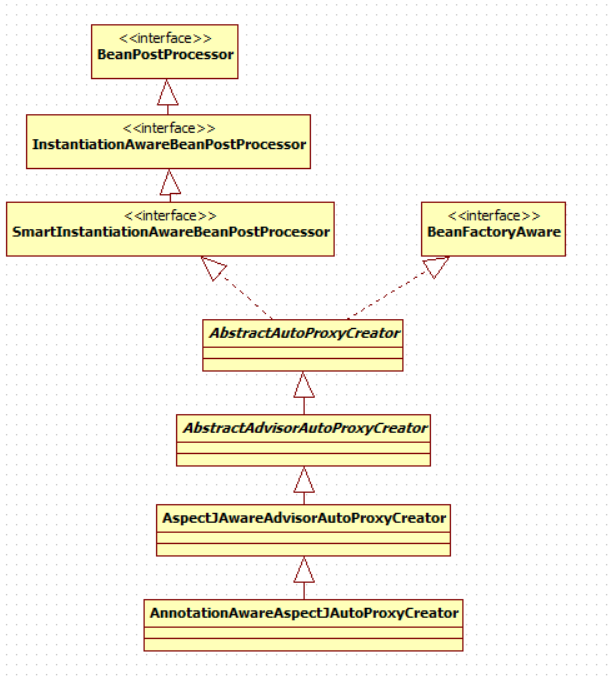
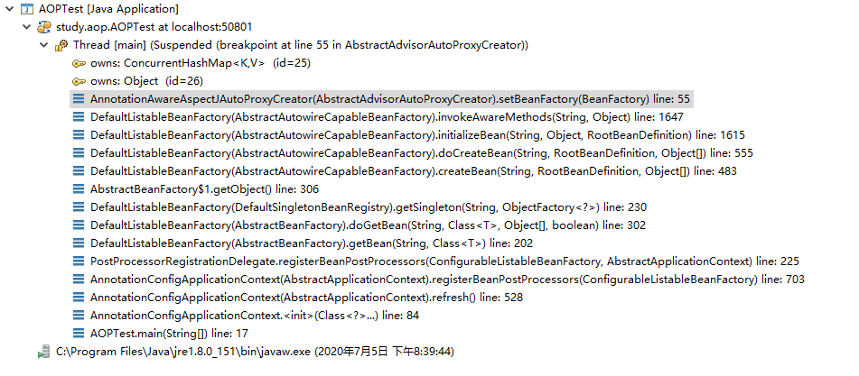
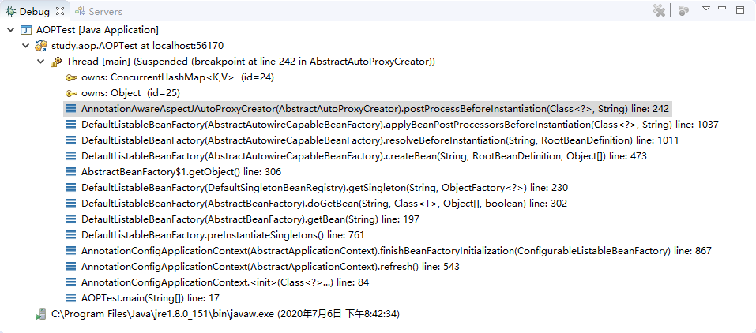

# AOP原理

## @EnableAspectJAutoProxy

**@EnableAspectJAutoProxy的最终效果是在beanFactory中注册了AnnotationAwareAspectJAutoProxyCreator组件**

```java
@Import(AspectJAutoProxyRegistrar.class) // 导入自动代理注册器
public @interface EnableAspectJAutoProxy {
}
```

```java
class AspectJAutoProxyRegistrar implements ImportBeanDefinitionRegistrar {

	/**
	 * Register, escalate, and configure the AspectJ auto proxy creator based on the value
	 * of the @{@link EnableAspectJAutoProxy#proxyTargetClass()} attribute on the importing
	 * {@code @Configuration} class.
	 */
	@Override
	public void registerBeanDefinitions(
			AnnotationMetadata importingClassMetadata, BeanDefinitionRegistry registry) {

        // 注册AnnotationAwareAspectJAutoProxyCreator
		AopConfigUtils.registerAspectJAnnotationAutoProxyCreatorIfNecessary(registry);

		AnnotationAttributes enableAspectJAutoProxy =
				AnnotationConfigUtils.attributesFor(importingClassMetadata, EnableAspectJAutoProxy.class);
		if (enableAspectJAutoProxy.getBoolean("proxyTargetClass")) {
			AopConfigUtils.forceAutoProxyCreatorToUseClassProxying(registry);
		}
		if (enableAspectJAutoProxy.getBoolean("exposeProxy")) {
			AopConfigUtils.forceAutoProxyCreatorToExposeProxy(registry);
		}
	}

}
```

## AnnotationAwareAspectJAutoProxyCreator

### 继承关系

**实际上AnnotationAwareAspectJAutoProxyCreator是一个BeanPostProcessor，也是一个BeanFactoryAware**



### setBeanFactory

* AbstractAdvisorAutoProxyCreator.setBeanFactory

```java
	@Override
	public void setBeanFactory(BeanFactory beanFactory) {
        // 保存beanFactory
		super.setBeanFactory(beanFactory);
		if (!(beanFactory instanceof ConfigurableListableBeanFactory)) {
			throw new IllegalStateException("Cannot use AdvisorAutoProxyCreator without a 		ConfigurableListableBeanFactory");
		}
        // 初始化beanFactory
		initBeanFactory((ConfigurableListableBeanFactory) beanFactory);
	}
```

### AnnotationAwareAspectJAutoProxyCreator创建和注册流程

* 将断点打在`AbstractAdvisorAutoProxyCreator.setBeanFactory()`的`super.setBeanFactory(beanFactory)`上

  

#### 传入配置类，创建ioc容器

####  注册配置类，`refresh()`容器

####  `registerBeanPostProcessors`,注册Bean的后置处理器

1. 先获取容器中所有需要实例化的`BeanPostProcessors`

2. 给容器中添加额外的后置处理器`BeanPostProcessorChecker`

3. 优先注册实现了`PriorityOrdered`接口的`BeanPostProcessor`

4. 再给容器中注册实现了`Ordered`接口的BeanPostProcessor

5. 注册没实现优先级接口的`BeanPostProcessor`

6. 注册`BeanPostProcessor`，实际上就是创建`BeanPostProcessor`对象，保存在容器中

   创建`internalAutoProxyCreator`的`BeanPostProcessor`【`AnnotationAwareAspectJAutoProxyCreator`】

   * 创建Bean的实例
   * `populateBean()`，给Bean的各种属性赋值
   * `initializeBean()`,初始化Bean
     * `invokeAwareMethods()`,处理`aware()`方法的回调
     * `applyBeanPostProcessorsBeforeInitialization()`，应用后置处理器的`postProcessBeforeInitialization()`
     * `invokeInitMethods()`,执行自定义的初始化方法
     * `applyBeanPostProcessorsAfterInitialization()`,应用后置处理器的`postProcessAfterInitialization()`

7. 把`BeanPostProcessor`注册到`BeanFactory`中

###  后置处理(包装需要代理的bean的过程)

* AbstractAutoProxyCreator

```java
// 实例化前的后置处理
public Object postProcessBeforeInstantiation(Class<?> beanClass, String beanName) throws BeansException {}
// 实例化后的后置处理(Nothing to do)
public boolean postProcessAfterInstantiation(Object bean, String beanName) {}
// 初始化前的后置处理(Nothing to do)
public Object postProcessBeforeInitialization(Object bean, String beanName) {}
// 初始化后的后置处理
public Object postProcessAfterInitialization(Object bean, String beanName) throws BeansException {}
```

#### postProcessBeforeInstantiation是如何被调用的



* `finishBeanFactoryInitialization // 完成Bean工厂的初始化,创建剩下的单实例Bean`

* `getBean(beanName)`

* `doGetBean(name, null, null, false)`
*  `getSingleton(beanName, new ObjectFactory<Object>())`
* `singletonFactory.getObject()`

* `createBean(beanName, mbd, args)`

* `resolveBeforeInstantiation() // 给后置处理器一个机会返回一个新的bean来代替当前bean`

* `applyBeanPostProcessorsBeforeInstantiation(targetType, beanName) // 应用实例化后置处理器的前置方法`

  **至此`AbstractAutoProxyCreator.postProcessBeforeInstantiation()被调用`**

  

#### postProcessBeforInstantiation执行流程

```java
@Override
	public Object postProcessBeforeInstantiation(Class<?> beanClass, String beanName) throws BeansException {
		Object cacheKey = getCacheKey(beanClass, beanName);

        // beanName != null || 目标bean中不包含此bean
		if (beanName == null || !this.targetSourcedBeans.contains(beanName)) {
            // bean已经被增强
			if (this.advisedBeans.containsKey(cacheKey)) {
				return null;
			}
            // 基础bean || 需要跳过的bean
            // 基础Bean((标注了Advice/Pointcut/Advisor/AopInfrastructureBean))
            // 需要跳过的bean(spring中的一些内置的不需要被增强的bean)
			if (isInfrastructureClass(beanClass) || shouldSkip(beanClass, beanName)) {
				this.advisedBeans.put(cacheKey, Boolean.FALSE);
				return null;
			}
		}

		// Create proxy here if we have a custom TargetSource.
		// Suppresses unnecessary default instantiation of the target bean:
		// The TargetSource will handle target instances in a custom fashion.
		if (beanName != null) {
			TargetSource targetSource = getCustomTargetSource(beanClass, beanName);
			if (targetSource != null) {
				this.targetSourcedBeans.add(beanName);
				Object[] specificInterceptors = getAdvicesAndAdvisorsForBean(beanClass, beanName, targetSource);
				Object proxy = createProxy(beanClass, beanName, specificInterceptors, targetSource);
				this.proxyTypes.put(cacheKey, proxy.getClass());
				return proxy;
			}
		}

		return null;
	}
```

以`MathCalculator`为例，说明 `postProcessBeforeInstantiation()`执行流程：

1. 判断当前bean是否在`advisedBeans`中，**即是否已被增强**
2. 判断当前bean是否为基础bean或者是否需要跳过
   * 基础bean(**标注了Advice/Pointcut/Advisor/AopInfrastructureBean**)
   * 需要跳过(**获取候选的增强器`List<Advisor> candidateAdvisors`，判断是否为`InstantiationModelAwarePointcutAdvisor`类型，是才返回true，不是则返回false**)
3. 无自定义的`targetSource`，直接返回null

#### postProcessAfterInitialization执行流程

```java
public Object postProcessAfterInitialization(Object bean, String beanName) throws BeansException {
    if (bean != null) {
        Object cacheKey = getCacheKey(bean.getClass(), beanName);
        if (!this.earlyProxyReferences.contains(cacheKey)) {
            // 进行包装
            return wrapIfNecessary(bean, beanName, cacheKey);
        }
    }
    return bean;
}

protected Object wrapIfNecessary(Object bean, String beanName, Object cacheKey) {
    if (beanName != null && this.targetSourcedBeans.contains(beanName)) {
        return bean;
    }
    if (Boolean.FALSE.equals(this.advisedBeans.get(cacheKey))) {
        return bean;
    }
    if (isInfrastructureClass(bean.getClass()) || shouldSkip(bean.getClass(), beanName)) {
        this.advisedBeans.put(cacheKey, Boolean.FALSE);
        return bean;
    }

    // Create proxy if we have advice.
    Object[] specificInterceptors = getAdvicesAndAdvisorsForBean(bean.getClass(), beanName, null);
    if (specificInterceptors != DO_NOT_PROXY) {
        this.advisedBeans.put(cacheKey, Boolean.TRUE);
        Object proxy = createProxy(
            bean.getClass(), beanName, specificInterceptors, new SingletonTargetSource(bean));
        this.proxyTypes.put(cacheKey, proxy.getClass());
        return proxy;
    }

    this.advisedBeans.put(cacheKey, Boolean.FALSE);
    return bean;
}
```

1. 获取当前bean的所有增强器(**通知方法**)，`Object[] specificInterceptors = getAdvicesAndAdvisorsForBean(bean.getClass(), beanName, null)`

   ```java
   @Override
   protected Object[] getAdvicesAndAdvisorsForBean(Class<?> beanClass, String beanName, TargetSource targetSource) {
       // 获取合适的增前期
       List<Advisor> advisors = findEligibleAdvisors(beanClass, beanName);
       if (advisors.isEmpty()) {
           return DO_NOT_PROXY;
       }
       return advisors.toArray();
   }
   protected List<Advisor> findEligibleAdvisors(Class<?> beanClass, String beanName) {
       // 获取所有候选的增强器
       List<Advisor> candidateAdvisors = findCandidateAdvisors();
       // 获取可以给bean使用的增前期
       List<Advisor> eligibleAdvisors = findAdvisorsThatCanApply(candidateAdvisors, beanClass, beanName);
       extendAdvisors(eligibleAdvisors);
       if (!eligibleAdvisors.isEmpty()) {
           eligibleAdvisors = sortAdvisors(eligibleAdvisors);
       }
       return eligibleAdvisors;
   }
   ```

   * 找到候选的所有的增强器
   * 获取到能在bean使用的增强器
   * 给增强器排序

2. 保存当前bean在advisedBeans中；

3. 创建代理对象；

   ```java
   protected Object createProxy(
       Class<?> beanClass, String beanName, Object[] specificInterceptors, TargetSource targetSource) {
   
       if (this.beanFactory instanceof ConfigurableListableBeanFactory) {
           AutoProxyUtils.exposeTargetClass((ConfigurableListableBeanFactory) this.beanFactory, beanName, beanClass);
       }
   
       ProxyFactory proxyFactory = new ProxyFactory();
       proxyFactory.copyFrom(this);
   
       if (!proxyFactory.isProxyTargetClass()) {
           if (shouldProxyTargetClass(beanClass, beanName)) {
               proxyFactory.setProxyTargetClass(true);
           }
           else {
               evaluateProxyInterfaces(beanClass, proxyFactory);
           }
       }
   
       // 找到增强器(通知方法)
       Advisor[] advisors = buildAdvisors(beanName, specificInterceptors);
       // 将增强器保存到代理工厂中
       proxyFactory.addAdvisors(advisors);
       proxyFactory.setTargetSource(targetSource);
       customizeProxyFactory(proxyFactory);
   
       proxyFactory.setFrozen(this.freezeProxy);
       if (advisorsPreFiltered()) {
           proxyFactory.setPreFiltered(true);
       }
   
       // 通过代理工厂获取代理对象
       return proxyFactory.getProxy(getProxyClassLoader());
   }
   ```

   * 找到增强器(通知方法)

   * 将增强器保存到代理工厂中

   * 通过代理工厂获取代理对象

     ```java
     public AopProxy createAopProxy(AdvisedSupport config) throws AopConfigException {
     		if (config.isOptimize() || config.isProxyTargetClass() || hasNoUserSuppliedProxyInterfaces(config)) {
     			Class<?> targetClass = config.getTargetClass();
     			if (targetClass == null) {
     				throw new AopConfigException("TargetSource cannot determine target class: " +
     						"Either an interface or a target is required for proxy creation.");
     			}
     			if (targetClass.isInterface() || Proxy.isProxyClass(targetClass)) {
                     // 创建JDK动态代理
     				return new JdkDynamicAopProxy(config);
     			}
                 // 创建cglib代理
     			return new ObjenesisCglibAopProxy(config);
     		}
     		else {
                 // 创建JDK动态代理
     			return new JdkDynamicAopProxy(config);
     		}
     	}
     ```

4. 返回代理对象