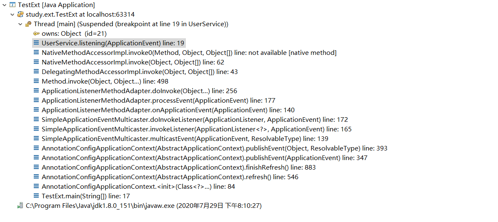

# ApplicationListener

## 基本使用

### 编写类实现ApplicationListener并加入到容器中

```java
@Component
public class MyApplicationListener implements ApplicationListener<ApplicationEvent>{

	@Override
	public void onApplicationEvent(ApplicationEvent event) {
		System.out.println(event.toString());
	}

}
```

### 当容器中有事件发生,就会得到通知

* `ContextRefreshedEvent`：容器刷新完成（所有bean都完全创建）会发布这个事件；
* `ContextClosedEvent`：关闭容器会发布这个事件；

## 如何自定义事件

### 定义事件

```java
public class MyEvent extends ApplicationEvent {

	public MyEvent() {
		super("My Event");
	}

	private static final long serialVersionUID = 1L;

}
```

### 发布事件

```java
public static void main(String[] args) {
    AnnotationConfigApplicationContext applicationContext =
        new AnnotationConfigApplicationContext(ExtConfig.class);

    // 发布事件
    applicationContext.publishEvent(new MyEvent());

    applicationContext.close();
}
```

## 使用注解方式监听容器中的事件

```java
@Service
public class UserService {
	@EventListener(classes = { ApplicationEvent.class })
	public void listening(ApplicationEvent event) {
		System.out.println("UserService " + event);
	}
}
```

## ApplicationListener事件监听原理



### 完成刷新，发布事件

```java
protected void finishRefresh() {
    // Initialize lifecycle processor for this context.
    initLifecycleProcessor();

    // Propagate refresh to lifecycle processor first.
    getLifecycleProcessor().onRefresh();

    // 发布事件.
    publishEvent(new ContextRefreshedEvent(this));

    // Participate in LiveBeansView MBean, if active.
    LiveBeansView.registerApplicationContext(this);
}
```

### 多播器派发事件

```java
@Override
public void publishEvent(ApplicationEvent event) {
    publishEvent(event, null);
}

protected void publishEvent(Object event, ResolvableType eventType) {
    Assert.notNull(event, "Event must not be null");
    if (logger.isTraceEnabled()) {
        logger.trace("Publishing event in " + getDisplayName() + ": " + event);
    }

    // Decorate event as an ApplicationEvent if necessary
    ApplicationEvent applicationEvent;
    if (event instanceof ApplicationEvent) {
        applicationEvent = (ApplicationEvent) event;
    }
    else {
        applicationEvent = new PayloadApplicationEvent<Object>(this, event);
        if (eventType == null) {
            eventType = ((PayloadApplicationEvent)applicationEvent).getResolvableType();
        }
    }

    // Multicast right now if possible - or lazily once the multicaster is initialized
    if (this.earlyApplicationEvents != null) {
        this.earlyApplicationEvents.add(applicationEvent);
    }
    else {
        // 获取多播器，派发事件
        getApplicationEventMulticaster().multicastEvent(applicationEvent, eventType);
    }

    // Publish event via parent context as well...
    if (this.parent != null) {
        if (this.parent instanceof AbstractApplicationContext) {
            ((AbstractApplicationContext) this.parent).publishEvent(event, eventType);
        }
        else {
            this.parent.publishEvent(event);
        }
    }
}
```

#### 多播器的初始化

`refresh() -> initApplicationEventMulticaster()`

```java
protected void initApplicationEventMulticaster() {
    ConfigurableListableBeanFactory beanFactory = getBeanFactory();
    if (beanFactory.containsLocalBean(APPLICATION_EVENT_MULTICASTER_BEAN_NAME)) {
        this.applicationEventMulticaster =
            beanFactory.getBean(APPLICATION_EVENT_MULTICASTER_BEAN_NAME, ApplicationEventMulticaster.class);
        if (logger.isDebugEnabled()) {
            logger.debug("Using ApplicationEventMulticaster [" + this.applicationEventMulticaster + "]");
        }
    }
    else {
        // 无多播器则初始化多播器
        this.applicationEventMulticaster = new SimpleApplicationEventMulticaster(beanFactory);
        beanFactory.registerSingleton(APPLICATION_EVENT_MULTICASTER_BEAN_NAME, this.applicationEventMulticaster);
        if (logger.isDebugEnabled()) {
            logger.debug("Unable to locate ApplicationEventMulticaster with name '" +
                         APPLICATION_EVENT_MULTICASTER_BEAN_NAME +
                         "': using default [" + this.applicationEventMulticaster + "]");
        }
    }
}
```

#### 监听器的注册

`refresh() -> registerListeners()`

```java
protected void registerListeners() {
    // Register statically specified listeners first.
    for (ApplicationListener<?> listener : getApplicationListeners()) {
        getApplicationEventMulticaster().addApplicationListener(listener);
    }

    // Do not initialize FactoryBeans here: We need to leave all regular beans
    // uninitialized to let post-processors apply to them!
    // 根据类型获取监听器，注册监听器
    String[] listenerBeanNames = getBeanNamesForType(ApplicationListener.class, true, false);
    for (String listenerBeanName : listenerBeanNames) {
        getApplicationEventMulticaster().addApplicationListenerBean(listenerBeanName);
    }

    // Publish early application events now that we finally have a multicaster...
    Set<ApplicationEvent> earlyEventsToProcess = this.earlyApplicationEvents;
    this.earlyApplicationEvents = null;
    if (earlyEventsToProcess != null) {
        for (ApplicationEvent earlyEvent : earlyEventsToProcess) {
            getApplicationEventMulticaster().multicastEvent(earlyEvent);
        }
    }
}
```

#### 获取监听器，执行`onApplicationEvent`

```java
@Override
public void multicastEvent(final ApplicationEvent event, ResolvableType eventType) {
    ResolvableType type = (eventType != null ? eventType : resolveDefaultEventType(event));
    // 获取监听器
    for (final ApplicationListener<?> listener : getApplicationListeners(event, type)) {
        Executor executor = getTaskExecutor();
        if (executor != null) {
            executor.execute(new Runnable() {
                @Override
                public void run() {
                    invokeListener(listener, event);
                }
            });
        }
        else {
            // 执行监听
            invokeListener(listener, event);
        }
    }
}
```

## @EventListener原理

### 在bean实例化后解析注解，注册监听器

```java
// 实现了SmartInitializingSingleton接口，在Bean实例化后afterSingletonsInstantiated会被调用
public class EventListenerMethodProcessor implements SmartInitializingSingleton, ApplicationContextAware{
}
```

### SmartInitializingSingleton原理

```java
// DefaultListableBeanFactory
public void preInstantiateSingletons() throws BeansException {
    if (this.logger.isDebugEnabled()) {
        this.logger.debug("Pre-instantiating singletons in " + this);
    }

    // Iterate over a copy to allow for init methods which in turn register new bean definitions.
    // While this may not be part of the regular factory bootstrap, it does otherwise work fine.
    List<String> beanNames = new ArrayList<String>(this.beanDefinitionNames);

    // Trigger initialization of all non-lazy singleton beans...
    for (String beanName : beanNames) {
        RootBeanDefinition bd = getMergedLocalBeanDefinition(beanName);
        if (!bd.isAbstract() && bd.isSingleton() && !bd.isLazyInit()) {
            if (isFactoryBean(beanName)) {
                final FactoryBean<?> factory = (FactoryBean<?>) getBean(FACTORY_BEAN_PREFIX + beanName);
                boolean isEagerInit;
                if (System.getSecurityManager() != null && factory instanceof SmartFactoryBean) {
                    isEagerInit = AccessController.doPrivileged(new PrivilegedAction<Boolean>() {
                        @Override
                        public Boolean run() {
                            return ((SmartFactoryBean<?>) factory).isEagerInit();
                        }
                    }, getAccessControlContext());
                }
                else {
                    isEagerInit = (factory instanceof SmartFactoryBean &&
                                   ((SmartFactoryBean<?>) factory).isEagerInit());
                }
                if (isEagerInit) {
                    getBean(beanName);
                }
            }
            else {
                getBean(beanName);
            }
        }
    }

    // Trigger post-initialization callback for all applicable beans...
    for (String beanName : beanNames) {
        Object singletonInstance = getSingleton(beanName);
        if (singletonInstance instanceof SmartInitializingSingleton) {
            // 是SmartInitializingSingleton的实例,调用afterSingletonsInstantiated()函数
            final SmartInitializingSingleton smartSingleton = (SmartInitializingSingleton) singletonInstance;
            if (System.getSecurityManager() != null) {
                AccessController.doPrivileged(new PrivilegedAction<Object>() {
                    @Override
                    public Object run() {
                        smartSingleton.afterSingletonsInstantiated();
                        return null;
                    }
                }, getAccessControlContext());
            }
            else {
                smartSingleton.afterSingletonsInstantiated();
            }
        }
    }
}
```

