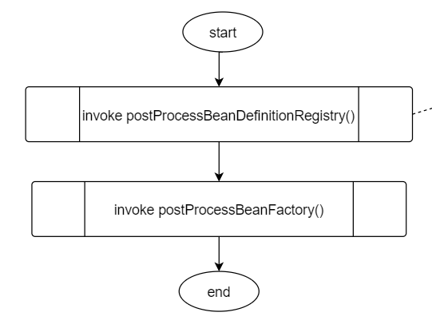
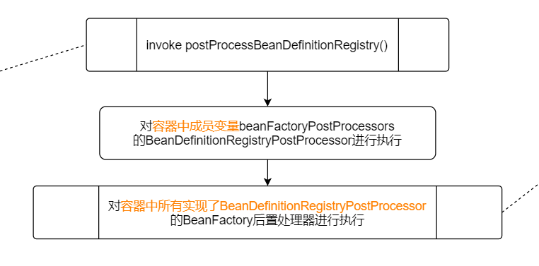
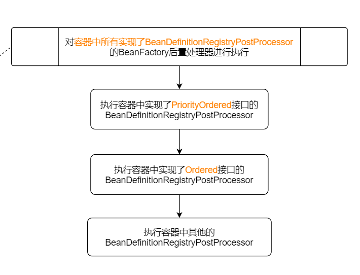
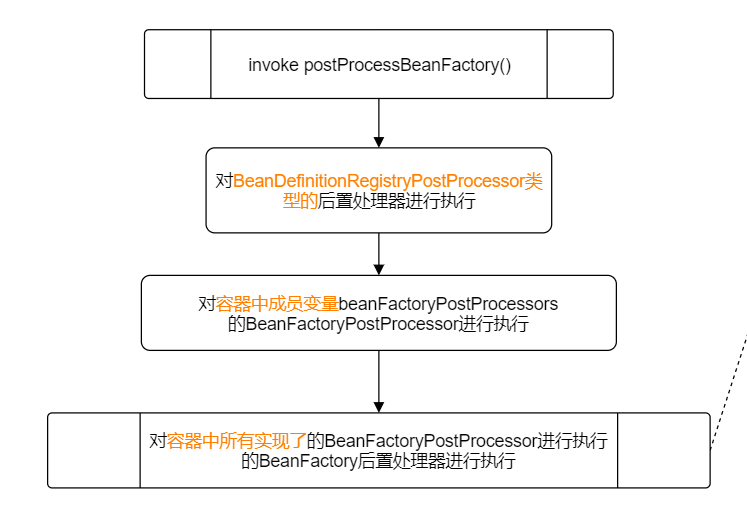
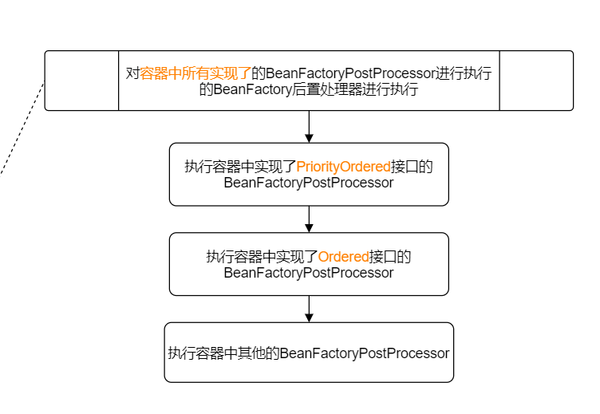

# BeanFactory的后置处理

该步工作主要完成以下两个功能。

1. `通过回调函数postProcessBeanFactory()允许子类对BeanFactory进行后置处理`；
2. `执行容器中的BeanFactory后置处理器`

## 支持子类对BeanFactory进行后置处理

```java
/**
 * Modify the application context's internal bean factory after its standard
 * initialization. All bean definitions will have been loaded, but no beans
 * will have been instantiated yet. This allows for registering special
 * BeanPostProcessors etc in certain ApplicationContext implementations.
 * @param beanFactory the bean factory used by the application context
 */
protected void postProcessBeanFactory(ConfigurableListableBeanFactory beanFactory) {
}
```

## invokeBeanFactoryPostProcessors



### invoke postProcessBeanDefinitionRegistry()



1. 对容器中`成员变量beanFactoryPostProcessors`的BeanDefinitionRegistryPostProcessor进行执行

2. 对`容器中所有实现了BeanDefinitionRegistryPostProcessor的BeanFactory`后置处理器进行执行

   

   1. 执行容器中实现了`PriorityOrdered`接口的BeanDefinitionRegistryPostProcessor
   2. 执行容器中实现了`Ordered`接口的BeanDefinitionRegistryPostProcessor
   3. 执行容器中`其他`的BeanDefinitionRegistryPostProcessor

### invoke postProcessBeanFactory()




1. 对`BeanDefinitionRegistryPostProcessor类型`的后置处理器进行执行

2. 对`容器中成员变量beanFactoryPostProcessors`的BeanFactoryPostProcessor进行执行

3. 对`容器中所有实现了的BeanFactoryPostProcessor`进行执行的BeanFactory后置处理器进行执行



		1. 执行容器中实现了`PriorityOrdered`接口的BeanFactoryPostProcessor
  		2. 执行容器中实现了`Ordered`接口的BeanFactoryPostProcessor
  		3. 执行容器中`其他`的BeanFactoryPostProcessor

## 源码

```java
protected void invokeBeanFactoryPostProcessors(ConfigurableListableBeanFactory beanFactory) {
    PostProcessorRegistrationDelegate.invokeBeanFactoryPostProcessors(beanFactory, getBeanFactoryPostProcessors());

    // Detect a LoadTimeWeaver and prepare for weaving, if found in the meantime
    // (e.g. through an @Bean method registered by ConfigurationClassPostProcessor)
    if (beanFactory.getTempClassLoader() == null && beanFactory.containsBean(LOAD_TIME_WEAVER_BEAN_NAME)) {
        beanFactory.addBeanPostProcessor(new LoadTimeWeaverAwareProcessor(beanFactory));
        beanFactory.setTempClassLoader(new ContextTypeMatchClassLoader(beanFactory.getBeanClassLoader()));
    }
}
```

```java
if (beanFactory instanceof BeanDefinitionRegistry) {
    // 将普通的BeanFactoryPostProcessor和BeanDefinitionRegistryPostProcessor进行分离
    BeanDefinitionRegistry registry = (BeanDefinitionRegistry) beanFactory;
    List<BeanFactoryPostProcessor> regularPostProcessors = 
        new LinkedList<BeanFactoryPostProcessor>();
    List<BeanDefinitionRegistryPostProcessor> registryProcessors = 
        new LinkedList<BeanDefinitionRegistryPostProcessor>();

    for (BeanFactoryPostProcessor postProcessor : beanFactoryPostProcessors) {
        if (postProcessor instanceof BeanDefinitionRegistryPostProcessor) {
            BeanDefinitionRegistryPostProcessor registryProcessor =
                (BeanDefinitionRegistryPostProcessor) postProcessor;
            // 对容器中成员变量beanFactoryPostProcessors
            // 的BeanDefinitionRegistryPostProcessor进行执行
            registryProcessor.postProcessBeanDefinitionRegistry(registry);
            registryProcessors.add(registryProcessor);
        }
        else {
            regularPostProcessors.add(postProcessor);
        }
    }
    
    List<BeanDefinitionRegistryPostProcessor> currentRegistryProcessors = 
        new ArrayList<BeanDefinitionRegistryPostProcessor>();

    // First, invoke the BeanDefinitionRegistryPostProcessors 
    // that implement PriorityOrdered.
     // 执行实现了PriorityOrdered接口的BeanDefinitionRegistryPostProcessor
    String[] postProcessorNames = beanFactory.getBeanNamesForType(
        BeanDefinitionRegistryPostProcessor.class, true, false);
    for (String ppName : postProcessorNames) {
        if (beanFactory.isTypeMatch(ppName, PriorityOrdered.class)) {
            currentRegistryProcessors.add(
                beanFactory.getBean(ppName, BeanDefinitionRegistryPostProcessor.class));
            processedBeans.add(ppName);
        }
    }
    sortPostProcessors(currentRegistryProcessors, beanFactory);
    registryProcessors.addAll(currentRegistryProcessors);
    invokeBeanDefinitionRegistryPostProcessors(
        currentRegistryProcessors, registry);
    currentRegistryProcessors.clear();
    
    // 执行实现了Ordered接口的BeanDefinitionRegistryPostProcessor
    postProcessorNames = beanFactory.getBeanNamesForType(
    BeanDefinitionRegistryPostProcessor.class, true, false);
	for (String ppName : postProcessorNames) {
    	if (!processedBeans.contains(ppName) 
            && beanFactory.isTypeMatch(ppName, Ordered.class)) {
        	currentRegistryProcessors.add(beanFactory.getBean(
                ppName, BeanDefinitionRegistryPostProcessor.class));
        	processedBeans.add(ppName);
    	}
	}
    sortPostProcessors(currentRegistryProcessors, beanFactory);
    registryProcessors.addAll(currentRegistryProcessors);
    invokeBeanDefinitionRegistryPostProcessors(currentRegistryProcessors, registry);
    currentRegistryProcessors.clear();
    
    // 执行没有实现排序接口的BeanDefinitionRegistryPostProcessor
    boolean reiterate = true;
    while (reiterate) {
        reiterate = false;
        postProcessorNames = beanFactory.getBeanNamesForType(
            BeanDefinitionRegistryPostProcessor.class, true, false);
        for (String ppName : postProcessorNames) {
            if (!processedBeans.contains(ppName)) {
                currentRegistryProcessors.add(beanFactory.getBean(
                    ppName, BeanDefinitionRegistryPostProcessor.class));
                processedBeans.add(ppName);
                reiterate = true;
            }
        }
        sortPostProcessors(currentRegistryProcessors, beanFactory);
        registryProcessors.addAll(currentRegistryProcessors);
        invokeBeanDefinitionRegistryPostProcessors(currentRegistryProcessors, registry);
        currentRegistryProcessors.clear();
    }
    // Now, invoke the postProcessBeanFactory callback of all processors handled so far.
    // 执行BeanDefinitionRegistryPostProcessor的postProcessBeanFactory()
    invokeBeanFactoryPostProcessors(registryProcessors, beanFactory);
    // 对容器中成员变量beanFactoryPostProcessors
	// 的BeanFactoryPostProcessor进行执行
    invokeBeanFactoryPostProcessors(regularPostProcessors, beanFactory);
}
```

```java
// Do not initialize FactoryBeans here: We need to leave all regular beans
// uninitialized to let the bean factory post-processors apply to them!
String[] postProcessorNames =
    beanFactory.getBeanNamesForType(BeanFactoryPostProcessor.class, true, false);

// Separate between BeanFactoryPostProcessors that implement PriorityOrdered,
// Ordered, and the rest.
List<BeanFactoryPostProcessor> priorityOrderedPostProcessors = new ArrayList<BeanFactoryPostProcessor>();
List<String> orderedPostProcessorNames = new ArrayList<String>();
List<String> nonOrderedPostProcessorNames = new ArrayList<String>();
for (String ppName : postProcessorNames) {
    if (processedBeans.contains(ppName)) {
        // skip - already processed in first phase above
    }
    else if (beanFactory.isTypeMatch(ppName, PriorityOrdered.class)) {
        priorityOrderedPostProcessors.add(beanFactory.getBean(ppName, BeanFactoryPostProcessor.class));
    }
    else if (beanFactory.isTypeMatch(ppName, Ordered.class)) {
        orderedPostProcessorNames.add(ppName);
    }
    else {
        nonOrderedPostProcessorNames.add(ppName);
    }
}

// 执行实现了PriorityOrdered接口的后置处理器
sortPostProcessors(priorityOrderedPostProcessors, beanFactory);
invokeBeanFactoryPostProcessors(priorityOrderedPostProcessors, beanFactory);

// 执行实现了Ordered接口的后置处理器
List<BeanFactoryPostProcessor> orderedPostProcessors = new ArrayList<BeanFactoryPostProcessor>();
for (String postProcessorName : orderedPostProcessorNames) {
    orderedPostProcessors.add(beanFactory.getBean(postProcessorName, BeanFactoryPostProcessor.class));
}
sortPostProcessors(orderedPostProcessors, beanFactory);
invokeBeanFactoryPostProcessors(orderedPostProcessors, beanFactory);

// 执行普通的后置处理器
List<BeanFactoryPostProcessor> nonOrderedPostProcessors = new ArrayList<BeanFactoryPostProcessor>();
for (String postProcessorName : nonOrderedPostProcessorNames) {
    nonOrderedPostProcessors.add(beanFactory.getBean(postProcessorName, BeanFactoryPostProcessor.class));
}
invokeBeanFactoryPostProcessors(nonOrderedPostProcessors, beanFactory);

// Clear cached merged bean definitions since the post-processors might have
// modified the original metadata, e.g. replacing placeholders in values...
beanFactory.clearMetadataCache();
```

