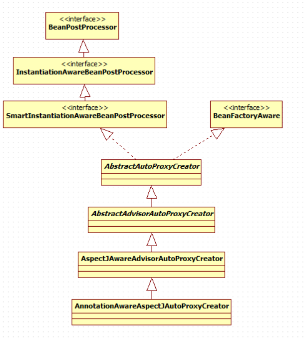
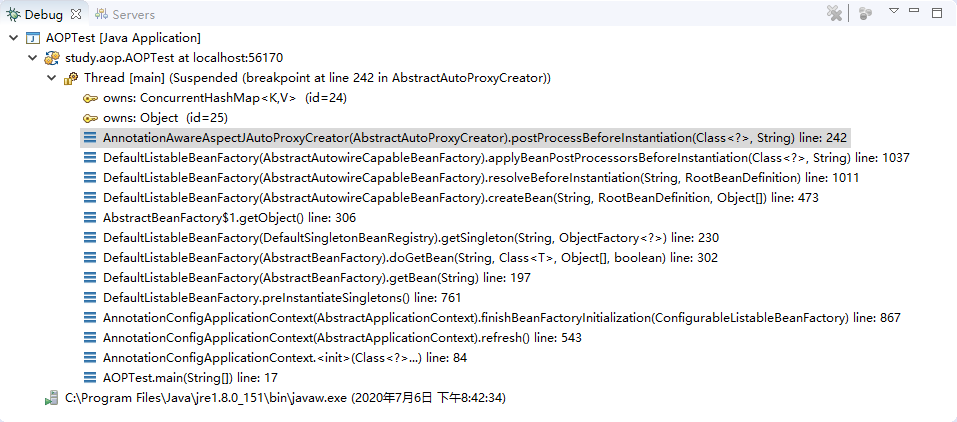

# IOC相关注解

* `@Configuration`

```java
@Configuration
public class MainConfig {
}  
```

* `@Bean`

```java
@Bean
public Person person() {
	Person person = new Person();
	person.setName("spring bean");
	person.setAge(20);
	person.setNickName("豆子");
	return person;
}
```

* `@ComponentScan`

```java
@Configuration
@ComponentScan(value = "study.ioc",
		includeFilters = { @Filter(type = FilterType.ANNOTATION, classes = { Controller.class }), },
		useDefaultFilters = false)
public class MainConfig {
	@Bean
	public Person person() {
		Person person = new Person();
		person.setName("spring bean");
		person.setAge(20);
		person.setNickName("豆子");
		return person;
	}
}
```

* `@Scope`

```java
@Scope(ConfigurableBeanFactory.SCOPE_PROTOTYPE)
@Bean
public Person person() {
	Person person = new Person();
	person.setName("spring bean");
	person.setAge(20);
	person.setNickName("豆子");
	return person;
}

Person person1 = (Person) applicationContext.getBean("person");
Person person2 = (Person) applicationContext.getBean("person");
System.out.println(person1 == person2); // false
```

* `@Lazy`

```java
@Bean
@Lazy // 单实例Bean默认在容器启动时创建，添加@Lazy注解后则在第一次获取时创建
public Person person() {
	Person person = new Person();
	person.setName("spring bean");
	person.setAge(20);
	person.setNickName("豆子");
	return person;
}
```

* `@Conditional`

```java
@Conditional({ WindowsCondition.class })
@Scope(ConfigurableBeanFactory.SCOPE_SINGLETON)
@Bean
public BillGates gates() {
	return new BillGates();
}

@Conditional({ LinuxCondition.class })
@Bean
public LinusBenedictTorvalds linus() {
	return new LinusBenedictTorvalds();
}

public class LinuxCondition implements Condition {

	@Override
	public boolean matches(ConditionContext context, AnnotatedTypeMetadata metadata) {
		Environment environment = context.getEnvironment();
		String osName = environment.getProperty("os.name");
		if (osName.toLowerCase().contains("linux")) {
			return true;
		} else {
			return false;
		}
	}

}

public class WindowsCondition implements Condition {

	@Override
	public boolean matches(ConditionContext context, AnnotatedTypeMetadata metadata) {
		Environment environment = context.getEnvironment();
		String osName = environment.getProperty("os.name");
		if (osName.toLowerCase().contains("windows")) {
			return true;
		} else {
			return false;
		}
	}

}
```

* `@Import`
  主要用于导入第三方库的组件到spring容器中。

```java
@Import({ Color.class, CustomImportSelector.class, CustomImportBeandefinitionRegister.class })
public class MainConfig {
}

public class CustomImportSelector implements ImportSelector{

	@Override
	public String[] selectImports(AnnotationMetadata importingClassMetadata) {
		return new String[] {"study.ioc.bean.Red"};
	}

}
public class CustomImportBeandefinitionRegister implements ImportBeanDefinitionRegistrar{

	@Override
	public void registerBeanDefinitions(AnnotationMetadata importingClassMetadata,
			BeanDefinitionRegistry registry) {
		boolean containsRed = registry.containsBeanDefinition("study.ioc.bean.Red");
		if (containsRed) {
			registry.registerBeanDefinition("yellow", new RootBeanDefinition(Yellow.class));
		}
	}

}
```

* `FactoryBean`

```java
public class DogFactoryBean implements FactoryBean<Dog>{

	@Override
	public Dog getObject() throws Exception {
		return new Dog();
	}

	@Override
	public Class<?> getObjectType() {
		return Dog.class;
	}

	@Override
	public boolean isSingleton() {
		return true;
	}

}

Dog dog1 = applicationContext.getBean(Dog.class);
Dog dog2 = applicationContext.getBean(Dog.class);
System.out.println(dog1 == dog2);// 由FactoryBean的isSingleton()返回值决定

// 获取FactoryBean
DogFactoryBean dogFactoryBean =
		(DogFactoryBean) applicationContext.getBean("&dogFactoryBean");
Dog dog = dogFactoryBean.getObject();
System.out.println(dog == dog1); // 获取的dog不是spring管理的bean
applicationContext.close();
```

# 生命周期

* `@Bean`

```java
public class Car {
	// construct后被调用
	@SuppressWarnings("unused")
	private void init() {
		System.out.println("car init");
	}

	// 被最早调用
	public Car() {
		System.out.println("car construct");
	}

	// 单例对象容器关闭时调用
	// 多实例对象不调用
	@SuppressWarnings("unused")
	private void destroy() {
		System.out.println("car destroy");
	}
}

@Bean(initMethod = "init", destroyMethod = "destroy")
public Car car() {
	return new Car();
}
```

* `InitializingBean,DisposableBean`

```java
public class Cat implements InitializingBean,DisposableBean {

	public Cat(){
		System.out.println("cat constructor...");
	}

	@Override
	public void destroy() throws Exception {
		System.out.println("cat...destroy...");
	}

	@Override
	public void afterPropertiesSet() throws Exception {
		System.out.println("cat...afterPropertiesSet...");
	}

}
```

* `@PreDestroy,@PostConstruct`

```java
public class Duck {
	public Duck() {
		System.out.println("duck construct");
	}

	@PostConstruct
	private void init() {
		System.out.println("duck init");
	}

	@PreDestroy
	private void destroy() {
		System.out.println("duck destroy");
	}
}
```

---

## BeanPostProcessor

### 使用示例

```java
public class MyBeanPostProcessor implements BeanPostProcessor {

	// construct
	// postProcessBeforeInitialization
	// init
	// postProcessAfterInitialization
	// preDestory
	// destory
	@Override
	public Object postProcessBeforeInitialization(Object bean, String beanName)
			throws BeansException {
		System.out.println("postProcessBeforeInitialization =>" + beanName);
		return bean;
	}

	@Override
	public Object postProcessAfterInitialization(Object bean, String beanName)
			throws BeansException {
		System.out.println("postProcessAfterInitialization =>" + beanName);
		return bean;
	}

}
```

### 原理

```java
/**
 * Initialize the given bean instance, applying factory callbacks
 * as well as init methods and bean post processors.
 * <p>Called from {@link #createBean} for traditionally defined beans,
 * and from {@link #initializeBean} for existing bean instances.
 * @param beanName the bean name in the factory (for debugging purposes)
 * @param bean the new bean instance we may need to initialize
 * @param mbd the bean definition that the bean was created with
 * (can also be {@code null}, if given an existing bean instance)
 * @return the initialized bean instance (potentially wrapped)
 * @see BeanNameAware
 * @see BeanClassLoaderAware
 * @see BeanFactoryAware
 * @see #applyBeanPostProcessorsBeforeInitialization
 * @see #invokeInitMethods
 * @see #applyBeanPostProcessorsAfterInitialization
 */
AbstractAutowireCapableBeanFactory
protected Object initializeBean(final String beanName, final Object bean, RootBeanDefinition mbd) {
	if (System.getSecurityManager() != null) {
		AccessController.doPrivileged(new PrivilegedAction<Object>() {
			@Override
			public Object run() {
				invokeAwareMethods(beanName, bean);
				return null;
			}
		}, getAccessControlContext());
	}
	else {
		invokeAwareMethods(beanName, bean);
	}

	Object wrappedBean = bean;
	if (mbd == null || !mbd.isSynthetic()) {
		// PostProcessorsBeforeInitialization
		wrappedBean = applyBeanPostProcessorsBeforeInitialization(wrappedBean, beanName);
	}

	try {
		// init
		invokeInitMethods(beanName, wrappedBean, mbd);
	}
	catch (Throwable ex) {
		throw new BeanCreationException(
				(mbd != null ? mbd.getResourceDescription() : null),
				beanName, "Invocation of init method failed", ex);
	}

	// PostProcessorsAfterInitialization
	if (mbd == null || !mbd.isSynthetic()) {
		wrappedBean = applyBeanPostProcessorsAfterInitialization(wrappedBean, beanName);
	}
	return wrappedBean;
}
```

### BeanPostProcessor在spring底层的应用

* AutowiredAnnotationBeanPostProcessor
* MethodValidationPostProcessor

# 属性值注解

* `@value`

```java
@Data
public class Person {
	// 姓名
	@Value("zhangsan") // 直接取值
	private String name;

	// 年龄
	@Value("#{20 - 2}") // 表达式
	private Integer age;

	// 昵称
	@Value("${person.nickName}") // 从spring的environment中取值
	private String nickName;

}
```

* `@PropertySource`

```java
@Configuration
@PropertySource("classpath:person.properties")
public class MainConfigOfPropertyValues {
	@Bean
	public Person person() {
		return new Person();
	}
}
```

# 自动装配注解

* `@Autowired`
  1. 默认优先按照类型去容器中找对应的组件:`applicationContext.getBean(BookDao.class)`;找到就赋值
  2. 如果找到多个相同类型的组件，再将属性的名称作为组件的id去容器中查找`	applicationContext.getBean("bookDao")`
  3. `@Qualifier("bookDao")`：使用`@Qualifier`指定需要装配的组件的id，而不是使用属性名
  4. 自动装配默认一定要将属性赋值好，没有就会报错；可以使用`@Autowired(required=false);`
  5. `@Primary`：让Spring进行自动装配的时候，默认使用首选的bean；也可以继续使用`@Qualifier`指定需要装配的bean的名字

---

* `@Resource(JSR250)`
  * 可以和`@Autowired`一样实现自动装配功能；默认是按照组件名称进行装配的；
  * 没有能支持`@Primary`功能
  * 没有支持`@Autowired（reqiured=false）`

---

* `@Inject(JSR330)`
  * 需要导入`javax.inject`的包，和`Autowired`的功能一样。没有`required=false`的功能

---

* `@Autowired`：构造器，参数，方法，属性；都是从容器中获取参数组件的值
  * [标注在方法位置]：`@Bean+方法参数`；参数从容器中获取;默认不写`@Autowired`效果是一样的；都能自动装配
  * [标在构造器上]：如果组件只有一个有参构造器，这个有参构造器的`@Autowired`可以省略，参数位置的组件还是可以自动从容器中获取
  * 放在参数位置

---

* 自定义组件想要使用Spring容器底层的一些组件（ApplicationContext，BeanFactory，xxx）
  **自定义组件实现`xxxAware`；在创建对象的时候，会调用接口规定的方法注入相关组件；Aware；**

  ```java
  public class Dog implements ApplicationContextAware, EmbeddedValueResolverAware, BeanNameAware {
  
  	@Override
  	public void setBeanName(String name) {
  		System.out.println("bean name is " + name);
  	}
  
  	@Override
  	public void setEmbeddedValueResolver(StringValueResolver resolver) {
  		String expression = "#{3 * 4}";
  		System.out.println(expression + " = " + resolver.resolveStringValue(expression));
  		System.out.println("os.name = " + resolver.resolveStringValue("${os.name}"));
  	}
  
  	@Override
  	public void setApplicationContext(ApplicationContext applicationContext) throws BeansException {
  		System.out.println("applicationContext=" + applicationContext);
  	}
  
  }
  ```

  * `Aware`原理

  ```java
  protected Object initializeBean(final String beanName, final Object bean, RootBeanDefinition mbd) {
  	if (System.getSecurityManager() != null) {
  		AccessController.doPrivileged(new PrivilegedAction<Object>() {
  			@Override
  			public Object run() {
  				invokeAwareMethods(beanName, bean);
  				return null;
  			}
  		}, getAccessControlContext());
  	}
  	else {
  		invokeAwareMethods(beanName, bean);
  	}
  
  	Object wrappedBean = bean;
  	if (mbd == null || !mbd.isSynthetic()) {
      // 应用后置处理器
      // 每一个xxxAware都有一个对应的XXXAwarePostProcessor
  
  		wrappedBean = applyBeanPostProcessorsBeforeInitialization(wrappedBean, beanName);
  	}
  
  	try {
  		invokeInitMethods(beanName, wrappedBean, mbd);
  	}
  	catch (Throwable ex) {
  		throw new BeanCreationException(
  				(mbd != null ? mbd.getResourceDescription() : null),
  				beanName, "Invocation of init method failed", ex);
  	}
  
  	if (mbd == null || !mbd.isSynthetic()) {
  		wrappedBean = applyBeanPostProcessorsAfterInitialization(wrappedBean, beanName);
  	}
  	return wrappedBean;
  }
  
  private void invokeAwareInterfaces(Object bean) {
  	if (bean instanceof Aware) {
  		if (bean instanceof EnvironmentAware) {
  			((EnvironmentAware) bean).setEnvironment(this.applicationContext.getEnvironment());
  		}
  		if (bean instanceof EmbeddedValueResolverAware) {
  			((EmbeddedValueResolverAware) bean).setEmbeddedValueResolver(this.embeddedValueResolver);
  		}
  		if (bean instanceof ResourceLoaderAware) {
  			((ResourceLoaderAware) bean).setResourceLoader(this.applicationContext);
  		}
  		if (bean instanceof ApplicationEventPublisherAware) {
  			((ApplicationEventPublisherAware) bean).setApplicationEventPublisher(this.applicationContext);
  		}
  		if (bean instanceof MessageSourceAware) {
  			((MessageSourceAware) bean).setMessageSource(this.applicationContext);
  		}
  		if (bean instanceof ApplicationContextAware) {
  			((ApplicationContextAware) bean).setApplicationContext(this.applicationContext);
  		}
  	}
  }
  ```

# profile

* 使用虚拟机参数`-Dspring.profiles.active=test`指定当前环境

```java
@Configuration
public class MainConfigOfProfile {
	@Bean
	@Profile("test")
	public DataSource testDataSource() throws Exception {
		ComboPooledDataSource dataSource = new ComboPooledDataSource();
		return dataSource;
	}

	@Bean
	@Profile("dev")
	public DataSource devDataSource() throws Exception {
		ComboPooledDataSource dataSource = new ComboPooledDataSource();
		return dataSource;
	}

	@Bean
	@Profile("product")
	public DataSource productDataSource() throws Exception {
		ComboPooledDataSource dataSource = new ComboPooledDataSource();
		return dataSource;
	}
}
```

* 通过配置`environment`设置当前环境

```java
public class IOCProfileTest {
	public static void main(String[] args) {
		AnnotationConfigApplicationContext applicationContext =
				new AnnotationConfigApplicationContext();
		ConfigurableEnvironment environment = applicationContext.getEnvironment();
		// 设置当前环境
		environment.setActiveProfiles("product");
		applicationContext.register(MainConfigOfProfile.class);
		applicationContext.refresh();

		// 获取所有的bean
		String[] beanDefinitionNames = applicationContext.getBeanDefinitionNames();
		Arrays.stream(beanDefinitionNames).forEach(beanDefinitionName -> {
			System.out.println(beanDefinitionName);
		});

		applicationContext.close();
	}
}
```

# AOP的使用

## 编写业务逻辑类

```java
public class MathCalculator {
	public int div(int i, int j) {
		return i / j;
	}
}
```

## 编写切面类

1. 写切入点`PointCut`表达式

2. 写切入方法

   ```java
   @Aspect // 此注解标识此类是一个切面类
   public class LogAspect {
   	@Before("execution(public int study.aop.service.MathCalculator.*(..))")
   	public void logBefore(JoinPoint joinPoint) {
   		String methodName = joinPoint.getSignature().getName();
   		Object[] args = joinPoint.getArgs();
   		System.out.printf("before,方法=%s,参数=%s\n", methodName, Arrays.toString(args));
   	};
   
   	// 抽取公共的切入点表达式
   	// 本类可以使用
   	// 其他类也可以使用
   	@Pointcut("execution(public int study.aop.service.MathCalculator.*(..))")
   	public void pointCut() {
   	};
   
   	@After("pointCut()")
   	public void logAfter(JoinPoint joinPoint) {
   		String methodName = joinPoint.getSignature().getName();
   		Object[] args = joinPoint.getArgs();
   		System.out.printf("after,方法=%s,参数=%s\n", methodName, Arrays.toString(args));
   	}
   
   	@AfterReturning(value = "study.aop.aspect.LogAspect.pointCut()", returning = "retVal")
   	public void logAfterReturn(JoinPoint joinPoint, Object retVal) {
   		String methodName = joinPoint.getSignature().getName();
   		System.out.printf("afterReturn,方法=%s,返回值=%s\n", methodName, retVal.toString());
   	}
   
   	@AfterThrowing(value = "pointCut()", throwing = "exception")
   	public void logAfterThrowing(JoinPoint joinPoint, Exception exception) {
   		String methodName = joinPoint.getSignature().getName();
   		System.out.printf("afterThrowing,方法=%s,异常=%s\n", methodName, exception.toString());
   	}
   }
   ```

## 将切面类和业务逻辑类交由spring管理

```java
@Configuration
@EnableAspectJAutoProxy
public class MainConfigAOP {
	@Bean
	public MathCalculator mathCalculator() {
		return new MathCalculator();
	}

	@Bean
	public LogAspect logAspect() {
		return new LogAspect();
	}
}
```

## 测试

```java
public class AOPTest {
	public static void main(String[] args) {
		AnnotationConfigApplicationContext applicationContext =
				new AnnotationConfigApplicationContext(MainConfigAOP.class);

		MathCalculator mathCalculator = applicationContext.getBean(MathCalculator.class);

		mathCalculator.div(6, 0);

		applicationContext.close();
	}
}
```

# AOP原理

## @EnableAspectJAutoProxy

**@EnableAspectJAutoProxy的最终效果是在beanFactory中注册了AnnotationAwareAspectJAutoProxyCreator组件**

```java
@Import(AspectJAutoProxyRegistrar.class) // 导入自动代理注册器
public @interface EnableAspectJAutoProxy {
}
```

```java
class AspectJAutoProxyRegistrar implements ImportBeanDefinitionRegistrar {

	/**
	 * Register, escalate, and configure the AspectJ auto proxy creator based on the value
	 * of the @{@link EnableAspectJAutoProxy#proxyTargetClass()} attribute on the importing
	 * {@code @Configuration} class.
	 */
	@Override
	public void registerBeanDefinitions(
			AnnotationMetadata importingClassMetadata, BeanDefinitionRegistry registry) {

        // 注册AnnotationAwareAspectJAutoProxyCreator
		AopConfigUtils.registerAspectJAnnotationAutoProxyCreatorIfNecessary(registry);

		AnnotationAttributes enableAspectJAutoProxy =
				AnnotationConfigUtils.attributesFor(importingClassMetadata, EnableAspectJAutoProxy.class);
		if (enableAspectJAutoProxy.getBoolean("proxyTargetClass")) {
			AopConfigUtils.forceAutoProxyCreatorToUseClassProxying(registry);
		}
		if (enableAspectJAutoProxy.getBoolean("exposeProxy")) {
			AopConfigUtils.forceAutoProxyCreatorToExposeProxy(registry);
		}
	}

}
```

## AnnotationAwareAspectJAutoProxyCreator

### 继承关系

**实际上AnnotationAwareAspectJAutoProxyCreator是一个BeanPostProcessor，也是一个BeanFactoryAware**



### setBeanFactory

* AbstractAdvisorAutoProxyCreator.setBeanFactory

```java
	@Override
	public void setBeanFactory(BeanFactory beanFactory) {
        // 保存beanFactory
		super.setBeanFactory(beanFactory);
		if (!(beanFactory instanceof ConfigurableListableBeanFactory)) {
			throw new IllegalStateException("Cannot use AdvisorAutoProxyCreator without a 		ConfigurableListableBeanFactory");
		}
        // 初始化beanFactory
		initBeanFactory((ConfigurableListableBeanFactory) beanFactory);
	}
```

### AnnotationAwareAspectJAutoProxyCreator创建和注册流程

* 将断点打在`AbstractAdvisorAutoProxyCreator.setBeanFactory()`的`super.setBeanFactory(beanFactory)`上

  

#### 传入配置类，创建ioc容器

####  注册配置类，`refresh()`容器

####  `registerBeanPostProcessors`,注册Bean的后置处理器

1. 先获取容器中所有需要实例化的`BeanPostProcessors`

2. 给容器中添加额外的后置处理器`BeanPostProcessorChecker`

3. 优先注册实现了`PriorityOrdered`接口的`BeanPostProcessor`

4. 再给容器中注册实现了`Ordered`接口的BeanPostProcessor

5. 注册没实现优先级接口的`BeanPostProcessor`

6. 注册`BeanPostProcessor`，实际上就是创建`BeanPostProcessor`对象，保存在容器中

   创建`internalAutoProxyCreator`的`BeanPostProcessor`【`AnnotationAwareAspectJAutoProxyCreator`】

   * 创建Bean的实例
   * `populateBean()`，给Bean的各种属性赋值
   * `initializeBean()`,初始化Bean
     * `invokeAwareMethods()`,处理`aware()`方法的回调
     * `applyBeanPostProcessorsBeforeInitialization()`，应用后置处理器的`postProcessBeforeInitialization()`
     * `invokeInitMethods()`,执行自定义的初始化方法
     * `applyBeanPostProcessorsAfterInitialization()`,应用后置处理器的`postProcessAfterInitialization()`

7. 把`BeanPostProcessor`注册到`BeanFactory`中

###  后置处理(包装需要代理的bean的过程)

* AbstractAutoProxyCreator

```java
// 实例化前的后置处理
public Object postProcessBeforeInstantiation(Class<?> beanClass, String beanName) throws BeansException {}
// 实例化后的后置处理(Nothing to do)
public boolean postProcessAfterInstantiation(Object bean, String beanName) {}
// 初始化前的后置处理(Nothing to do)
public Object postProcessBeforeInitialization(Object bean, String beanName) {}
// 初始化后的后置处理
public Object postProcessAfterInitialization(Object bean, String beanName) throws BeansException {}
```

#### postProcessBeforeInstantiation是如何被调用的



* `finishBeanFactoryInitialization // 完成Bean工厂的初始化,创建剩下的单实例Bean`

* `getBean(beanName)`

* `doGetBean(name, null, null, false)`

* `getSingleton(beanName, new ObjectFactory<Object>())`

* `singletonFactory.getObject()`

* `createBean(beanName, mbd, args)`

* `resolveBeforeInstantiation() // 给后置处理器一个机会返回一个新的bean来代替当前bean`

* `applyBeanPostProcessorsBeforeInstantiation(targetType, beanName) // 应用实例化后置处理器的前置方法`

  **至此`AbstractAutoProxyCreator.postProcessBeforeInstantiation()被调用`**

  

#### postProcessBeforInstantiation执行流程

```java
@Override
	public Object postProcessBeforeInstantiation(Class<?> beanClass, String beanName) throws BeansException {
		Object cacheKey = getCacheKey(beanClass, beanName);

        // beanName != null || 目标bean中不包含此bean
		if (beanName == null || !this.targetSourcedBeans.contains(beanName)) {
            // bean已经被增强
			if (this.advisedBeans.containsKey(cacheKey)) {
				return null;
			}
            // 基础bean || 需要跳过的bean
            // 基础Bean((标注了Advice/Pointcut/Advisor/AopInfrastructureBean))
            // 需要跳过的bean(spring中的一些内置的不需要被增强的bean)
			if (isInfrastructureClass(beanClass) || shouldSkip(beanClass, beanName)) {
				this.advisedBeans.put(cacheKey, Boolean.FALSE);
				return null;
			}
		}

		// Create proxy here if we have a custom TargetSource.
		// Suppresses unnecessary default instantiation of the target bean:
		// The TargetSource will handle target instances in a custom fashion.
		if (beanName != null) {
			TargetSource targetSource = getCustomTargetSource(beanClass, beanName);
			if (targetSource != null) {
				this.targetSourcedBeans.add(beanName);
				Object[] specificInterceptors = getAdvicesAndAdvisorsForBean(beanClass, beanName, targetSource);
				Object proxy = createProxy(beanClass, beanName, specificInterceptors, targetSource);
				this.proxyTypes.put(cacheKey, proxy.getClass());
				return proxy;
			}
		}

		return null;
	}
```

以`MathCalculator`为例，说明 `postProcessBeforeInstantiation()`执行流程：

1. 判断当前bean是否在`advisedBeans`中，**即是否已被增强**
2. 判断当前bean是否为基础bean或者是否需要跳过
   * 基础bean(**标注了Advice/Pointcut/Advisor/AopInfrastructureBean**)
   * 需要跳过(**获取候选的增强器`List<Advisor> candidateAdvisors`，判断是否为`InstantiationModelAwarePointcutAdvisor`类型，是才返回true，不是则返回false**)
3. 无自定义的`targetSource`，直接返回null

#### postProcessAfterInitialization执行流程

```java
public Object postProcessAfterInitialization(Object bean, String beanName) throws BeansException {
    if (bean != null) {
        Object cacheKey = getCacheKey(bean.getClass(), beanName);
        if (!this.earlyProxyReferences.contains(cacheKey)) {
            // 进行包装
            return wrapIfNecessary(bean, beanName, cacheKey);
        }
    }
    return bean;
}

protected Object wrapIfNecessary(Object bean, String beanName, Object cacheKey) {
    if (beanName != null && this.targetSourcedBeans.contains(beanName)) {
        return bean;
    }
    if (Boolean.FALSE.equals(this.advisedBeans.get(cacheKey))) {
        return bean;
    }
    if (isInfrastructureClass(bean.getClass()) || shouldSkip(bean.getClass(), beanName)) {
        this.advisedBeans.put(cacheKey, Boolean.FALSE);
        return bean;
    }

    // Create proxy if we have advice.
    Object[] specificInterceptors = getAdvicesAndAdvisorsForBean(bean.getClass(), beanName, null);
    if (specificInterceptors != DO_NOT_PROXY) {
        this.advisedBeans.put(cacheKey, Boolean.TRUE);
        Object proxy = createProxy(
            bean.getClass(), beanName, specificInterceptors, new SingletonTargetSource(bean));
        this.proxyTypes.put(cacheKey, proxy.getClass());
        return proxy;
    }

    this.advisedBeans.put(cacheKey, Boolean.FALSE);
    return bean;
}
```

1. 获取当前bean的所有增强器(**通知方法**)，`Object[] specificInterceptors = getAdvicesAndAdvisorsForBean(bean.getClass(), beanName, null)`

   ```java
   @Override
   protected Object[] getAdvicesAndAdvisorsForBean(Class<?> beanClass, String beanName, TargetSource targetSource) {
       // 获取合适的增前期
       List<Advisor> advisors = findEligibleAdvisors(beanClass, beanName);
       if (advisors.isEmpty()) {
           return DO_NOT_PROXY;
       }
       return advisors.toArray();
   }
   protected List<Advisor> findEligibleAdvisors(Class<?> beanClass, String beanName) {
       // 获取所有候选的增强器
       List<Advisor> candidateAdvisors = findCandidateAdvisors();
       // 获取可以给bean使用的增前期
       List<Advisor> eligibleAdvisors = findAdvisorsThatCanApply(candidateAdvisors, beanClass, beanName);
       extendAdvisors(eligibleAdvisors);
       if (!eligibleAdvisors.isEmpty()) {
           eligibleAdvisors = sortAdvisors(eligibleAdvisors);
       }
       return eligibleAdvisors;
   }
   ```

   * 找到候选的所有的增强器
   * 获取到能在bean使用的增强器
   * 给增强器排序

2. 保存当前bean在advisedBeans中；

3. 创建代理对象；

   ```java
   protected Object createProxy(
       Class<?> beanClass, String beanName, Object[] specificInterceptors, TargetSource targetSource) {
   
       if (this.beanFactory instanceof ConfigurableListableBeanFactory) {
           AutoProxyUtils.exposeTargetClass((ConfigurableListableBeanFactory) this.beanFactory, beanName, beanClass);
       }
   
       ProxyFactory proxyFactory = new ProxyFactory();
       proxyFactory.copyFrom(this);
   
       if (!proxyFactory.isProxyTargetClass()) {
           if (shouldProxyTargetClass(beanClass, beanName)) {
               proxyFactory.setProxyTargetClass(true);
           }
           else {
               evaluateProxyInterfaces(beanClass, proxyFactory);
           }
       }
   
       // 找到增强器(通知方法)
       Advisor[] advisors = buildAdvisors(beanName, specificInterceptors);
       // 将增强器保存到代理工厂中
       proxyFactory.addAdvisors(advisors);
       proxyFactory.setTargetSource(targetSource);
       customizeProxyFactory(proxyFactory);
   
       proxyFactory.setFrozen(this.freezeProxy);
       if (advisorsPreFiltered()) {
           proxyFactory.setPreFiltered(true);
       }
   
       // 通过代理工厂获取代理对象
       return proxyFactory.getProxy(getProxyClassLoader());
   }
   ```

   * 找到增强器(通知方法)

   * 将增强器保存到代理工厂中

   * 通过代理工厂获取代理对象

     ```java
     public AopProxy createAopProxy(AdvisedSupport config) throws AopConfigException {
     		if (config.isOptimize() || config.isProxyTargetClass() || hasNoUserSuppliedProxyInterfaces(config)) {
     			Class<?> targetClass = config.getTargetClass();
     			if (targetClass == null) {
     				throw new AopConfigException("TargetSource cannot determine target class: " +
     						"Either an interface or a target is required for proxy creation.");
     			}
     			if (targetClass.isInterface() || Proxy.isProxyClass(targetClass)) {
                     // 创建JDK动态代理
     				return new JdkDynamicAopProxy(config);
     			}
                 // 创建cglib代理
     			return new ObjenesisCglibAopProxy(config);
     		}
     		else {
                 // 创建JDK动态代理
     			return new JdkDynamicAopProxy(config);
     		}
     	}
     ```

4. 返回代理对象

### 目标方法执行流程

```java
// CglibAopProxy
@Override
public Object intercept(Object proxy, Method method, Object[] args, MethodProxy methodProxy) throws Throwable {
    Object oldProxy = null;
    boolean setProxyContext = false;
    Class<?> targetClass = null;
    Object target = null;
    try {
        if (this.advised.exposeProxy) {
            // Make invocation available if necessary.
            oldProxy = AopContext.setCurrentProxy(proxy);
            setProxyContext = true;
        }
        // May be null. Get as late as possible to minimize the time we
        // "own" the target, in case it comes from a pool...
        target = getTarget();
        if (target != null) {
            targetClass = target.getClass();
        }
        // 获取拦截器链
        List<Object> chain = this.advised.getInterceptorsAndDynamicInterceptionAdvice(method, targetClass);
        Object retVal;
        // Check whether we only have one InvokerInterceptor: that is,
        // no real advice, but just reflective invocation of the target.
        if (chain.isEmpty() && Modifier.isPublic(method.getModifiers())) {
            // We can skip creating a MethodInvocation: just invoke the target directly.
            // Note that the final invoker must be an InvokerInterceptor, so we know
            // it does nothing but a reflective operation on the target, and no hot
            // swapping or fancy proxying.
            Object[] argsToUse = AopProxyUtils.adaptArgumentsIfNecessary(method, args);
            retVal = methodProxy.invoke(target, argsToUse);
        }
        else {
            // We need to create a method invocation...
            retVal = new CglibMethodInvocation(proxy, target, method, args, targetClass, chain, methodProxy).proceed();
        }
        retVal = processReturnType(proxy, target, method, retVal);
        return retVal;
    }
    finally {
        if (target != null) {
            releaseTarget(target);
        }
        if (setProxyContext) {
            // Restore old proxy.
            AopContext.setCurrentProxy(oldProxy);
        }
    }
}
```

1. 获取拦截器链`List<Object> chain = this.advised.getInterceptorsAndDynamicInterceptionAdvice(method, targetClass);`

2. 如果没有拦截器链，直接执行目标方法;

3. 如果有拦截器链，把需要执行的目标对象，目标方法 `Object retVal =  methodInvocation.proceed();`

4. 拦截器链的触发过程

   

   ```java
   public Object proceed() throws Throwable {
       //	We start with an index of -1 and increment early.
       // 从第一个开始拦截器开始执行
       if (this.currentInterceptorIndex == this.interceptorsAndDynamicMethodMatchers.size() - 1) {
           // 执行到最后一个拦截器,执行目标方法
           return invokeJoinpoint();
       }
   
       Object interceptorOrInterceptionAdvice =
           this.interceptorsAndDynamicMethodMatchers.get(++this.currentInterceptorIndex);
       if (interceptorOrInterceptionAdvice instanceof InterceptorAndDynamicMethodMatcher) {
           // Evaluate dynamic method matcher here: static part will already have
           // been evaluated and found to match.
           InterceptorAndDynamicMethodMatcher dm =
               (InterceptorAndDynamicMethodMatcher) interceptorOrInterceptionAdvice;
           if (dm.methodMatcher.matches(this.method, this.targetClass, this.arguments)) {
               return dm.interceptor.invoke(this);
           }
           else {
               // Dynamic matching failed.
               // Skip this interceptor and invoke the next in the chain.
               return proceed();
           }
       }
       else {
           // It's an interceptor, so we just invoke it: The pointcut will have
           // been evaluated statically before this object was constructed.
           // 递归调用
           return ((MethodInterceptor) interceptorOrInterceptionAdvice).invoke(this);
       }
   }
   ```

   1. 执行到 **最后一个** 拦截器时，直接执行目标方法，并返回

   2. 利用拦截器链机制，依次进入每一个拦截器链执行。

      

## AOP原理总结

1. `@EnableAspectJAutoProxy` 开启AOP功能

2. `@EnableAspectJAutoProxy` 会给容器中注册一个组件 `AnnotationAwareAspectJAutoProxyCreator`

* 容器创建时会在`registerBeanPostProcessors()`注册``AnnotationAwareAspectJAutoProxyCreator``，因为`AnnotationAwareAspectJAutoProxyCreator`是一个后置处理器

3. 包装 **业务逻辑类**

* 容器创建时会在`finishBeanFactoryInitialization()`完成 **业务逻辑类**的初始化,回到用后置处理器``AnnotationAwareAspectJAutoProxyCreator``的后置处理方法，对 **业务逻辑类进行包装**

4. 执行目标方法

   利用拦截器的链式机制，依次进入每一个拦截器进行执行，**递归调用**

# 声明式事务

## 配置数据源

```java
@Bean
public DataSource dataSource() throws Exception {
    ComboPooledDataSource dataSource = new ComboPooledDataSource();
    dataSource.setUser("root");
    dataSource.setPassword("1234");
    dataSource.setDriverClass("com.mysql.jdbc.Driver");
    dataSource.setJdbcUrl("jdbc:mysql://localhost:3307/test");
    return dataSource;
}
```

## 配置JdbcTemplate

```java
@Bean
public JdbcTemplate jdbcTemplate() throws Exception {
    // Spring对@Configuration类会特殊处理；给容器中加组件的方法，多次调用都只是从容器中找组件
    JdbcTemplate jdbcTemplate = new JdbcTemplate(dataSource());
    return jdbcTemplate;
}
```

## 注册事务管理器

```java
@Bean
public PlatformTransactionManager transactionManager() throws Exception {
    return new DataSourceTransactionManager(dataSource());
}
```

## 开启事务管理功能

```java
@Configuration
@EnableTransactionManagement
@ComponentScan("study.tx")
public class MainConfigOfTX {
}
```

## 在需要添加事务的函数上添加事务注解

```java
@Transactional
public void saveUser() {
    int nextInt = new Random().nextInt(50);
    String name = "张三" + nextInt;
    userDao.saveUser(name, nextInt);

    nextInt = 10 / 0;
    System.out.println("插入成功");
}
```

# 声明式事务原理

## 导入TransactionManagementConfigurationSelector

```java
@Target(ElementType.TYPE)
@Retention(RetentionPolicy.RUNTIME)
@Documented
@Import(TransactionManagementConfigurationSelector.class)
public @interface EnableTransactionManagement {
}
```

## 导入AutoProxyRegistrar和ProxyTransactionManagementConfiguration

```java
// TransactionManagementConfigurationSelector
@Override
protected String[] selectImports(AdviceMode adviceMode) {
    switch (adviceMode) {
        case PROXY:
            return new String[] {AutoProxyRegistrar.class.getName(), 		ProxyTransactionManagementConfiguration.class.getName()};
        case ASPECTJ:
            return new String[] {TransactionManagementConfigUtils.TRANSACTION_ASPECT_CONFIGURATION_CLASS_NAME};
        default:
            return null;
    }
}
```

## AutoProxyRegistrar

### 注册InfrastructureAdvisorAutoProxyCreator

```java
@Override
public void registerBeanDefinitions(AnnotationMetadata importingClassMetadata, 
                                    BeanDefinitionRegistry registry) {
    boolean candidateFound = false;
    Set<String> annoTypes = importingClassMetadata.getAnnotationTypes();
    for (String annoType : annoTypes) {
        AnnotationAttributes candidate = 
            AnnotationConfigUtils.attributesFor(importingClassMetadata, annoType);
        if (candidate == null) {
            continue;
        }
        Object mode = candidate.get("mode");
        Object proxyTargetClass = candidate.get("proxyTargetClass");
        if (mode != null && proxyTargetClass != null && AdviceMode.class == mode.getClass() &&
            Boolean.class == proxyTargetClass.getClass()) {
            candidateFound = true;
            if (mode == AdviceMode.PROXY) {
                // 注册自动代理创建器
                AopConfigUtils.registerAutoProxyCreatorIfNecessary(registry);
                if ((Boolean) proxyTargetClass) {
                    AopConfigUtils.forceAutoProxyCreatorToUseClassProxying(registry);
                    return;
                }
            }
        }
    }
    if (!candidateFound) {
        String name = getClass().getSimpleName();
        logger.warn(String.format("%s was imported but no annotations were found " +
                                  "having both 'mode' and 'proxyTargetClass' attributes of type " +
                                  "AdviceMode and boolean respectively. This means that auto proxy " +
                                  "creator registration and configuration may not have occurred as " +
                                  "intended, and components may not be proxied as expected. Check to " +
                                  "ensure that %s has been @Import'ed on the same class where these " +
                                  "annotations are declared; otherwise remove the import of %s " +
                                  "altogether.", name, name, name));
    }
}
```

```java
public static BeanDefinition registerAutoProxyCreatorIfNecessary(BeanDefinitionRegistry registry) {
    return registerAutoProxyCreatorIfNecessary(registry, null);
}

public static BeanDefinition registerAutoProxyCreatorIfNecessary(BeanDefinitionRegistry registry, 
                                                                 Object source) {
    return registerOrEscalateApcAsRequired(InfrastructureAdvisorAutoProxyCreator.class,
                                           registry, source);
}
```

### InfrastructureAdvisorAutoProxyCreator包装Bean

利用 **后置处理器** 机制在对象创建以后 **包装对象**， 返回一个 **代理对象(增强器)**， 代理对象执行目标方法时利用 **拦截器链** 进行调用。

## ProxyTransactionManagementConfiguration

### 注册事务属性增强器组件用于解析事务属性

```java
// 配置类
@Configuration
public class ProxyTransactionManagementConfiguration extends AbstractTransactionManagementConfiguration {

    // 注册事务属性增强器组件
	@Bean(name = TransactionManagementConfigUtils.TRANSACTION_ADVISOR_BEAN_NAME)
	@Role(BeanDefinition.ROLE_INFRASTRUCTURE)
	public BeanFactoryTransactionAttributeSourceAdvisor transactionAdvisor() {
		BeanFactoryTransactionAttributeSourceAdvisor advisor = new BeanFactoryTransactionAttributeSourceAdvisor();
		advisor.setTransactionAttributeSource(transactionAttributeSource());
		advisor.setAdvice(transactionInterceptor());
		advisor.setOrder(this.enableTx.<Integer>getNumber("order"));
		return advisor;
	}
    
    @Bean
	@Role(BeanDefinition.ROLE_INFRASTRUCTURE)
	public TransactionAttributeSource transactionAttributeSource() {
		return new AnnotationTransactionAttributeSource();
	}
}
```

### 注册事务拦截器组件用于拦截事务

```java
@Configuration
public class ProxyTransactionManagementConfiguration extends AbstractTransactionManagementConfiguration {
    // 事务属性拦截器
	@Bean
	@Role(BeanDefinition.ROLE_INFRASTRUCTURE)
	public TransactionInterceptor transactionInterceptor() {
		TransactionInterceptor interceptor = new TransactionInterceptor();
		interceptor.setTransactionAttributeSource(transactionAttributeSource());
		if (this.txManager != null) {
			interceptor.setTransactionManager(this.txManager);
		}
		return interceptor;
	}

}
```

#### 设置事务属性和事务管理器

#### 在事务控制下执行

```java
@Override
public Object invoke(final MethodInvocation invocation) throws Throwable {
    // Work out the target class: may be {@code null}.
    // The TransactionAttributeSource should be passed the target class
    // as well as the method, which may be from an interface.
    Class<?> targetClass = (invocation.getThis() != null ? 
                            AopUtils.getTargetClass(invocation.getThis()) : null);

    // 在事务控制下执行
    // Adapt to TransactionAspectSupport's invokeWithinTransaction...
    return invokeWithinTransaction(invocation.getMethod(), targetClass, new InvocationCallback() {
        @Override
        public Object proceedWithInvocation() throws Throwable {
            return invocation.proceed();
        }
    });
}
```

##### 获取事务属性

##### 获取事务管理器

##### 在异常发生时使用事务管理器进行回滚

```java
protected Object invokeWithinTransaction(Method method, Class<?> targetClass,
                                         final InvocationCallback invocation)
    throws Throwable {

    // If the transaction attribute is null, the method is non-transactional.
    // 获取事务属性
    final TransactionAttribute txAttr = 
        getTransactionAttributeSource().getTransactionAttribute(method, targetClass);
    // 获取事务管理器
    final PlatformTransactionManager tm = determineTransactionManager(txAttr);
    final String joinpointIdentification = methodIdentification(method, targetClass, txAttr);

    if (txAttr == null || !(tm instanceof CallbackPreferringPlatformTransactionManager)) {
        // Standard transaction demarcation with getTransaction and commit/rollback calls.
        TransactionInfo txInfo = createTransactionIfNecessary(tm, txAttr, joinpointIdentification);
        Object retVal = null;
        try {
            // This is an around advice: Invoke the next interceptor in the chain.
            // This will normally result in a target object being invoked.
            retVal = invocation.proceedWithInvocation();
        }
        catch (Throwable ex) {
            // target invocation exception
            // 在异常时进行回滚
            completeTransactionAfterThrowing(txInfo, ex);
            throw ex;
        }
        finally {
            cleanupTransactionInfo(txInfo);
        }
        commitTransactionAfterReturning(txInfo);
        return retVal;
    }

    else {
			// It's a CallbackPreferringPlatformTransactionManager: pass a TransactionCallback in.
			try {
				Object result = ((CallbackPreferringPlatformTransactionManager) tm).execute(txAttr,
						new TransactionCallback<Object>() {
							@Override
							public Object doInTransaction(TransactionStatus status) {
								TransactionInfo txInfo = 
                                    prepareTransactionInfo(tm, txAttr, joinpointIdentification, status);
								try {
									return invocation.proceedWithInvocation();
								}
								catch (Throwable ex) {
									if (txAttr.rollbackOn(ex)) {
										// A RuntimeException: will lead to a rollback.
										if (ex instanceof RuntimeException) {
											throw (RuntimeException) ex;
										}
										else {
											throw new ThrowableHolderException(ex);
										}
									}
									else {
										// A normal return value: will lead to a commit.
										return new ThrowableHolder(ex);
									}
								}
								finally {
									cleanupTransactionInfo(txInfo);
								}
							}
						});

				// Check result: It might indicate a Throwable to rethrow.
				if (result instanceof ThrowableHolder) {
					throw ((ThrowableHolder) result).getThrowable();
				}
				else {
					return result;
				}
			}
			catch (ThrowableHolderException ex) {
				throw ex.getCause();
			}
		}
}

/**
 * Handle a throwable, completing the transaction.
 * We may commit or roll back, depending on the configuration.
 * @param txInfo information about the current transaction
 * @param ex throwable encountered
 */
protected void completeTransactionAfterThrowing(TransactionInfo txInfo, Throwable ex) {
    if (txInfo != null && txInfo.hasTransaction()) {
        if (logger.isTraceEnabled()) {
            logger.trace("Completing transaction for [" + txInfo.getJoinpointIdentification() +
                         "] after exception: " + ex);
        }
        if (txInfo.transactionAttribute.rollbackOn(ex)) {
            try {
                txInfo.getTransactionManager().rollback(txInfo.getTransactionStatus());
            }
            catch (TransactionSystemException ex2) {
                logger.error("Application exception overridden by rollback exception", ex);
                ex2.initApplicationException(ex);
                throw ex2;
            }
            catch (RuntimeException ex2) {
                logger.error("Application exception overridden by rollback exception", ex);
                throw ex2;
            }
            catch (Error err) {
                logger.error("Application exception overridden by rollback error", ex);
                throw err;
            }
        }
        else {
            // We don't roll back on this exception.
            // Will still roll back if TransactionStatus.isRollbackOnly() is true.
            try {
                txInfo.getTransactionManager().commit(txInfo.getTransactionStatus());
            }
            catch (TransactionSystemException ex2) {
                logger.error("Application exception overridden by commit exception", ex);
                ex2.initApplicationException(ex);
                throw ex2;
            }
            catch (RuntimeException ex2) {
                logger.error("Application exception overridden by commit exception", ex);
                throw ex2;
            }
            catch (Error err) {
                logger.error("Application exception overridden by commit error", ex);
                throw err;
            }
        }
    }
}
```

# Spring扩展

## BeanFactoryPostProcessor

### 执行时机

在BeanFactory标准初始化之后调用(**BeanDefinition已经被加载，但Bean实例还未被创建**)

### 使用方式

```java
@Component
public class MyBeanFactoryPostProcessor implements BeanFactoryPostProcessor {

	// 执行时机：在BeanFactory标准初始化之后调用(BeanDefinition已经被加载，但Bean实例还未被创建)
	@Override
	public void postProcessBeanFactory(ConfigurableListableBeanFactory beanFactory)
			throws BeansException {
		String[] beanDefinitionNames = beanFactory.getBeanDefinitionNames();
		System.out.println(Arrays.toString(beanDefinitionNames));
	}
}
```

### 实际应用

在BeanDefinition被加载后，可以在BeanFactoryPostProcessor中修改BeanDefinition的信息(如：属性信息)。

## BeanDefinitionRegistryPostProcessor

### 执行时机

在BeanFactory被标准初始化后调用(**BeanDefinition将要被加载**)。

### 使用方式

```java
@Component
public class MyBeanDefinitionRegistryPostProcessor implements BeanDefinitionRegistryPostProcessor {

	@Override
	public void postProcessBeanFactory(
			ConfigurableListableBeanFactory beanFactory)
			throws BeansException {
		System.out.println(
				"MyBeanDefinitionRegistryPostProcessor."
						+ "postProcessBeanFactory");
	}

	@Override
	public void postProcessBeanDefinitionRegistry(
			BeanDefinitionRegistry registry)
			throws BeansException {
		System.out.println(
				"MyBeanDefinitionRegistryPostProcessor."
						+ "postProcessBeanDefinitionRegistry");
	}

}
```

### 实际应用

在钩子方法中添加BeanDefinition。

### 原理


#### 执行BeanFactory后置处理器

```java
AbstractApplicationContext.refresh
// Invoke factory processors registered as beans in the context.
invokeBeanFactoryPostProcessors(beanFactory);
```

#### 先执行BeanDefinitionRegistryPostProcessor,再执行BeanFactoryPostProcessor

```java
invokeBeanFactoryPostProcessors(registryProcessors, beanFactory);
invokeBeanFactoryPostProcessors(regularPostProcessors, beanFactory);
```

# ApplicationListener

## 基本使用

### 编写类实现ApplicationListener并加入到容器中

```java
@Component
public class MyApplicationListener implements ApplicationListener<ApplicationEvent>{

	@Override
	public void onApplicationEvent(ApplicationEvent event) {
		System.out.println(event.toString());
	}

}
```

### 当容器中有事件发生,就会得到通知

* `ContextRefreshedEvent`：容器刷新完成（所有bean都完全创建）会发布这个事件；
* `ContextClosedEvent`：关闭容器会发布这个事件；

## 如何自定义事件

### 定义事件

```java
public class MyEvent extends ApplicationEvent {

	public MyEvent() {
		super("My Event");
	}

	private static final long serialVersionUID = 1L;

}
```

### 发布事件

```java
public static void main(String[] args) {
    AnnotationConfigApplicationContext applicationContext =
        new AnnotationConfigApplicationContext(ExtConfig.class);

    // 发布事件
    applicationContext.publishEvent(new MyEvent());

    applicationContext.close();
}
```

## 使用注解方式监听容器中的事件

```java
@Service
public class UserService {
	@EventListener(classes = { ApplicationEvent.class })
	public void listening(ApplicationEvent event) {
		System.out.println("UserService " + event);
	}
}
```

## ApplicationListener事件监听原理


### 完成刷新，发布事件

```java
protected void finishRefresh() {
    // Initialize lifecycle processor for this context.
    initLifecycleProcessor();

    // Propagate refresh to lifecycle processor first.
    getLifecycleProcessor().onRefresh();

    // 发布事件.
    publishEvent(new ContextRefreshedEvent(this));

    // Participate in LiveBeansView MBean, if active.
    LiveBeansView.registerApplicationContext(this);
}
```

### 多播器派发事件

```java
@Override
public void publishEvent(ApplicationEvent event) {
    publishEvent(event, null);
}

protected void publishEvent(Object event, ResolvableType eventType) {
    Assert.notNull(event, "Event must not be null");
    if (logger.isTraceEnabled()) {
        logger.trace("Publishing event in " + getDisplayName() + ": " + event);
    }

    // Decorate event as an ApplicationEvent if necessary
    ApplicationEvent applicationEvent;
    if (event instanceof ApplicationEvent) {
        applicationEvent = (ApplicationEvent) event;
    }
    else {
        applicationEvent = new PayloadApplicationEvent<Object>(this, event);
        if (eventType == null) {
            eventType = ((PayloadApplicationEvent)applicationEvent).getResolvableType();
        }
    }

    // Multicast right now if possible - or lazily once the multicaster is initialized
    if (this.earlyApplicationEvents != null) {
        this.earlyApplicationEvents.add(applicationEvent);
    }
    else {
        // 获取多播器，派发事件
        getApplicationEventMulticaster().multicastEvent(applicationEvent, eventType);
    }

    // Publish event via parent context as well...
    if (this.parent != null) {
        if (this.parent instanceof AbstractApplicationContext) {
            ((AbstractApplicationContext) this.parent).publishEvent(event, eventType);
        }
        else {
            this.parent.publishEvent(event);
        }
    }
}
```

#### 多播器的初始化

`refresh() -> initApplicationEventMulticaster()`

```java
protected void initApplicationEventMulticaster() {
    ConfigurableListableBeanFactory beanFactory = getBeanFactory();
    if (beanFactory.containsLocalBean(APPLICATION_EVENT_MULTICASTER_BEAN_NAME)) {
        this.applicationEventMulticaster =
            beanFactory.getBean(APPLICATION_EVENT_MULTICASTER_BEAN_NAME, ApplicationEventMulticaster.class);
        if (logger.isDebugEnabled()) {
            logger.debug("Using ApplicationEventMulticaster [" + this.applicationEventMulticaster + "]");
        }
    }
    else {
        // 无多播器则初始化多播器
        this.applicationEventMulticaster = new SimpleApplicationEventMulticaster(beanFactory);
        beanFactory.registerSingleton(APPLICATION_EVENT_MULTICASTER_BEAN_NAME, this.applicationEventMulticaster);
        if (logger.isDebugEnabled()) {
            logger.debug("Unable to locate ApplicationEventMulticaster with name '" +
                         APPLICATION_EVENT_MULTICASTER_BEAN_NAME +
                         "': using default [" + this.applicationEventMulticaster + "]");
        }
    }
}
```

#### 监听器的注册

`refresh() -> registerListeners()`

```java
protected void registerListeners() {
    // Register statically specified listeners first.
    for (ApplicationListener<?> listener : getApplicationListeners()) {
        getApplicationEventMulticaster().addApplicationListener(listener);
    }

    // Do not initialize FactoryBeans here: We need to leave all regular beans
    // uninitialized to let post-processors apply to them!
    // 根据类型获取监听器，注册监听器
    String[] listenerBeanNames = getBeanNamesForType(ApplicationListener.class, true, false);
    for (String listenerBeanName : listenerBeanNames) {
        getApplicationEventMulticaster().addApplicationListenerBean(listenerBeanName);
    }

    // Publish early application events now that we finally have a multicaster...
    Set<ApplicationEvent> earlyEventsToProcess = this.earlyApplicationEvents;
    this.earlyApplicationEvents = null;
    if (earlyEventsToProcess != null) {
        for (ApplicationEvent earlyEvent : earlyEventsToProcess) {
            getApplicationEventMulticaster().multicastEvent(earlyEvent);
        }
    }
}
```

#### 获取监听器，执行`onApplicationEvent`

```java
@Override
public void multicastEvent(final ApplicationEvent event, ResolvableType eventType) {
    ResolvableType type = (eventType != null ? eventType : resolveDefaultEventType(event));
    // 获取监听器
    for (final ApplicationListener<?> listener : getApplicationListeners(event, type)) {
        Executor executor = getTaskExecutor();
        if (executor != null) {
            executor.execute(new Runnable() {
                @Override
                public void run() {
                    invokeListener(listener, event);
                }
            });
        }
        else {
            // 执行监听
            invokeListener(listener, event);
        }
    }
}
```

## @EventListener原理

### 在bean实例化后解析注解，注册监听器

```java
// 实现了SmartInitializingSingleton接口，在Bean实例化后afterSingletonsInstantiated会被调用
public class EventListenerMethodProcessor implements SmartInitializingSingleton, ApplicationContextAware{
}
```

### SmartInitializingSingleton原理

```java
// DefaultListableBeanFactory
public void preInstantiateSingletons() throws BeansException {
    if (this.logger.isDebugEnabled()) {
        this.logger.debug("Pre-instantiating singletons in " + this);
    }

    // Iterate over a copy to allow for init methods which in turn register new bean definitions.
    // While this may not be part of the regular factory bootstrap, it does otherwise work fine.
    List<String> beanNames = new ArrayList<String>(this.beanDefinitionNames);

    // Trigger initialization of all non-lazy singleton beans...
    for (String beanName : beanNames) {
        RootBeanDefinition bd = getMergedLocalBeanDefinition(beanName);
        if (!bd.isAbstract() && bd.isSingleton() && !bd.isLazyInit()) {
            if (isFactoryBean(beanName)) {
                final FactoryBean<?> factory = (FactoryBean<?>) getBean(FACTORY_BEAN_PREFIX + beanName);
                boolean isEagerInit;
                if (System.getSecurityManager() != null && factory instanceof SmartFactoryBean) {
                    isEagerInit = AccessController.doPrivileged(new PrivilegedAction<Boolean>() {
                        @Override
                        public Boolean run() {
                            return ((SmartFactoryBean<?>) factory).isEagerInit();
                        }
                    }, getAccessControlContext());
                }
                else {
                    isEagerInit = (factory instanceof SmartFactoryBean &&
                                   ((SmartFactoryBean<?>) factory).isEagerInit());
                }
                if (isEagerInit) {
                    getBean(beanName);
                }
            }
            else {
                getBean(beanName);
            }
        }
    }

    // Trigger post-initialization callback for all applicable beans...
    for (String beanName : beanNames) {
        Object singletonInstance = getSingleton(beanName);
        if (singletonInstance instanceof SmartInitializingSingleton) {
            // 是SmartInitializingSingleton的实例,调用afterSingletonsInstantiated()函数
            final SmartInitializingSingleton smartSingleton = (SmartInitializingSingleton) singletonInstance;
            if (System.getSecurityManager() != null) {
                AccessController.doPrivileged(new PrivilegedAction<Object>() {
                    @Override
                    public Object run() {
                        smartSingleton.afterSingletonsInstantiated();
                        return null;
                    }
                }, getAccessControlContext());
            }
            else {
                smartSingleton.afterSingletonsInstantiated();
            }
        }
    }
}
```

