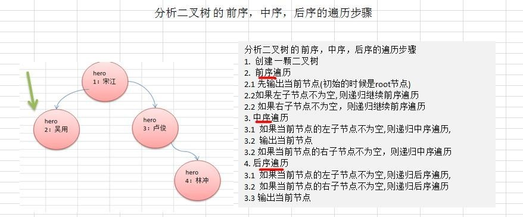

# 二叉树的遍历
1. **前序遍历:** 先输出父节点，再遍历左子树和右子树
2. **中序遍历:** 先遍历左子树，再输出父节点，再遍历右子树
3. **后序遍历:** 先遍历左子树，再遍历右子树，最后输出父节点

**小结: 看输出父节点的顺序，就确定是前序，中序还是后序**

---
## 图解


---
## 代码实现
```java
public class BinaryTree {
	// 根节点
	private Node root;

	public BinaryTree(Node root) {
		this.root = root;
	}

	// 前序遍历
	public void preOrder() {
		this.root.preOrder();
	}

	// 中序遍历
	public void infixOrder() {
		this.root.infixOrder();
	}

	// 后序遍历
	public void postOrder() {
		this.root.postOrder();
	}
}

class Node {
	public int id;
	public String name;
	public Node left;
	public Node right;

	public Node(int id, String name) {
		this.id = id;
		this.name = name;
	}

	@Override
	public String toString() {
		return "Node [id=" + id + ", name=" + name + "]";
	}

	// 前序遍历
	public void preOrder() {
		// 输出当前节点
		System.out.println(this);
		// 如果左节点不为null，递归遍历左节点
		if (this.left != null) {
			this.left.preOrder();
		}
		// 如果右节点不为null，递归遍历右节点
		if (this.right != null) {
			this.right.preOrder();
		}
	}

	// 中序遍历
	public void infixOrder() {
		// 如果左节点不为null，递归遍历左节点
		if (this.left != null) {
			this.left.infixOrder();
		}
		// 输出当前节点
		System.out.println(this);
		// 如果右节点不为null，递归遍历右节点
		if (this.right != null) {
			this.right.infixOrder();
		}
	}

	// 后序遍历
	public void postOrder() {
		// 如果左节点不为null，递归遍历左节点
		if (this.left != null) {
			this.left.postOrder();
		}
		// 如果右节点不为null，递归遍历右节点
		if (this.right != null) {
			this.right.postOrder();
		}
		// 输出当前节点
		System.out.println(this);
	}
}
```
