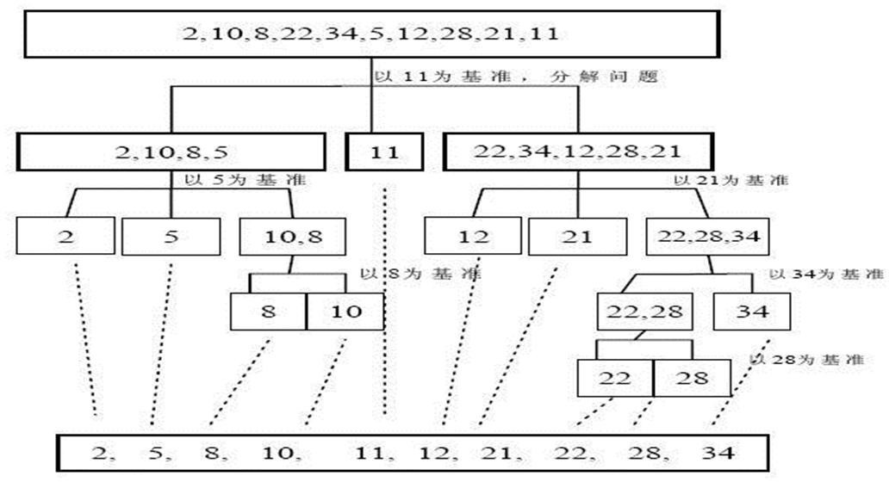
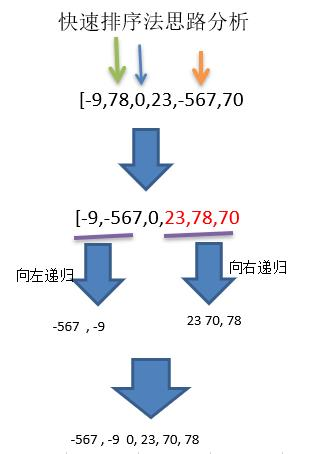

# 快速排序

---
## 基本介绍
快速排序（Quicksort）是对 **冒泡排序** 的一种改进。基本思想是：通过一趟排序将要排序的数据分割成独立的两部分，其中一部分的所有数据都比另外一部分的所有数据都要小，然后再按此方法对这两部分数据分别进行快速排序， **整个排序过程可以递归进行** ，以此达到整个数据变成有序序列。

---
## 图解




---
## 代码实现
```java
/**
 * 使用快速排序算法对数组排序
 * @param array		排序
 * @param left		排序数组的左下标
 * @param right		排序数组的右下标
 */
public static void quickSort(int[] array, int left, int right) {
	// 无序数组长度为1，排序完成
	if (left >= right) {
		return;
	}

	// 选取左边数字为基准值
	int pivot = array[left];
	// 左索引,右索引
	int l = left;
	int r = right;

	while (l < r) {
		// 交替遍历右边和左边,大于pivot的数放右边,小于pivot的数放左边
		while (array[r] >= pivot && r > l) {
			r--;
		}
		// 将小于pivot的数移到左边
		if (r > l) {
			array[l] = array[r];
		}
		while (array[l] < pivot && r > l) {
			l++;
		}
		// 将大于pivot的数移到右边
		if (r > l) {
			array[r] = array[l];
		}
		// 相等,将pivot放到此位置
		if (r == l) {
			array[r] = pivot;
		}
	}

	// 递归左边
	quickSort(array, left, l - 1);
	// 递归右边
	quickSort(array, l + 1, right);
}
```
