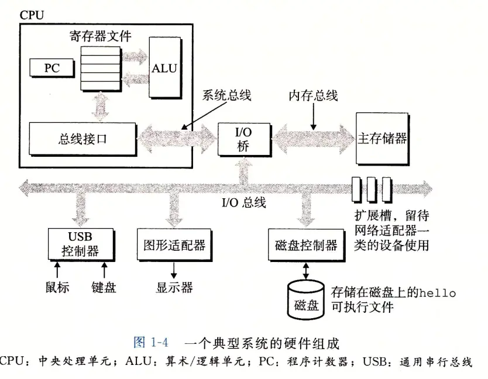
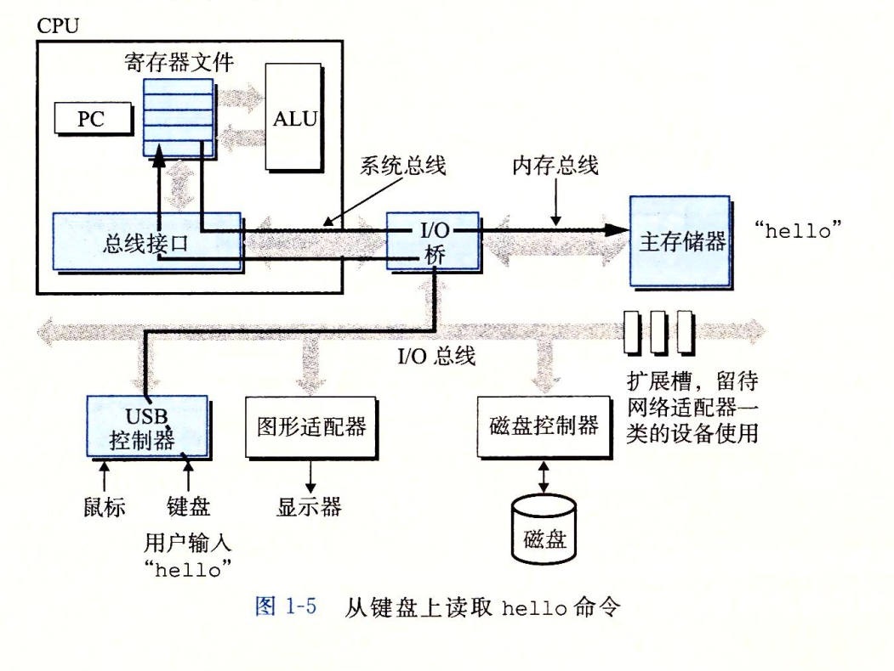
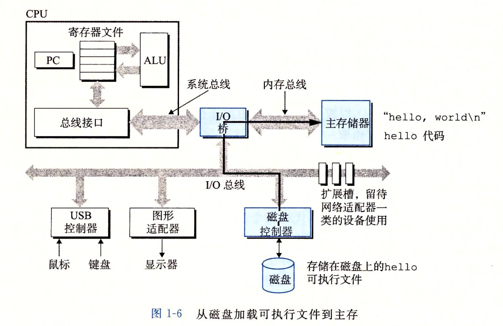
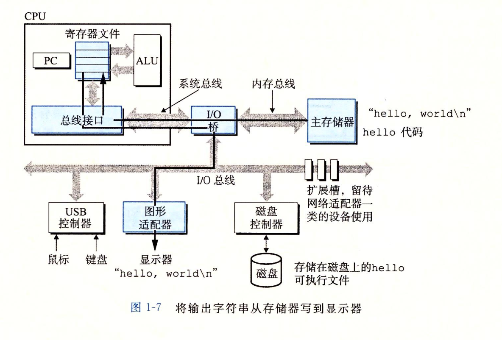
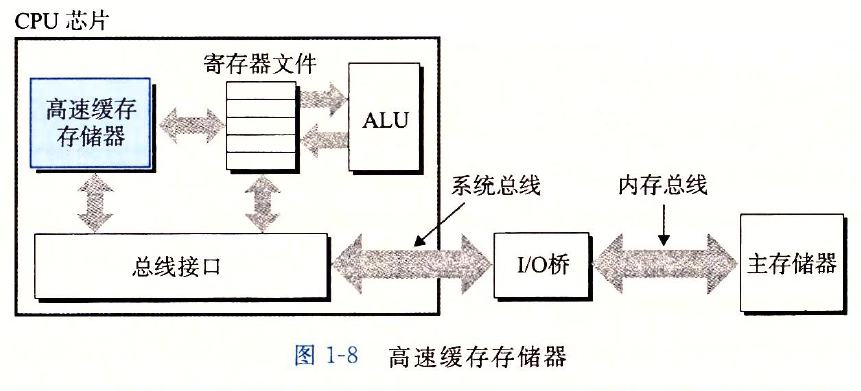
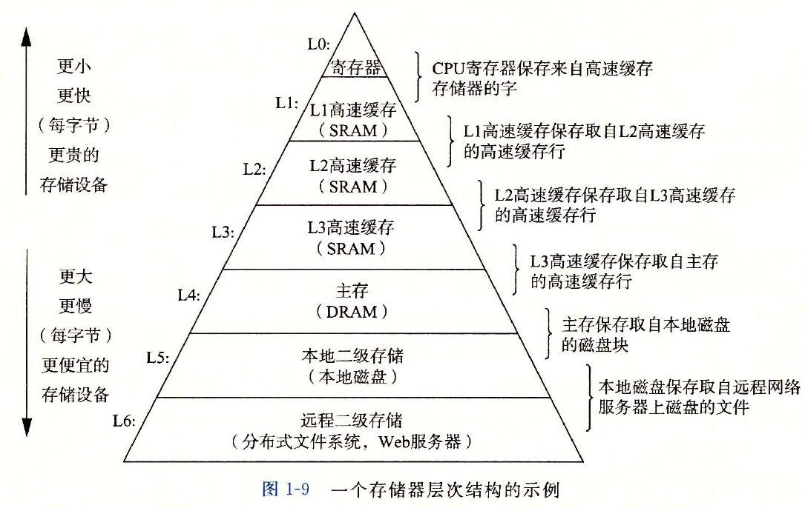
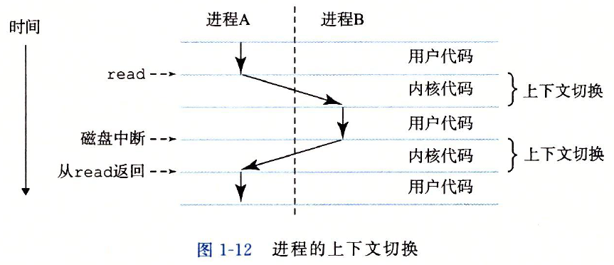
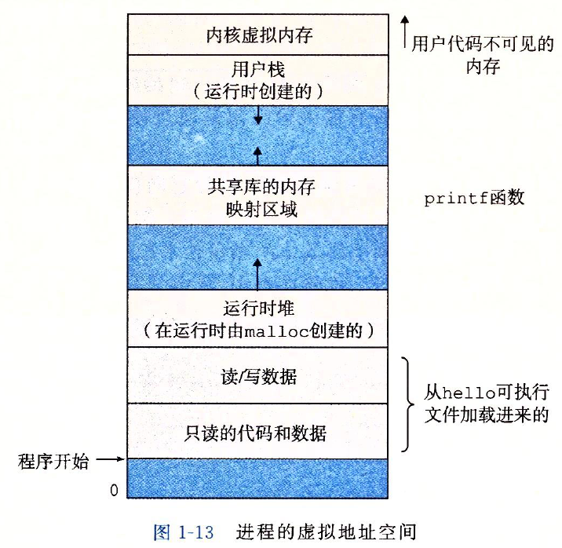
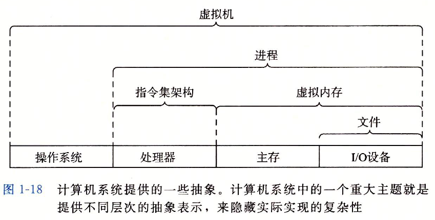

# 计算机系统漫游

## 信息就是 <u>位+上下文</u>

### 文本文件&二进制文件

* **文本文件：** 只由ASCII字符构成的文件称为文本文件
* **二进制文件：** 所有的 **非文本文件** 称之为二进制文件

### 上下文

在不同的上下文中，一个同样的字节序列可能表示一个整数、浮点数、字符串或机器指令。

**即在不同的上下文中同样的字节序列可能有不同的含义。**

## 程序被其他程序翻译成不同的格式

hello.c => 预处理 =》 hello.i =》 编译器 =》 hello.s =》汇编器 =》hello.o =》链接器 =》 hello（可执行的目标程序）

### 预处理

预处理器（CPP *C Preprocesor*）根据以字符#开头的命令，修改原始的C程序。比如hello.c中的`# include <stdio.h>`，预处理器就会把stdio.h的头文件内容插入到原来的c程序中。这样就得到了另一个c程序，通常以.i作文文件的扩展名。

### 编译

编译器（CCL）将文本文件hello.i编译为汇编程序hello.s。

### 汇编

汇编器（as）将hello.s翻译成机器指令，也叫 **可重定位的目标程序**，以 .o作为扩展名。

### 链接

由于我们的程序会调用其他的库函数，因此我们必须将hello.o和其他的 **可重定位的目标程序other.o** 进行合并，这种合并操作称之为链接。

## 计算机系统硬件组成

### 总线

贯穿整个系统的一组电子管称之为总线。携带信息字节并负责 **在各个部件间传递**。 通常总线被设计成传送定长的字节快，也就是 **字(word)**。

### IO设备

IO设备是系统与外部世界的联系通道。

输入设备：键盘和鼠标。

输出设备：显示器。

存储设备：磁盘。

IO设备都通过 *一个控制器或适配器* 与I/O总线相连接。，控制器与适配器之间的区别主要在于它们的封装方式， **控制器是I/O设备本身或者系统主办上的芯片组。**， **而适配器则是插在主板插槽上的卡。**

### 主存

主存是一种临时存储设备，由 *一组动态随机存储器(DRAM)芯片组成*。

### 处理器

处理器主要用于 *解释执行在主存中的指令*。 处理器的核心是一个大小为一个字的存储设备 *(寄存器)*，称之为 **程序计数器(PC)**。

在任何时刻，PC都指向主存中的某条机器语言指令(即含有该条指令的地址)。每执行一条指令，PC会被更新，使其指向下一条指令， **而这一条指令并不一定和在内存中刚刚执行的指令相邻。**

CPU在指令的要求下可能会执行这些操作：

* 加载：从主存复制一个字节或者一个字到寄存器，以覆盖寄存器原来的内容。
* 存储：从寄存器复制一个字节或者一个字到主存的某个位置，以覆盖这个位置上原来的内容。
* 操作：把两个寄存器的内容复制到ALU，ALU对这两个字做算术运算，并将结果存放到一个寄存器中，以覆盖该寄存器中原来的内容。
* 跳转：从指令本身中抽取一个字，并将这个字复制到程序计数器(PC)中，以覆盖PC中原来的值。

## 程序如何在计算机系统中运行

### 加载执行命令到主存

当在键盘上输入`./hello`时，shell程序将字符逐一读入到寄存器，再把它放入到内存中。

### 加载程序到主存

当在键盘上输入回车后，shell就知道命令已经输入完成，然后shell调用其他指令来讲程序加载到主存中，利用 *直接存储器存取(DMA)*的方式，数据可以不通过处理器直接从磁盘到达主存。

### 执行程序

在程序加载到主存后，处理器就开始执行程序中的指令，指令先被复制到寄存器中，然后被执行。最终 *hello world*被显示在屏幕上。

## 存储器层次结构

### 高速缓存存储器

### 存储器层次

## 操作系统

### 操作系统的功能

1. 防止硬件被失控的应用程序滥用
2. 向应用程序提供简单而又一致的机制来控制复杂而又大不相同的低级硬件设备。

### 操作系统的几个抽象

#### 进程

* 进程是操作系统对一个 **正在运行的程序** 的一种 *抽象。*

* 一个CPU看上去是在并发的执行多个进程，这是通过处理器在进程之间进行切换来实现的。操作系统实现这种交错执行的机制称之为 **上下文切换。**

  

##### 上下文

操作系统需要保持跟踪进程运行所需的所有状态信息。这种状态，称之为 *上下文*。

上下文包含如下信息：

* PC寄存器当前值
* 主存内容

##### 线程

一个进程实际上由多个称为 *线程* 的执行单元组成，每个线程都运行在进程的上下文中，并 *共享同样的代码和全局数据。*

#### 虚拟内存

* 虚拟内存是一个抽象概念，它为每个进程提供了一个假象，即每个进程都在独占地使用主存。

* 每个进程看到的内存都是一致的，称为 *虚拟地址空间。*

* 进程的虚拟地址空间

  

  * 程序代码和数据
  * 堆：当调用`malloc`和`free`这样的C标准库函数时，堆可以在运行时动态地扩展和收缩
  * 共享库
  * 栈：编译器用它来实现函数的调用。和堆一样，用户栈在程序执行期间也可以动态地扩展和收缩
  * 内核虚拟内存

#### 文件

文件就是字节序列。

## 并发和并行

*并发* 指的是一个同时具有多个活动的系统，*并行* 指的是用并发来使一个系统运行的更快。

### 超线程

指的是一项允许一个CPU执行多个控制流的技术。它涉及CPU某些硬件有多个备份，比如 *程序计数器和寄存器* ，而其他的硬件部分只有一份，比如 *算术运算单元*。

### 指令集并行

现代处理器可以同时执行多条指令的属性称为指令集并行。即在一个时钟周期通过流水线的方式执行多个指令。

### 单指令、多数据并行

现在处理器的特殊硬件，允许一条指令产生多个可以并行执行的操作。

## 计算机系统的抽象

