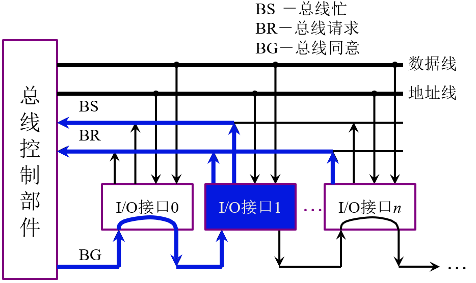
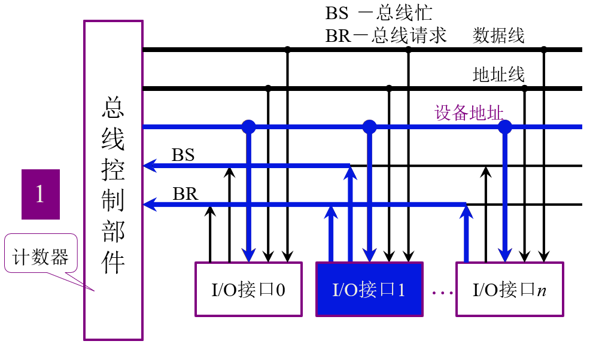
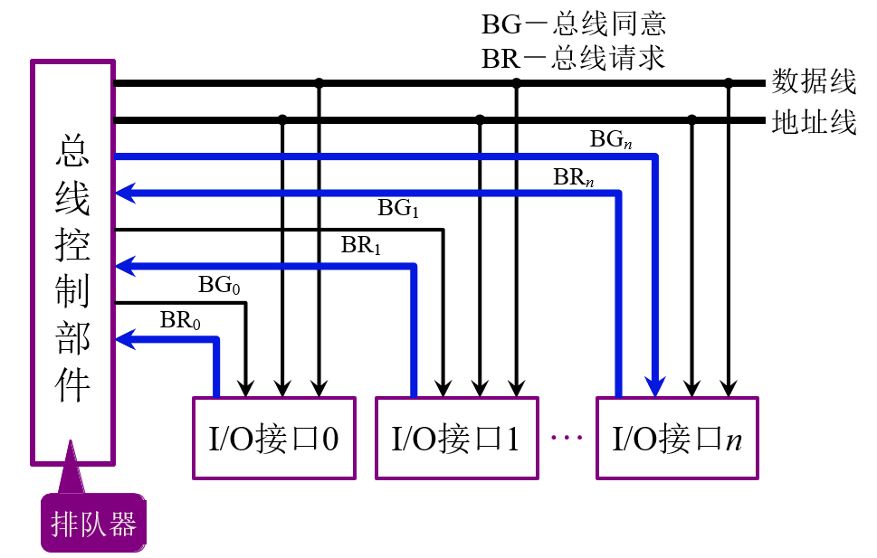

# 基本概念
* 主设备(模块)
  对总线有 **控制权**
* 从设备(模块)
  **响应** 从主设备发送来的总线命令
* 总线判优控制
  > 集中式
  >> 链式查询
  >> 计数器定时查询
  >> 独立请求方式

  > 分布式

# 链式查询方式

1. **I/O接口1** 和 **I/O接口n** 发送总线请求
2. 总线控制部件通过链式查询，I/O接口1获得 **占用权**
3. I/0接口1 通过BS通知 总线控制部件 **总线已被占用**

## 特点&缺点
* 优先级由电路确定
* 出现电路故障可能导出后面的I/O接口永远无法获得总线的使用权

# 计数器定时查询

1. **I/O接口1** 和 **I/O接口n** 发送总线请求
2. 总线控制器部件通过 **计数器的值** 来对I/O设备进行查询，I/O接口1获得 **占用权**
3. I/0接口1 通过BS通知 总线控制部件 **总线已被占用**

## 特点
1. 优先级控制灵活,由 **计数器的值** 来控制
2. I/O接口越多，则线路越多

# 独立请求方式

1. **I/O接口1** 和 **I/O接口n** 发送总线请求
2. 总线控制部件 同一 I/O接口1的请求， I/O接口n进入排队队列

## 特点
1. 响应快，不用遍历所有设备
2. 线路太多
