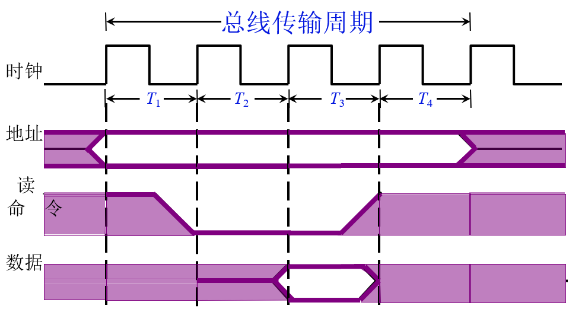
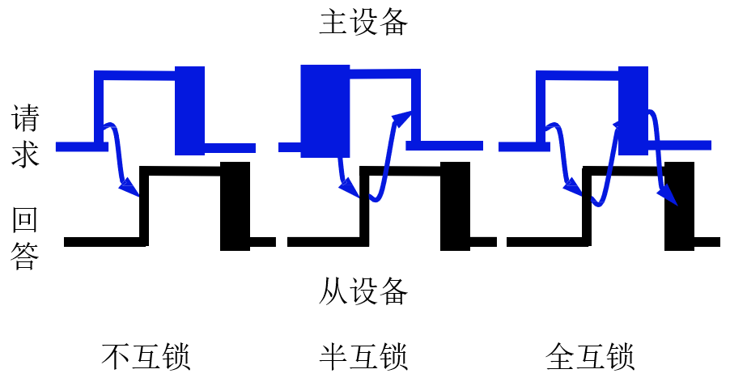
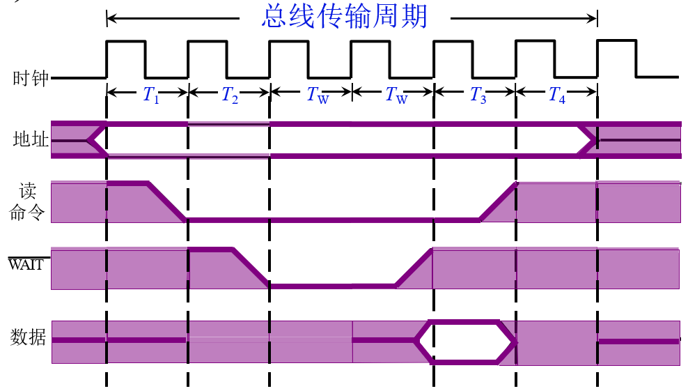

# 基本概念
* 目的
  解决通信双方 **协调配合** 的问题
* 总线传输周期
  1. 申请分配阶段
  **主模块申请**， 总线仲裁决定
  2. 寻址阶段
  主模块向从模块 **给出地址** 和 **命令**
  3. 传数阶段
  主模块和从模块 **交换数据**
  4. 结束阶段
  主模块 **撤消有关信息**

# 通信的四种方式
* 同步通信
  由 **统一时标** 控制数据传送
* 异步通信
  采用 **应答方式** ，没有公共时钟标准
* 半同步通信
  **同步、异步结合**
* 分离式通信
  充分 **挖掘** 系统 **总线每个瞬间** 的 **潜力**

# 同步通信

1. 主设备(CPU) 给出 **地址**
2. 主设备(cpu) 发出 **读命令**
3. 从设备(I/O设备) 给出 **数据信号**
4. **数据信号** 和 **读信号** 撤销
5. **地址信号** 撤销

## 特点
* 速度高的设备需要 **等待** 速度低的设备
* 适用于 **速度比较接近** 的设备之间的通信

# 异步通信

## 特点
* **不互锁** 方式通信不可靠
* **半互锁** 方式有可能造成请求信号一直处于等待状态， **无法释放**
* 异步通信实际上是通过 **请求和应答** 来实现通信的可靠性

# 半同步通信

1. 主设备(CPU) 给出 **地址**
2. 主设备(cpu) 发出 **读命令**
3. 从设备(I/O设备) 给出 **数据信号**
4. 主设备(cpu) 等待 **从设备**
5. **等待信号**、 **数据信号**、**读信号** 撤销
6. **地址信号** 撤销

# 上述三种通信方式的共同特点
| 信号    | 总线占用情况    |
| :------------- | :------------- |
| 主模块发地址 、命令     | 占用总线      |
| 从模块准备数据          | 不占用总线 总线空闲      |
| 从模块向主模块发数据     | 占用总线     |

# 分离式通信
1. **主模块** 申请 **占用总线**，使用完后 即 **放弃总线** 的使用权
2. **从模块** 申请 占用总线，将各种信息送至总线上

## 特点
* 各模块有权申请占用总线
* 采用同步方式通信，不等对方回答
* 各模块准备数据时，不占用总线
* 总线被占用时，无空闲 **充分提高了总线的有效占用**
