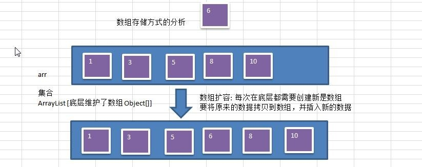
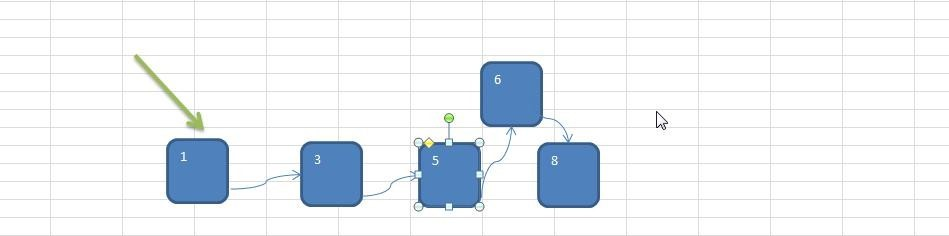

# 为什么需要树结构
---
## 数组存储方式
**优点：** 通过 **下标方式访问元素** ，速度快。对于有序数组，还可使用 **二分查找提高检索速度** 。
**缺点：** 如果要检索具体某个值，或者 **插入** 值(按一定顺序)会 **整体移动** ，效率较低 [示意图]

---
## 链式存储方式
**优点：** 在一定程度上对数组存储方式有优化(比如： **插入** 一个数值节点，只需要将插入节点，链接到链表中即可， **删除效率也很好** )。
**缺点：** 在进行 **检索** 时，效率仍然较低，比如(检索某个值，需要从头节点开始遍历) 【示意图】

---
## 树存储方式的分析
能提高数据 **存储，读取** 的效率,	比如利用 二叉排序树(Binary Sort Tree)，既可以保证数据的检索速度，同时也可以保证数据的插入，删除，修改的速度。
