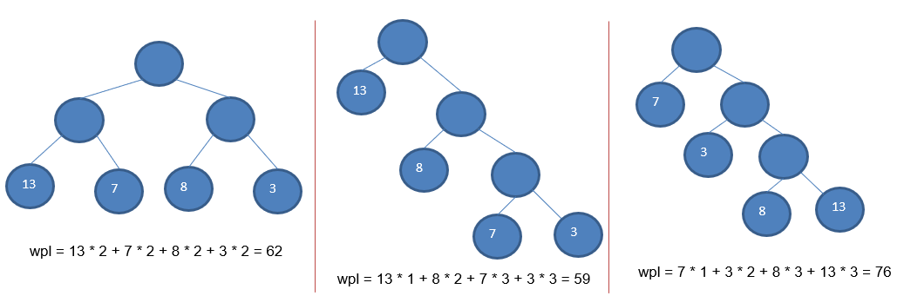
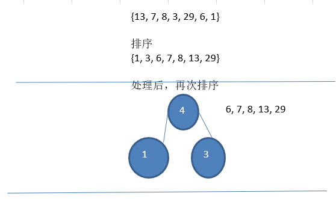
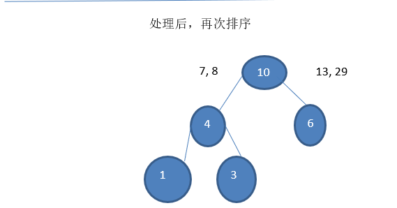
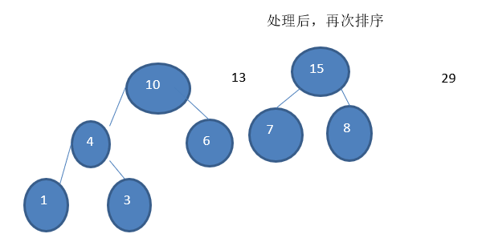
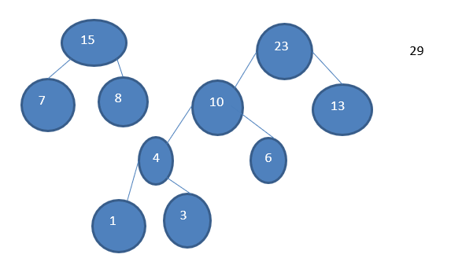
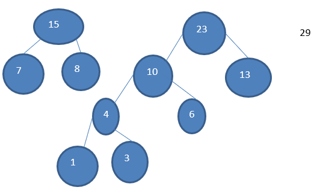
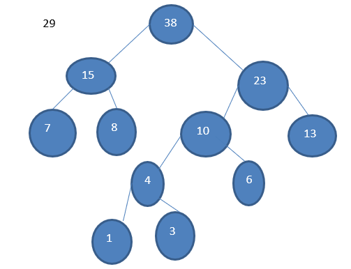
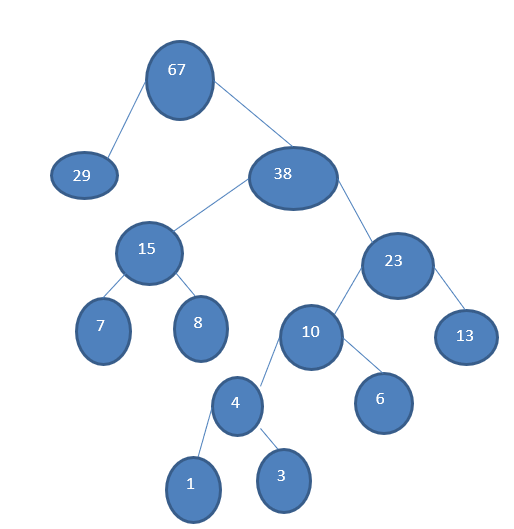

# 赫夫曼树

## 基本介绍

* 给定 n 个权值作为 n 个叶子结点，构造一棵二叉树，**若该树的带权路径长度(wpl)达到最小**，称这样的二叉树为最优二叉树，也称为哈夫曼树(Huffman Tree), 还有的书翻译为霍夫曼树。

* 赫夫曼树是带权路径长度最短的树，**权值较大的结点离根较近**

## 重要概念

### 路径和路径长度

在一棵树中，从一个结点往下可以达到的孩子或孙子结点之间的通路，称为路径。**通路中分支的数目称为路径长度**。若规定根结点的层数为 1，则从根结点到第 L 层结点的路径长度为 L-1

### 结点的权及带权路径长度

若将树中结点赋给一个有着某种含义的数值，则这个数值称为该结点的权。**结点的带权路径长度为**：从根结点到该结点之间的路径长度与该结点的权的乘积

### 树的带权路径长度

树的带权路径长度规定为**所有叶子结点的带权路径长度之和**，记为 WPL(weighted path length) ,权值越大的结点离根结点越近的二叉树才是最优二叉树。

### WPL最小的就是赫夫曼树



## 思路图解

### 步骤

1. 从小到大进行排序, 将每一个数据，每个数据都是一个节点 ， 每个节点可以看成是一颗最简单的二叉树.

2. 取出根节点权值最小的两颗二叉树 
3. 组成一颗新的二叉树, 该新的二叉树的根节点的权值是前面两颗二叉树根节点权值的和 
4. 再将这颗新的二叉树，以根节点的权值大小 再次排序， 不断重复 1-2-3-4 的步骤，直到数列中，所有的数据都被处理，就得到一颗赫夫曼树

### 图解

1. **排序，**取出前两个节点，构成一颗二叉树

   

2. **再次排序**，取出前两个节点，构成一颗二叉树

   

3. **再次排序**，取出前两个节点，构成一颗二叉树

   

4. **再次排序**，取出前两个节点，构成一颗二叉树

   

5. **再次排序**，取出前两个节点，构成一颗二叉树

   

6. **再次排序**，取出前两个节点，构成一颗二叉树

   

## 代码实现

```java
public class Node {
	// 权值
	int value;
	// 左节点
	Node left;
	// 右节点
	Node right;

	public Node(int value) {
		this.value = value;
	}

	@Override
	public String toString() {
		return "Node [value=" + value + "]";
	}
	
	// 前序遍历
	public void preOrder() {
		System.out.println(this);
		// 左递归
		if (this.left != null) {
			this.left.preOrder();
		}
		// 右递归
		if (this.right != null) {
			this.right.preOrder();
		}
	}
}

public class HuffmanTree {
	/**
	 * 将数组构建成一个huffman树
	 * @param array	数组
	 * @return		huffman树
	 */
	public static Node buildHuffmanTree(int[] array) {
		// 数组转换为一个集合
		List<Node> nodeList =
				Arrays.stream(array)
					.mapToObj(value -> new Node(value))
					.collect(Collectors.toList());

		// 大于一个元素
		while (nodeList.size() > 1) {
			// 排序
			nodeList.sort((node1, node2) -> Integer.compare(node1.value, node2.value));
			// 取出前两个元素
			Node node1 = nodeList.get(0);
			Node node2 = nodeList.get(1);
			// 构建成一棵树
			Node newNode = new Node(node1.value + node2.value);
			newNode.left = node1;
			newNode.right = node2;
			// 删除前两个节点
			nodeList.remove(node1);
			nodeList.remove(node2);
			// 添加新的节点
			nodeList.add(newNode);
		}

		return nodeList.get(0);
	}
	
	public static void preOrder(Node node) {
		node.preOrder();
	}
}
```

