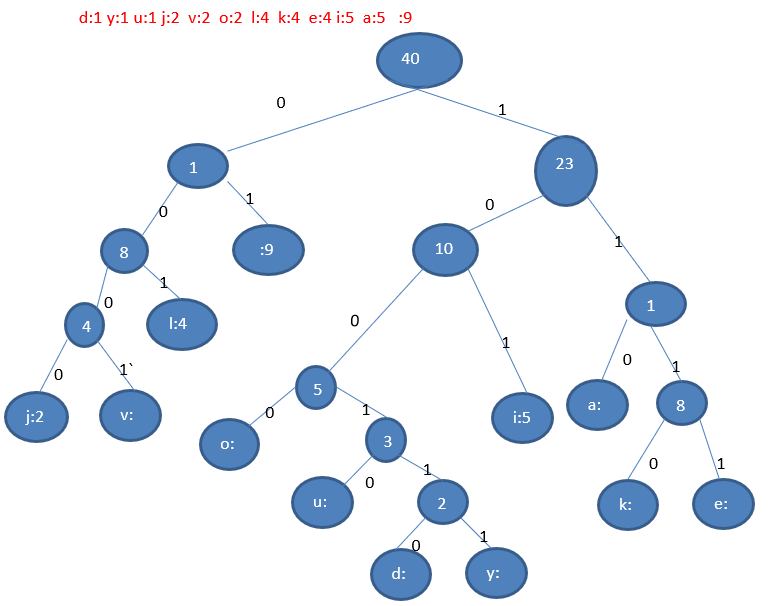
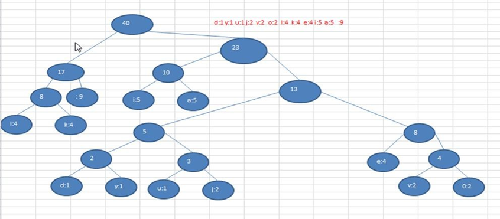

# 赫夫曼编码

## 基本介绍

1.  赫夫曼编码也翻译为  哈夫曼编码(Huffman Coding)，又称霍夫曼编码，是一种编码方式, 属于一种程序算法

2.  赫夫曼编码是赫哈夫曼树在电讯通信中的经典的应用之一。

3.  赫夫曼编码广泛地用于数据文件压缩。其压缩率通常在 20%～90%之间

4. 赫夫曼码是可变字长编码(VLC)的一种。Huffman 于 1952 年提出一种编码方法，称之为最佳编码

## 原理详解

### 定长编码

```
// 共40个字符(包括空格)  
i like like like java do you like a java

//对应Ascii码
105 32 108 105 107 101 32 108 105 107 101 32 108 105 107 101 32 106 97 118 97 32 100 111 32 121 111 117 32 108 105 107 101 32 97 32 106 97 118 97

//对应的二进制
01101001 00100000 01101100 01101001 01101011 01100101 00100000 01101100 01101001 01101011 01100101 00100000 01101100 01101001 01101011 01100101 00100000 01101010 01100001 01110110 01100001 00100000 01100100 01101111 00100000 01111001 01101111 01110101 00100000 01101100 01101001 01101011 01100101 00100000 01100001 00100000 01101010 01100001 01110110 01100001
总的长度是  359   (包括空格)
```

### 变长编码

```
i like like like java do you like a java       // 共40个字符(包括空格)

d:1 y:1 u:1 j:2 v:2  o:2  l:4  k:4  e:4 i:5  a:5  空格:9  // 各个字符对应的个数
0=空格,  1=a, 10=i, 11=e, 100=k, 101=l, 110=o, 111=v, 1000=j, 1001=u, 1010=y, 1011=d 
// 说明：按照各个字符出现的次数进行编码，原则是出现次数越多的，则编码越小，比如 空格出现了9 次， 编码为0 ,其它依次类推.

按照上面给各个字符规定的编码，则我们在传输  "i like like like java do you like a java" 数据时，编码就是 10010110100...  
```

字符的编码都不能是其他字符编码的前缀，符合此要求的编码叫做 **前缀编码** ， 即不能匹配到重复的编码

### 赫夫曼编码

```
i like like like java do you like a java       // 共40个字符(包括空格)

d:1 y:1 u:1 j:2  v:2  o:2  l:4  k:4  e:4 i:5  a:5   空格:9  // 各个字符对应的个数
```

**按照上面字符出现的次数构建一颗赫夫曼树, 次数作为权值**

​	

* 生成赫夫曼编码的步骤：

  1. 从小到大进行排序, 将每一个数据，每个数据都是一个节点 ， 每个节点可以看成是一颗最简单的二叉树

  2. 取出根节点权值最小的两颗二叉树

  3. 组成一颗新的二叉树, 该新的二叉树的根节点的权值是前面两颗二叉树根节点权值的和

  4.  再将这颗新的二叉树，以根节点的权值大小 再次排序， 不断重复  1-2-3-4 的步骤，直到数列中，所有的数据都被处理， 就得到一颗赫夫曼树

  5. 根据赫夫曼树，给各个字符,规定编码 (前缀编码)， 向左的路径为 0 向右的路径为 1 ， 编码如下:

     ```
     o: 1000   u: 10010  d: 100110  y: 100111  i: 101
     a : 110   k: 1110   e: 1111    j: 0000    v: 0001
     l: 001    空格: 01
     ```

  6. 按照上面的赫夫曼编码，我们的"i like like like java do you like a java"    字符串对应的编码为(注意这里我们使用的无损压缩)

     ```
     1010100110111101111010011011110111101001101111011110100001100001110011001111000011001111000100100100110111101111011100100001100001110
     // 长度为:133 
     说明:
     	原来长度是  359 , 压缩了  (359-133) / 359 = 62.9%
     	此编码满足前缀编码, 即字符的编码都不能是其他字符编码的前缀。不会造成匹配的多义性
     ```

### 注意事项

注意, 这个赫夫曼树根据**排序方法不同**，也可能不太一样，这样对应的**赫夫曼编码也不完全一样**，但是 **wpl** 是一样的，都是最小的, 最后生成的赫夫曼编码的长度是一样，比如: 如果我们让每次生成的新的二叉树总是排在权值相同的二叉树的最后一个，则生成的二叉树为:



## 最佳实践

### 压缩文本

```java
// 压缩算法
@Override
public byte[] encode(byte[] originData) {
    // 转换为赫夫曼树节点
    List<HuffmanTreeNode<Byte>> nodes = toHuffmanTreeNodes(originData);

    // 构建赫夫曼树
    HuffmanTreeNode<Byte> huffmanTree = buildHuffmanTree(nodes);

    // 生成赫夫曼编码
    Map<Byte, String> huffmanCode = generateHuffmanCode(huffmanTree);
    this.huffmanCode = huffmanCode;

    // 进行编码
    return doEncode(originData, huffmanCode);
}

// 将原始数据转换为赫夫曼树节点
private List<HuffmanTreeNode<Byte>> toHuffmanTreeNodes(byte[] originData) {
    // 统计每个字节出现的次数
    Map<Byte, Integer> byteCounter = new HashMap<Byte, Integer>();
    for (int i = 0; i < originData.length; i++) {
        byte currentByte = originData[i];
        Integer count = byteCounter.get(currentByte);
        if (count == null) {
            byteCounter.put(currentByte, Integer.valueOf(1));
        } else {
            byteCounter.put(currentByte, count + 1);
        }
    }

    List<HuffmanTreeNode<Byte>> nodes = new ArrayList<>();
    // 转换为节点
    byteCounter.forEach((byteValue, count) -> {
        nodes.add(new HuffmanTreeNode<Byte>(byteValue, count));
    });
    return nodes;
}

// 将给定的节点构建成一颗赫夫曼树
private HuffmanTreeNode<Byte> buildHuffmanTree(List<HuffmanTreeNode<Byte>> nodes) {
    while (nodes.size() > 1) {
        // 排序
        Collections.sort(nodes);

        // 取前两个节点
        HuffmanTreeNode<Byte> node1 = nodes.get(0);
        HuffmanTreeNode<Byte> node2 = nodes.get(1);

        // 构建节点
        HuffmanTreeNode<Byte> newNode =
            new HuffmanTreeNode<Byte>(null, node1.getWeight() + node2.getWeight());
        newNode.left = node1;
        newNode.right = node2;

        // 添加新节点,删除旧节点
        nodes.add(newNode);
        nodes.remove(node1);
        nodes.remove(node2);
    }
    return nodes.get(0);
}

// 根据赫夫曼树生成每个字节的赫夫曼编码
private Map<Byte, String> generateHuffmanCode(HuffmanTreeNode<Byte> huffmanTree) {
    Map<Byte, String> huffmanCode = new HashMap<>();

    // 获取左子节点的所有叶子节点的编码
    getCodes(huffmanTree.left, "0", new StringBuilder(), huffmanCode);
    // 获取右子节点的所有叶子节点的编码
    getCodes(huffmanTree.right, "1", new StringBuilder(), huffmanCode);
    return huffmanCode;
}

// 获取一个节点的的编码
private void getCodes(HuffmanTreeNode<Byte> node,
                      String code,
                      StringBuilder prevNodeHuffmanCode,
                      Map<Byte, String> huffmanCode) {
    StringBuilder codeBuilder = new StringBuilder(prevNodeHuffmanCode);
    codeBuilder.append(code);

    if (node == null) {
        return;
    }

    // 叶子节点
    if (node.getData() != null) {
        huffmanCode.put(node.getData(), codeBuilder.toString());
        return;
    }

    // 非叶子节点
    getCodes(node.left, "0", codeBuilder, huffmanCode);

    getCodes(node.right, "1", codeBuilder, huffmanCode);

}

// 根据原始数据和赫夫曼编码进行最终的编码
private byte[] doEncode(byte[] originData, Map<Byte, String> huffmanCode) {
    StringBuilder codeBuilder = new StringBuilder();
    for (int i = 0; i < originData.length; i++) {
        byte currentByte = originData[i];
        String code = huffmanCode.get(currentByte);
        codeBuilder.append(code);
    }

    return toBytes(codeBuilder.toString());
}

// 将二进制字符串转换为字节数组
private byte[] toBytes(String binaryString) {
    int length = binaryString.length() / 8;
    if (length % 8 != 0) {
        length += 1;
    }

    byte[] bytes = new byte[length];
    for (int i = 0; i < bytes.length; i++) {
        // 最后一个字节
        int start = i * 8;
        int end = start + 8;

        // 非最后一个字节
        if (i < bytes.length - 1) {
        } else {
            end = binaryString.length();
        }
        String byteStr = binaryString.substring(start, end);
        bytes[i] = (byte) Integer.parseInt(byteStr, 2);
    }
    return bytes;
}
```

### 解压缩文本

```java
@Override
public byte[] decode(byte[] code) {
    if (this.huffmanCode == null) {
        throw new IllegalStateException("未压缩,还不能解压");
    }

    // 转为二进制字符串
    String binaryString = toBinaryString(code);

    // 根据赫夫曼编码还原
    Map<String, Byte> huffmanCodeMap = new HashMap<>();
    this.huffmanCode.forEach((value, binaryStr) -> {
        huffmanCodeMap.put(binaryStr, value);
    });

    return revert(huffmanCodeMap, binaryString);
}

// 将字节数组转换为二进制字符串
private String toBinaryString(byte[] bytes) {
    StringBuffer sb = new StringBuffer();
    for (int i = 0; i < bytes.length; i++) {
        // 转为补码
        byte currentByte = bytes[i];
        int byteIntValue = Byte.toUnsignedInt(currentByte);

        // 最后一个字节,无须补高位
        if (i == bytes.length - 1) {
            String binaryString = Integer.toBinaryString(byteIntValue);
            sb.append(binaryString);
        } else {
            // 补高位
            byteIntValue = byteIntValue | 256;
            String binaryString = Integer.toBinaryString(byteIntValue);
            sb.append(binaryString.substring(binaryString.length() - 8));
        }
    }
    return sb.toString();
}

// 根据赫夫曼编码和二进制字符串还原编码
private byte[] revert(Map<String, Byte> huffmanCodeMap, String binaryString) {
    int tempIndex = 0;
    StringBuilder tempString = new StringBuilder();
    List<Byte> result = new ArrayList<>();
    while (tempIndex <= binaryString.length() - 1) {
        tempString.append(binaryString.charAt(tempIndex));
        Byte byteValue = huffmanCodeMap.get(tempString.toString());
        // 匹配到
        if (byteValue != null) {
            result.add(byteValue);
            tempString.delete(0, tempString.length());
        } else {
            // 未匹配到
        }
        tempIndex++;
    }

    byte[] bytes = new byte[result.size()];
    for (int i = 0; i < result.size(); i++) {
        Byte b = result.get(i);
        bytes[i] = b;

    }
    return bytes;
}
```

## 赫夫曼编码特点

1. 如果文件本身就是经过压缩处理的，那么使用赫夫曼编码再压缩效率不会有明显变化, 比如视频,ppt 等等文件；
2. 赫夫曼编码是按字节来处理的，因此可以处理所有的文件(二进制文件、文本文件) ；
3. 如果一个文件中的内容，重复的数据不多，压缩效果也不会很明显。