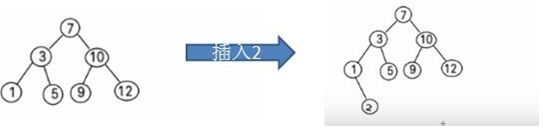
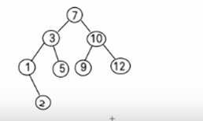

# 二叉排序树

## 基本介绍

**二叉排序树**：BST: (Binary Sort(Search) Tree), 对于二叉排序树的**任何一个非叶子节点**，要求**左子节点的值比当前节点的值小**，**右子节点的值比当前节点的值大**。

**特别说明**：如果有相同的值，可以将该节点放在左子节点或右子节点

比如针对数据 (7, 3, 10, 12, 5, 1, 9) ，对应的二叉排序树为：



## 添加节点

```java
public class BinarySortTree {
	// 根节点
	private Node root;

	public BinarySortTree(Node root) {
		this.root = root;
	}

	// 添加节点
	public void add(Node node) {
		if (this.root == null) {
			this.root = node;
		} else {
			this.root.add(node);
		}
	}
}

public class Node {
	// 节点的值
	public int value;

	// 左子节点
	public Node left;

	// 右子节点
	public Node right;

	public Node(int value) {
		super();
		this.value = value;
	}

	@Override
	public String toString() {
		return "Node [value=" + value + "]";
	}

	// 添加节点
	public void add(Node node) {
		// 小于,往左放
		if (node.value < this.value) {
			if (this.left == null) {
				this.left = node;
			} else {
				this.left.add(node);
			}
		} else {
			// 大于等于,往右放
			if (this.right == null) {
				this.right = node;
			} else {
				this.right.add(node);
			}
		}
	}
}
```

## 中序遍历

```java
public class BinarySortTree {
	// 根节点
	private Node root;

	public BinarySortTree(Node root) {
		this.root = root;
	}

	// 中序遍历
	public void infixOrder() {
		if (this.root == null) {
			System.out.println("二叉排序树为空");
		} else {
			this.root.infixOrder();
		}
	}
}

public class Node {
	// 中序遍历
	public void infixOrder() {
		if (this.left != null) {
			this.left.infixOrder();
		}

		System.out.println(this);

		if (this.right != null) {
			this.right.infixOrder();
		}
	}
}
```

## 删除节点

### 思路分析



二叉排序树的删除按照删除节点情况可以分为以下三种情况

#### 删除的节点为叶子节点

1. 找到要删除的节点`targetNode`
2. 找到`targetNode`的父节点`parentNode`
3. 如果`targetNode`是`parentNode`的左子节点,则`parentNode.left=null`,反之`parentNode.right=null`

#### 删除的节点是只有一颗子树的节点

1. 找到要删除的节点`targetNode`

2. 找到`targetNode`的父节点`parentNode`

3. 判断`tagetNode`存在左子节点还是右子节点

4. 判断`targetNode`是`parentNode`的左子节点还是右子节点

5. 如果`targetNode`存在左子节点

   * 如果`targetNode`是`parentNode`的左子节点

     `parentNode.left = target.left`

   * 如果`parentNode`是`parentNode`的右子节点

     `parentNode.right = target.left`

6. 如果`targetNode`存在右子节点

   * 如果`targetNode`是`parentNode`的左子节点

     `parentNode.left = target.right`

   * `parentNode`是`parentNode`的右子节点

     `parentNode.right = target.right`

#### 删除的节点是有两颗子树的节点

1. 找到要删除的节点`targetNode`
2. 找到`targetNode`的父节点`parentNode`
3. 找到`tagetNode`右子节点中最小的值`rightTreeMinNode`
4. 删除最小节点`rightTreeMinNode`
5. `targetNode.value = rightTreeMinNode.value`

### 代码实现

```java
public class BinarySortTree {
	// 根节点
	private Node root;

	public BinarySortTree(Node root) {
		this.root = root;
	}

	// 删除节点
	public void delete(int value) {
		if (this.root == null) {
			System.out.println("当前二叉排序树为null");
			return;
		}

		// 删除的是根节点
		if (this.root.value == value) {
			// 无子节点
			if (this.root.left == null && this.root.right == null) {
				this.root = null;
			} else if (this.root.left != null && this.root.right != null) {
				// 有两个子节点
				// 找右子树最小的节点
				Node minNode = this.root.deleteMinNode(this.root.right);
				this.root.value = minNode.value;
			} else {
				// 只有一个子节点
				if (this.root.left != null) {
					this.root = this.root.left;
				} else {
					this.root = this.root.right;
				}
			}
			return;
		}

		this.root.deleteChildNode(value);
	}
}

public class Node {
	// 节点的值
	public int value;

	// 左子节点
	public Node left;

	// 右子节点
	public Node right;

	public Node(int value) {
		super();
		this.value = value;
	}

	// 删除子节点
	public void deleteChildNode(int value) {
		// 找到要删除的节点targetNode
		Node targetNode = findNode(value);
		if (targetNode == null) {
			System.out.println("不存在要删除的节点,value=" + value);
			return;
		}

		// 找到targetNode的父节点parentNode
		Node parentNode = findParentNode(value);
		if (parentNode == null) {
			throw new IllegalStateException("该函数只提供删除子节点的功能");
		}

		// 删除的节点为叶子节点
		if (targetNode.left == null && targetNode.right == null) {
			deleteLeafNode(targetNode, parentNode);
		} else if (targetNode.left != null && targetNode.right != null) {
			// 删除的节点是有两颗子树的节点
			deleteHasTowSubTreeNode(targetNode, parentNode);
		} else {
			// 删除的节点是有一颗子树的节点
			// 判断删除的节点存在左子节点还是右子节点
			deleteHasOneSubTreeNode(targetNode, parentNode);
		}
	}

	// 查找节点
	private Node findNode(int value) {
		if (this.value == value) {
			return this;
		}

		if (value < this.value && this.left != null) {
			return this.left.findNode(value);
		} else if (value > this.value && this.right != null) {
			return this.right.findNode(value);
		}
		return null;
	}

	// 查找父节点
	private Node findParentNode(int value) {
		if ((this.left != null && this.left.value == value)
				|| (this.right != null && this.right.value == value)) {
			return this;
		}

		if (this.left != null && value < this.value) {
			return this.left.findParentNode(value);
		}

		if (this.right != null && value > this.value) {
			return this.right.findParentNode(value);
		}
		return null;
	}

	// 删除叶子节点
	private void deleteLeafNode(Node targetNode, Node parentNode) {
		// targetNode是parentNode的左子节点
		if (parentNode.left != null && parentNode.left == targetNode) {
			parentNode.left = null;
		} else {
			parentNode.right = null;
		}
	}

	// 删除只有一颗子树的节点
	private void deleteHasOneSubTreeNode(Node targetNode, Node parentNode) {
		if (targetNode.left != null) {
			if (parentNode.left == targetNode) {
				parentNode.left = targetNode.left;
			} else {
				parentNode.right = targetNode.left;
			}
		} else {
			if (parentNode.left == targetNode) {
				parentNode.left = targetNode.right;
			} else {
				parentNode.right = targetNode.right;
			}
		}
	}

	// 删除有两个子节点的节点
	private void deleteHasTowSubTreeNode(Node targetNode, Node parentNode) {
		// 删除右子树最小的节点
		Node minNode = deleteMinNode(targetNode.right);
		targetNode.value = minNode.value;
	}

	// 删除子树最小的节点
	public Node deleteMinNode(Node node) {
		Node minNode = node;
		while (minNode.left != null) {
			minNode = minNode.left;
		}
		deleteChildNode(minNode.value);
		return minNode;
	}
}
```

