# 平衡二叉树(AVL树)

## 为什么需要平衡二叉树

给定数列 `{1,2,3,4,5,6}`，创建一个二叉排序树

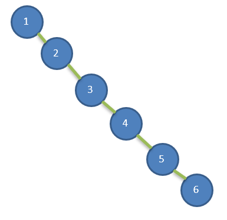

存在的问题：

1. 左子树全部为空，从形式上看，更像一个单链表.

2. 插入速度没有影响

3. **查询速度明显降低(因为需要依次比较)**, 不能发挥 BST的优势，因为每次还需要比较左子树，其查询速度比单链表还慢。


## 平衡二叉树的定义

平衡二叉树也叫平衡**二叉搜索树**（Self-balancing binary search tree）又被称为 AVL 树， 可以保证查询效率较高。

具有以下特点：

1. 它是**一 棵空树**或**它的左右两个子树的高度差的绝对值不超过** **1**；
2. **左右两个子树都是一棵平衡二叉树**。平衡二叉树的常用实现方法有红黑树、AVL、替罪羊树、Treap、伸展树等。

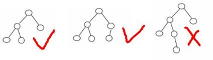

## 创建平衡二叉树思路分析

在添加一个新节点后，如果出现 `左子树高度-右子树高度>1`或 `右子树高度-左子树高度>1`，则需要进行特殊处理。

### 左子树高度-右子树高度>1(右旋转)

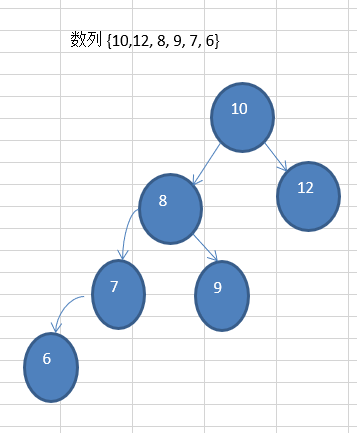

如图，当插入节点6时，`左子树高度(4)-右子树高度(2)>1`，这时需要对树结构进行调整，即 `右旋转`。右旋转步骤如下：

1. 创建一个新的节点 `newNode` (以10这个值创建)创建一个新的节点，值等于当前根节点的值

   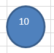

2. 设置新节点的右子树为当前节点的右子树`newNode.right = right` 

   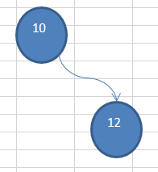

3. 把新节点的左子树设置为当前节点的左子树的右子树`newNode.left = left.right;`

   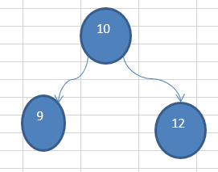

4. 把当前节点的值换为左子节点的值`value= left.value;` 

   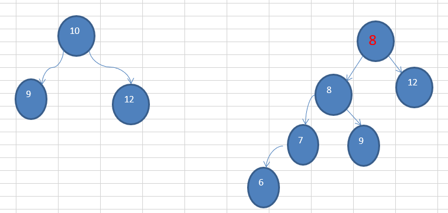

5. 把当前节点的左子树设置成当前节点左子树的左子树`left=newNode.left.left;`

   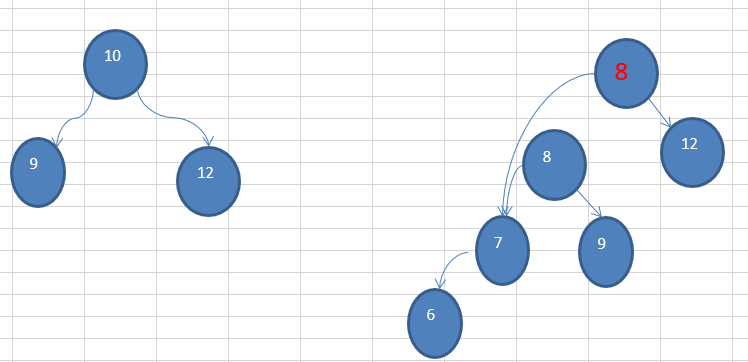

6. 把当前节点的右子树设置为新节点 `right=newNode`

   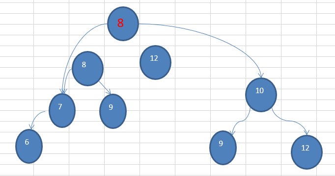
   
   ```java
   // 右旋转
   private void rightRotate() {
       // 创建新节点newNode,设置value为根节点的value
       Node newNode = new Node(value);
   
       // 新节点的右子树=当前节点的右子树
       newNode.right = this.right;
   
       // 新节点的左子树=当前节点的左子树的右子树
       newNode.left = this.left.right;
   
       // 当前节点的值设置为左子树的值
       this.value = this.left.value;
   
       // 当前节点的左子树=当前节点的左子树的左子树
       this.left = this.left.left;
   
       // 当前节点的右子树=newNode
       this.right = newNode;
   
   }
   ```

### 右子树高度-左子树高度>1(左旋转)

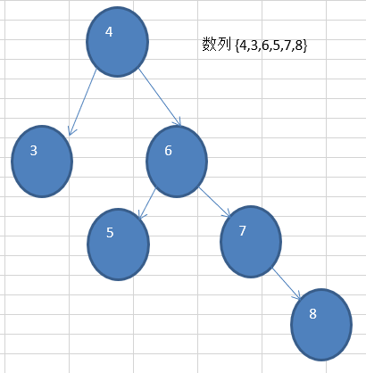

如图所示，当 `插入节点8时，右子树高度(4)-左子树高度(2)>1`，需要进行 **左旋转**，步骤如下：

1. 创建新节点 `newNode` ，值为跟节点的值，即为4
2. 设置新节点的左子树为当前节点的左子树， `newNode.left = this.left`
3. 设置新节点的右子树为当前节点的右子树的左子树， `newNode.right = this.right.left`
4. 设置当前节点的值为右子树的值, `this.value = this.right.value`
5. 设置当前节点的右子树为右子树的右子树， `this.right = this.right.right`
6. 设置当前节点的左子树为新节点， `this.left = newNode`

```java
// 左旋转
private void leftRotate() {
    // 创建新节点newNode,设置value为根节点的value
    Node newNode = new Node(value);

    // 新节点的左子树=当前节点的左子树
    newNode.left = this.left;

    // 新节点的右子树=当前节点的右子树的左子树
    newNode.right = this.right.left;

    // 当前节点的值设置为右子树的值
    this.value = this.right.value;

    // 当前节点右子树=当前节点右子树的右子树
    this.right = this.right.right;

    // 当前节点的左子树=newNode
    this.left = newNode;
}
```

### 双旋转

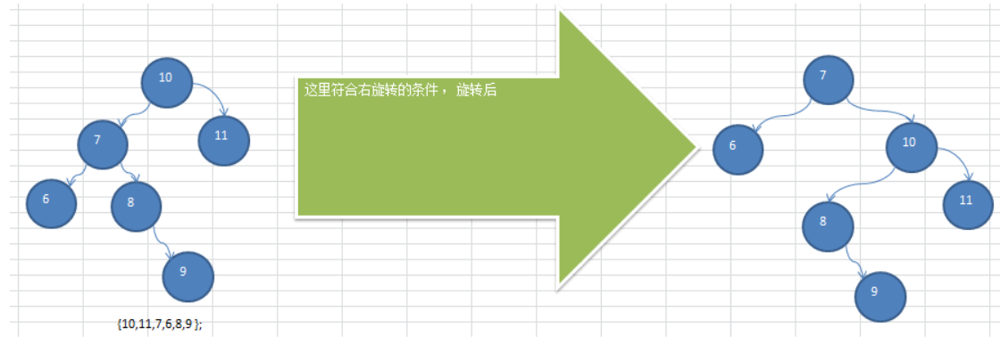

如图所示，`左子树高度-右子树高度>1，右旋转`， **但旋转后的二叉树依然不是平衡二叉树**，因此需要双旋转

1. 当`左子树高度-右子树高度>1，右旋转时`， 如果 `左子树的右子树高度>左子树的左子树高度`， 那么就需要先对 **当前节点的左子树进行左旋转，再对当前节点进行右旋转**
2. 同理当 `右子树高度-左子树高度>1时，左旋转`， 如果 `右子树的左子树高度>右子树的右子树高度`， 那么久需要对 **当前节点的右子树进行右旋转，再对当前节点进行左旋转**

```java
// 添加节点
public void add(Node node) {
    // 小于,往左放
    if (node.value < this.value) {
        if (this.left == null) {
            this.left = node;
        } else {
            this.left.add(node);
        }
    } else {
        // 大于等于,往右放
        if (this.right == null) {
            this.right = node;
        } else {
            this.right.add(node);
        }
    }

    // 判断是否平衡
    // 左子树高度-右子树高度>1(右旋转)
    if (this.leftHeight() - this.rightHeight() > 1) {
        // 左子树的右子树的高度>左子树的左子树的高度
        if (this.left != null
            && this.left.rightHeight() > this.left.leftHeight()) {
            this.left.leftRotate();
        }
        rightRotate();
        return;
    }
    // 右子树高度-左子树高度>1(左旋转)
    if (this.rightHeight() - this.leftHeight() > 1) {
        // 右子树的左子树的高度>右子树的右子树的高度
        if (this.right != null
            && this.right.leftHeight() > this.right.rightHeight()) {
            this.right.rightRotate();
        }
        leftRotate();
    }
}

```


## 完整代码实现

```java
public class Node {
	// 节点的值
	public int value;

	// 左子节点
	public Node left;

	// 右子节点
	public Node right;

	public Node(int value) {
		super();
		this.value = value;
	}

	// 求树的高度
	public int height() {
		if (this.left == null && this.right == null) {
			return 1;
		}

		if (this.left != null && this.right != null) {
			int leftHeight = this.left.height();
			int rightHeight = this.right.height();
			return 1 + Math.max(leftHeight, rightHeight);
		}

		if (this.left != null) {
			return 1 + this.left.height();
		} else {
			return 1 + this.right.height();
		}
	}

	// 求左子树高度
	public int leftHeight() {
		if (this.left == null) {
			return 0;
		} else {
			return this.left.height();
		}
	}

	// 求右子树高度
	public int rightHeight() {
		if (this.right == null) {
			return 0;
		} else {
			return this.right.height();
		}
	}

	// 添加节点
	public void add(Node node) {
		// 小于,往左放
		if (node.value < this.value) {
			if (this.left == null) {
				this.left = node;
			} else {
				this.left.add(node);
			}
		} else {
			// 大于等于,往右放
			if (this.right == null) {
				this.right = node;
			} else {
				this.right.add(node);
			}
		}

		// 判断是否平衡
		// 左子树高度-右子树高度>1(右旋转)
		if (this.leftHeight() - this.rightHeight() > 1) {
			// 左子树的右子树的高度>左子树的左子树的高度
			if (this.left != null
					&& this.left.rightHeight() > this.left.leftHeight()) {
				this.left.leftRotate();
			}
			rightRotate();
			return;
		}
		// 右子树高度-左子树高度>1(左旋转)
		if (this.rightHeight() - this.leftHeight() > 1) {
			// 右子树的左子树的高度>右子树的右子树的高度
			if (this.right != null
					&& this.right.leftHeight() > this.right.rightHeight()) {
				this.right.rightRotate();
			}
			leftRotate();
		}
	}
    
    // 右旋转
	private void rightRotate() {
		// 创建新节点newNode,设置value为根节点的value
		Node newNode = new Node(value);

		// 新节点的右子树=当前节点的右子树
		newNode.right = this.right;

		// 新节点的左子树=当前节点的左子树的右子树
		newNode.left = this.left.right;

		// 当前节点的值设置为左子树的值
		this.value = this.left.value;

		// 当前节点的左子树=当前节点的左子树的左子树
		this.left = this.left.left;

		// 当前节点的右子树=newNode
		this.right = newNode;

	}

	// 左旋转
	private void leftRotate() {
		// 创建新节点newNode,设置value为根节点的value
		Node newNode = new Node(value);

		// 新节点的左子树=当前节点的左子树
		newNode.left = this.left;

		// 新节点的右子树=当前节点的右子树的左子树
		newNode.right = this.right.left;

		// 当前节点的值设置为右子树的值
		this.value = this.right.value;

		// 当前节点右子树=当前节点右子树的右子树
		this.right = this.right.right;

		// 当前节点的左子树=newNode
		this.left = newNode;
	}
}

public class AVLTree {
	// 根节点
    private Node root;

    // 添加节点
    public void add(Node node) {
        if (this.root == null) {
            this.root = node;
        } else {
            this.root.add(node);
        }
    }
}
```

