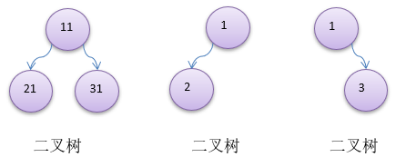
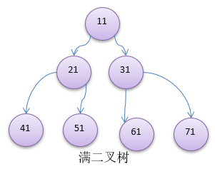
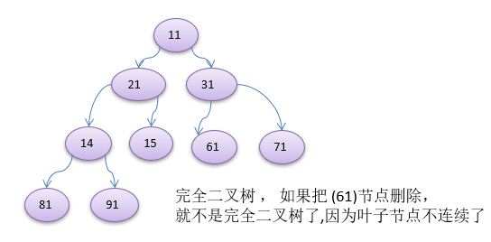

# 二叉树的概念
1. 树有很多种， **每个节点最多只能有两个子节点** 的一种形式称为二叉树。
2. 二叉树的子节点分为 **左节点和右节点**
3. 示意图

---
## 满二叉树
如果该二叉树的 **所有叶子节点都在最后一层** ，并且`结点总数= 2^n -1 , n 为层数`，则我们称为 **满二叉树** 。

---
## 完全二叉树
如果该二叉树的所有 **叶子节点** 都在 **最后一层或者倒数第二层** ，而且 **最后一层的叶子节点在左边连续，倒数第二层的叶子节点在右边连续** ，我们称为 **完全二叉树**

