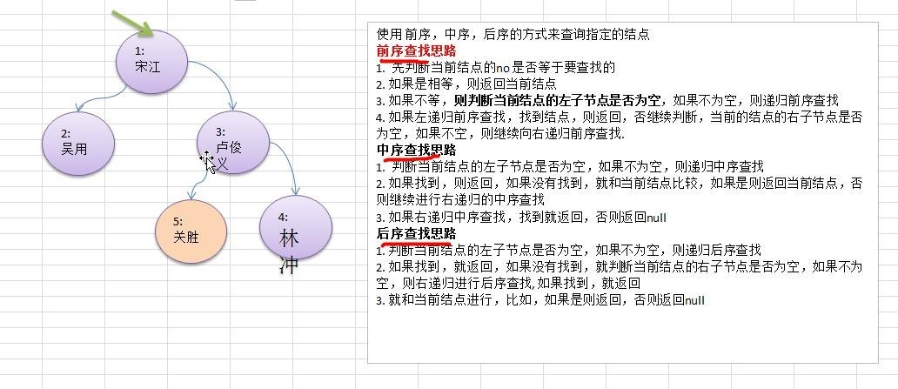

# 二叉树-查找指定节点
---
## 图解


---
## 代码实现
```java
public class BinaryTree {
	// 根节点
	private Node root;

	public BinaryTree(Node root) {
		this.root = root;
	}

	// 前序查找
	public Node preSearch(int id) {
		return this.root.preSearch(id);
	}

	// 中序查找
	public Node infixSearch(int id) {
		return this.root.infixSearch(id);
	}

	// 后序查找
	public Node postSearch(int id) {
		return this.root.postSearch(id);
	}
}

class Node {
	public int id;
	public String name;
	public Node left;
	public Node right;

	public Node(int id, String name) {
		this.id = id;
		this.name = name;
	}

	@Override
	public String toString() {
		return "Node [id=" + id + ", name=" + name + "]";
	}

	// 前序查找
	public Node preSearch(int id) {
		System.out.println("前序查找");
		// 和当前节点比较
		if (this.id == id) {
			return this;
		}

		// 左递归
		if (this.left != null) {
			Node searchResult = this.left.preSearch(id);
			if (searchResult != null) {
				return searchResult;
			}
		}

		// 右递归
		if (this.right != null) {
			Node searchResult = this.right.preSearch(id);
			if (searchResult != null) {
				return searchResult;
			}
		}

		return null;
	}

	// 中序查找
	public Node infixSearch(int id) {
		// 左递归
		if (this.left != null) {
			Node searchResult = this.left.infixSearch(id);
			if (searchResult != null) {
				return searchResult;
			}
		}

		System.out.println("中序查找");
		// 和当前节点比较
		if (this.id == id) {
			return this;
		}

		// 右递归
		if (this.right != null) {
			Node searchResult = this.right.infixSearch(id);
			if (searchResult != null) {
				return searchResult;
			}
		}

		return null;
	}

	// 后序查找
	public Node postSearch(int id) {
		// 左递归
		if (this.left != null) {
			Node searchResult = this.left.postSearch(id);
			if (searchResult != null) {
				return searchResult;
			}
		}

		// 右递归
		if (this.right != null) {
			Node searchResult = this.right.postSearch(id);
			if (searchResult != null) {
				return searchResult;
			}
		}

		System.out.println("后序查找");
		// 和当前节点比较
		if (this.id == id) {
			return this;
		}
		return null;
	}
}
```
