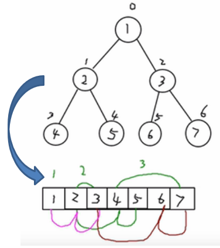

# 二叉树的顺序存储
从数据存储来看，数组存储方式和树的存储方式可以相互转换，即 **数组可以转换成树，树也可以转换成数组**

示意图：


---
## 需求
* 上图的二叉树的结点，要求以数组的方式来存放 arr : [1, 2, 3, 4, 5, 6, 7]
* 要求在遍历数组 arr 时，仍然可以以前序遍历，中序遍历和后序遍历的方式完成结点的遍历


---
## 顺序存储二叉树的特点
1. 顺序二叉树通常只考虑完全二叉树
2. 第 n 个元素的左子节点为	2 * n + 1
3. 第 n 个元素的右子节点为	2 * n + 2
4. 第 n 个元素的父节点为	(n-1) / 2

**n : 表示二叉树中的第几个元素(按 0 开始编号如图所示)**

---
## 代码实现
```java
public class ArrayBinaryTree {
	private int[] nodes;

	public ArrayBinaryTree(int[] nodes) {
		this.nodes = nodes;
	}

	/**
	 * 前序遍历
	 */
	public void preOrder() {
		preOrder(0);
	}

	/**
	 * 前序遍历
	 * @param index		开始遍历的节点的索引
	 */
	protected void preOrder(int index) {
		// 输出当前元素
		System.out.println(nodes[index]);

		// 左递归
		int leftNodeIndex = 2 * index + 1;
		if (leftNodeIndex < nodes.length) {
			preOrder(leftNodeIndex);
		}

		// 右递归
		int rightNodeIndex = 2 * index + 2;
		if (rightNodeIndex < nodes.length) {
			preOrder(rightNodeIndex);
		}
	}
}
```
