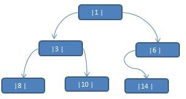
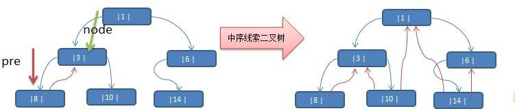

# 线索化二叉树
---
## 二叉树的问题


当我们对上面的二叉树进行中序遍历时，数列为 {8, 3, 10, 1, 6, 14 }，但是 6, 8, 10, 14  **这几个节点的 左右指针，并没有完全的利用上**。如果我们希望 **充分的利用 各个节点的左右指针** ， 让各个节点可以指向自己的前后节点,就可以使用 **线索化二叉树**。

---
## 基本介绍
1. n 个结点的二叉链表中含有`n+1[2n-(n-1)=n+1]` 个 **空指针域**。利用二叉链表中的空指针域，存放指向该结点在某种遍历次序下的前驱和后继结点的指针（这种附加的指针称为"线索"）
2. 这种加上了线索的二叉链表称为线索链表，相应的二叉树称为线索二叉树(Threaded BinaryTree)。根据线索性质的不同，线索二叉树可分为 **前序线索二叉树、中序线索二叉树和后序线索二叉树三种**
3. 一个结点的前一个结点，称为前驱结点
4. 一个结点的后一个结点，称为后继结点

---
## 思路图解


说明: 当线索化二叉树后，Node 节点的 属性 left  和 right  ，有如下情况:
1. left 指向的是左子树，也可能是指向的前驱节点.  比如 ① 节点 left 指向的左子树,  而 [10] 节点的 left  指向的就是前驱节点.
2. right 指向的是右子树，也可能是指向后继节点，比如 ① 节点 right 指向的是右子树，而 [10] 节点的 right 指向的是后继节点.

---
## 代码实现
```java
public class ThreadedBinaryTree {
	// 根节点
	private Node root;

	// 前一个节点
	private Node preNode;

	public ThreadedBinaryTree(Node root) {
		this.root = root;
	}

	// 线索化二叉树
	public void threadedNodes() {
		threadedNodes(root);
	}

	/**
	 * 将node为根的子树中序线索化
	 * @param node	子树跟节点
	 */
	protected void threadedNodes(Node node) {
		if (node == null) {
			return;
		}

		// 线索化左子树
		threadedNodes(node.left);

		// 左子树为空,进行线索化
		if (node.left == null) {
			node.left = preNode;
			node.leftNodeType = Node.PREV_NODE_TYPE;
		}

		// 右子树为空,线索化前一个节点的右子树
		if (preNode != null && preNode.right == null) {
			preNode.right = node;
			preNode.rightNodeType = Node.NEXT_NODE_TYPE;
		}

		preNode = node;

		// 线索化右子树
		threadedNodes(node.right);
	}

	// 遍历线索化二叉树
	public void list() {
		Node currentNode = root;
		while (currentNode != null) {
			// 找到第一个节点
			while (currentNode.leftNodeType == Node.SUB_TREE_TYPE) {
				currentNode = currentNode.left;
			}

			// 输出第一个节点
			System.out.println(currentNode);

			// 遍历
			while (currentNode.rightNodeType == Node.NEXT_NODE_TYPE) {
				System.out.println(currentNode.right);
				currentNode = currentNode.right;
			}

			currentNode = currentNode.right;
		}
	}
}

class Node {
	// 节点类型-子树
	public static final int SUB_TREE_TYPE = 0;

	// 节点类型-前驱节点
	public static final int PREV_NODE_TYPE = 1;

	// 节点类型-后继节点
	public static final int NEXT_NODE_TYPE = 2;

	public int id;
	public String name;
	public Node left;
	public Node right;
	public int leftNodeType = Node.SUB_TREE_TYPE;
	public int rightNodeType = Node.SUB_TREE_TYPE;

	public Node(int id, String name) {
		this.id = id;
		this.name = name;
	}

	@Override
	public String toString() {
		return "Node [id=" + id + ", name=" + name + "]";
	}
}
```
