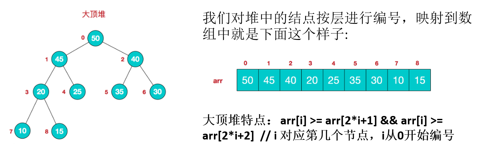
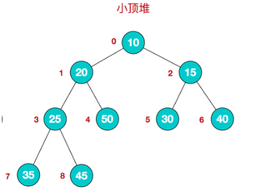
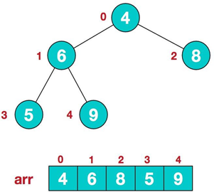
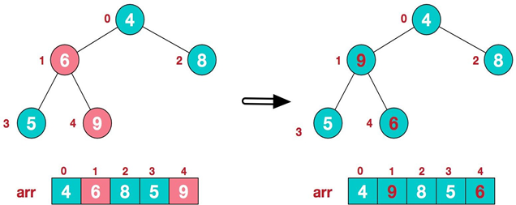
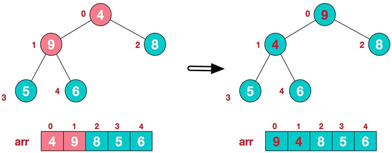
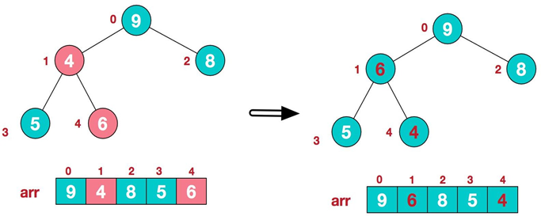
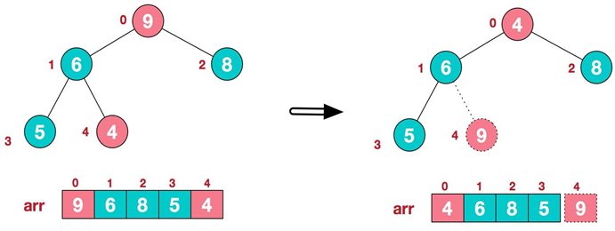
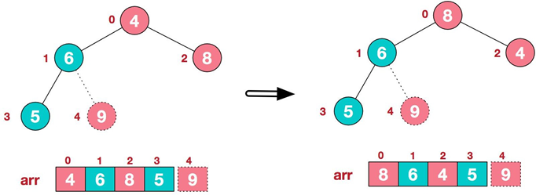
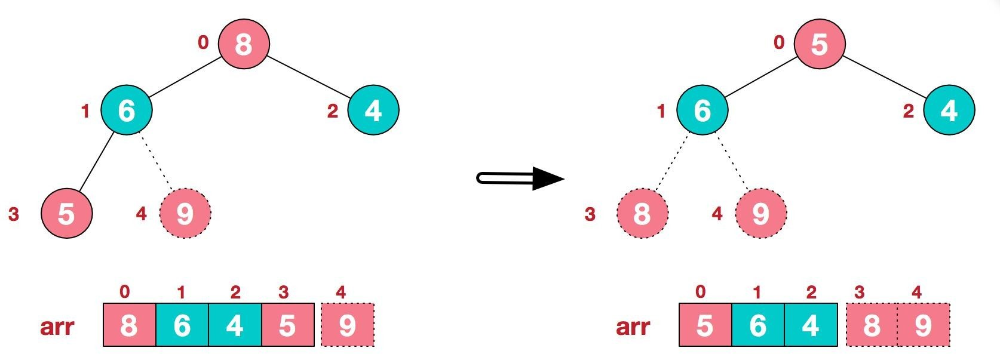
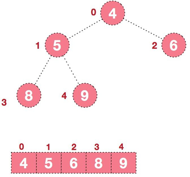

# 堆排序
## 基本介绍
1. 堆排序是利用堆这种数据结构而设计的一种排序算法，堆排序是一种选择排序，它的最坏，最好，平均时间复杂度均为 O(nlogn)，它也是不稳定排序。

2.  堆是具有以下性质的完全二叉树： **每个结点的值都大于或等于其左右孩子结点的值** ，称为 **大顶堆**, 

   注意 : 没有要求结点的左孩子的值和右孩子的值的大小关系。

3. 每个结点的值都小于或等于其左右孩子结点的值，称为 **小顶堆**

4. 大顶堆举例

   



5. 小顶堆举例

   

6. 一般**升序采用大顶堆**，**降序采用小顶堆** 

## 基本思想（图解）

1. 将待排序序列构造成一个大顶堆

2. 此时，整个序列的最大值就是堆顶的根节点。

3. 将其与末尾元素进行交换，此时末尾就为最大值。

4. 然后将剩余 n-1 个元素重新构造成一个堆，这样会得到 n 个元素的次小值。如此反复执行，便能得到一个有序序列了。

   可以看到在构建大顶堆的过程中，元素的个数逐渐减少，最后就得到一个有序序列了。

**图解：**

要求：给你一个数组 `{4,6,8,5,9}` , 要求使用堆排序法，将数组**升序排序**。

**步骤一** 

构造初始堆。将给定无序序列构造成一个大顶堆（一般升序采用大顶堆，降序采用小顶堆)。原始的数组 `[4, 6, 8, 5, 9]`

1. 假设给定无序序列结构如下

   

2. 此时我们从最后一个非叶子结点开始（叶子结点自然不用调整，第一个非叶子结点`arr.length/2-1=5/2-1=1`，也就是下面的 6 结点），从左至右，从下至上进行调整。

   

3.  找到第二个非叶节点 4，由于`[4,9,8]`中 9 元素最大，4 和 9 交换。

   

4. 这时，交换导致了子根`[4,5,6]`结构混乱，继续调整，`[4,5,6]`中 6 最大，交换 4 和 6

   

   此时，我们就将一个无序序列构造成了一个大顶堆。

**步骤二**

将堆顶元素与末尾元素进行交换，使末尾元素最大。然后继续调整堆，再将堆顶元素与末尾元素交换,得到第二大元素。如此反复进行交换、重建、交换。

1. 将堆顶元素 9 和末尾元素 4 进行交换

   

2. 重新调整结构，使其继续满足堆定义

   

3. 再将堆顶元素 8 与末尾元素 5 进行交换，得到第二大元素 8。

   

4. 后续过程，继续进行调整，交换，如此反复进行，最终使得整个序列有序。

   

## 代码实现

```java
	/**
	 * 对数组array进行堆排序
	 * @param array
	 */
	public static void heapSort(int[] array) {
		// 构建大顶堆
		buildHeap(array, array.length);

		for (int i = array.length - 1; i >= 0; i--) {
			// 交换第1个位置和最后一个位置
			swap(array, 0, i);
			// 对0~i-1个位置重新heapfiy
			heapfiy(array, 0, i - 1);
		}
	}

	/**
	 * 将数组tree构建成一个大顶堆
	 * @param tree		数组形式的树
	 * @param length	树的长度
	 */
	public static void buildHeap(int[] tree, int length) {
		// 从最后一个节点的父节点,按照从右到左从上到下依次进行heapfiy
		int lastNodeIndex = length - 1;
		int parentIndex = (lastNodeIndex - 1) / 2;
		for (int i = parentIndex; i >= 0; i--) {
			heapfiy(tree, i, lastNodeIndex);
		}
	}

	/**
	 * 将一个树 tree的 beginIndex~endIndex 的子树构造成一个大顶堆
	 * @param tree				树
	 * @param beginIndex		调整的起始节点索引(此节点后的所有子树均是大顶堆)
	 * @param endIndex			调整的结束节点的索引
	 */
	public static void heapfiy(int[] tree, int beginIndex, int endIndex) {
		// 从左节点开始调整
		int leftIndex = beginIndex * 2 + 1;
		int rightIndex = leftIndex + 1;
		for (int i = leftIndex; i <= endIndex; i = i * 2 + 1) {
			int leftValue = tree[leftIndex];
			// 左节点小于右节点
			if (rightIndex <= endIndex && leftValue < tree[rightIndex]) {
				i = rightIndex;// i指向右节点
			}

			// 子节点大于跟节点,交换位置
			if (tree[i] > tree[beginIndex]) {
				swap(tree, i, beginIndex);
				// 继续调整变化的子树
				beginIndex = i;
				leftIndex = beginIndex * 2 + 1;
				rightIndex = leftIndex + 1;
			} else {
				// 当前堆为大顶堆,又因为子树为大顶堆,因此直接返回
				return;
			}
		}
	}

	// 交换位置
	private static void swap(int[] array, int i, int j) {
		int temp = array[i];
		array[i] = array[j];
		array[j] = temp;
	}
```

