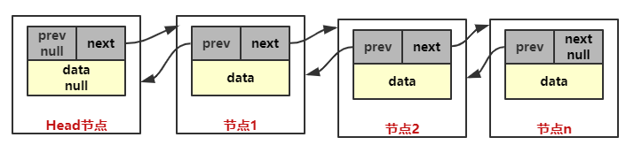

# 双向链表
## 基本结构图示


## 代码实现
### 双向链表的基本结构
```java
class Node {
	private Node prev; // 上一个节点
	private Node next; // 下一个节点

	// data信息
	private String name;
	private int no;
}
```

---

### 添加节点
思路分析：
1. 找到链表的最后一个节点`lastNode`
2. `lastNode.next = node`
3. `node.prev = lastNode`

代码实现：
```java
public void add(Node node) {
	// 找到链表的最后一个节点lastNode
	Node lastNode = this.head;
	while (lastNode.getNext() != null) {
		lastNode = lastNode.getNext();
	}

	lastNode.setNext(node);
	node.setPrev(lastNode);
}
```

---

### 遍历所有节点
思路分析：
1. 从`head`节点开始往下遍历，直到找到最后一个节点

代码实现：
```java
public void list() {
	Node currentNode = this.head;
	while (currentNode.getNext() != null) {
		System.out.println(currentNode.getNext());
		currentNode = currentNode.getNext();
	}
}
```

---

### 修改节点
思路分析：
1. 找到要修改的节点`updatedNode`
2. 修改`updatedNode`的属性

代码实现：
```java
public void update(Node node) {
	// 找到待修改的节点updatedNode
	Node updatedNode = this.head.getNext();
	boolean exist = false;
	while (updatedNode != null) {
		if (updatedNode.getNo() == node.getNo()) {
			exist = true;
			break;
		} else {
			updatedNode = updatedNode.getNext();
		}
	}

	if (exist) {
		updatedNode.setName(node.getName());
	} else {
		System.out.println("要修改的节点不存在");
	}
}
```

---

### 删除节点
思路分析：
1. 找到要删除的节点`deletedNode`
2. `deletedNode.prev.next = deletedNode.next`
3. `deletedNode != null` 时 `deletedNode.next.prev = deletedNode.prev`
```java
public void remove(Node node) {
	// 找到要删除的节点deletedNode
	Node deletedNode = this.head.getNext();
	boolean exist = false;
	while (deletedNode != null) {
		if (deletedNode.getNo() == node.getNo()) {
			exist = true;
			break;
		} else {
			deletedNode = deletedNode.getNext();
		}
	}

	if (exist) {
		deletedNode.getPrev().setNext(deletedNode.getNext());
		if (deletedNode.getNext() != null) {
			deletedNode.getNext().setPrev(deletedNode.getPrev());
		}
	} else {
		System.out.println("要删除的节点不存在");
	}
}
```
