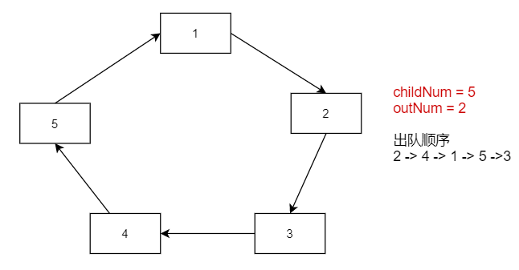

# 约瑟夫问题
Josephu	问题为：设编号为 1，2，… n 的 n 个人围坐一圈，约定编号为 k（1<=k<=n）的人从 1 开始报数，数到
m 的那个人出列，它的下一位又从 1 开始报数，数到 m 的那个人又出列，依次类推，直到所有人出列为止，由此产生一个出队编号的序列。

# 使用链表解决约瑟夫问题



```python
public class Josephu {
	public int solution_linkedlist(int childNum, int outNum) {
		if (childNum <= 0 || outNum <= 0) {
			return -1;
		}
		// 初始化链表
		LinkedList<Integer> childs = new LinkedList<>();
		for (int i = 0; i < childNum; i++) {
			childs.add(i + 1);
		}

		// 当未出队孩子数量超过1时,寻找出队孩子的序号,进行出队
		int removeIndex = 0;
		while (childs.size() > 1) {
			removeIndex = (removeIndex + (outNum - 1)) % childs.size();
			Integer removeChild = childs.remove(removeIndex);
			System.out.println(removeChild);
		}

		return childs.get(0);
	}

	public static void main(String[] args) {
		new Josephu().solution_linkedlist(5, 2);
	}
}
```
