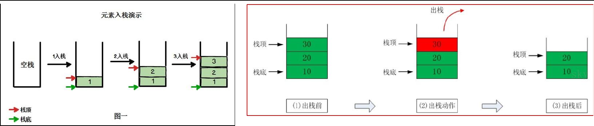

# 栈
栈是一个 **先入后出** (FILO-First In Last Out)的有序列表。

## 栈的实现
---
### 入栈出栈图示


---
### 代码实现
#### 成员变量和构造函数
```java
public class ArrayStack<T> implements Stack<T> {
	private Object[] datas;

	// top指针,指向栈顶元素
	private int top = -1;

	public ArrayStack(int size) {
		this.datas = new Object[size];
	}
}
```

#### 入栈
```java
public void push(T element) throws Exception {
	// 栈满
	if (full()) {
		throw new Exception("stack is full.");
	}

	this.top++;
	this.datas[this.top] = element;
}
```

#### 出栈
```java
public T pop() throws Exception {
	// 栈空
	if (empty()) {
		throw new Exception("stack is empty.");
	}

	@SuppressWarnings("unchecked")
	T element = (T) this.datas[this.top];
	this.top--;
	return element;
}
```

#### peek
```java
public T peek() throws Exception {
	// 栈空
	if (empty()) {
		throw new Exception("stack is empty.");
	}

	return (T) this.datas[this.top];
}
```
