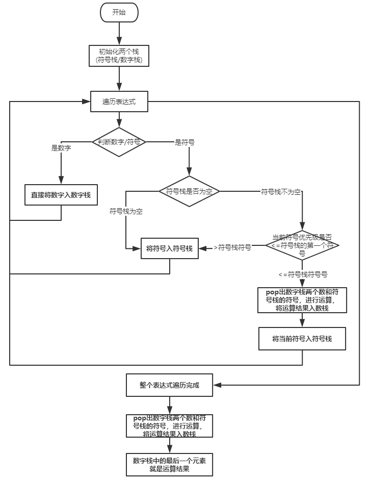

# 栈的应用(计算器-中缀表达式)
## 思路分析


---
## 代码实现
```java
public class SimpleExpressionCalculator implements ExpressionCalculator {

	@Override
	public int calculate(String expression) throws Exception {
		// 7 + 2 - 3 * 4
		// 定义两个栈(数字栈和符号栈)
		Stack<Integer> numberStack = new ArrayStack<>(20);
		Stack<Integer> symbolStack = new ArrayStack<>(20);

		StringBuilder currentNumberCache = new StringBuilder();
		// 遍历表达式字符串
		// 如果当前字符为符号，分以下三种情况
		// 符号栈为空，直接入栈
		// 当前符号优先级 > 符号栈栈顶符号优先级，直接将符号入栈
		// 当前符号优先级 <= 符号栈栈顶符号优先级，将符号栈栈顶符号出栈，计算数字栈栈顶两个数字的值，最后将当前符号入栈
		// 如果当前字符为数字,分以下两种情况
		// 下一个字符为符号，将之间缓存的数字+当前数字入栈，清空数字缓存
		// 下一个字符为数字，将当前数字添加至数字缓存
		for (int currentCharIndex = 0; currentCharIndex < expression.length(); currentCharIndex++) {
			int currentChar = expression.charAt(currentCharIndex);
			if (isSymbol(currentChar)) {
				// 符号
				if (symbolStack.empty()) {
					// 符号栈为空
					symbolStack.push(currentChar);
				} else if (getPriority(currentChar) > getPriority(symbolStack.peek())) {
					// 当前符号优先级 > 符号栈栈顶符号优先级
					symbolStack.push(currentChar);
				} else {
					// 当前符号优先级 <= 符号栈栈顶符号优先级
					Integer symbol = symbolStack.pop();
					Integer num1 = numberStack.pop();
					Integer num2 = numberStack.pop();
					int res = calculate(num1, num2, symbol);
					numberStack.push(res);
					symbolStack.push(currentChar);
				}
			} else {
				// 数字
				// ASCII码-48
				int currentNumber = currentChar - 48;
				Character nextChar = nextChar(expression, currentCharIndex);
				if (nextChar == null || isSymbol(nextChar)) {
					// 下一个为符号
					currentNumberCache.append(currentNumber);
					numberStack.push(Integer.parseInt(currentNumberCache.toString()));
					currentNumberCache = new StringBuilder();
				} else {
					// 下一个字符为数字
					currentNumberCache.append(currentNumber);
				}
			}
		}

		// 依次出栈，计算
		while (true) {
			if (symbolStack.empty()) {
				return numberStack.pop();
			}
			Integer symbol = symbolStack.pop();
			Integer num1 = numberStack.pop();
			Integer num2 = numberStack.pop();
			int res = calculate(num1, num2, symbol);
			numberStack.push(res);
		}
	}

	/**
	 * 计算两个数的值
	 * @param num1		数字1
	 * @param num2		数字2
	 * @param symbol	符号
	 * @return			计算后的值
	 */
	private int calculate(Integer num1, Integer num2, Integer symbol) {
		if ('+' == symbol) {
			return num1 + num2;
		} else if ('-' == symbol) {
			return num2 - num1;
		} else if ('*' == symbol) {
			return num1 * num2;
		} else {
			return num2 / num1;
		}
	}

	/**
	 * 获取符号的优先级
	 * @param symbol	符号
	 * @return			优先级
	 */
	private int getPriority(Integer symbol) {
		if ('+' == symbol) {
			return Integer.MIN_VALUE;
		} else if ('-' == symbol) {
			return Integer.MIN_VALUE;
		} else if ('*' == symbol) {
			return Integer.MAX_VALUE;
		} else {
			return Integer.MAX_VALUE;
		}
	}

	/**
	 * 获取表达式的下一个字符
	 * @param expression
	 * @param currentCharIndex
	 * @return
	 */
	private Character nextChar(String expression, int currentCharIndex) {
		if (currentCharIndex >= expression.length() - 1) {
			return null;
		}
		return expression.charAt(currentCharIndex + 1);
	}

	/**
	 * 判断char是否为符号
	 * @param chars	字符
	 * @return		true-是符号
	 * 				false-不是符号
	 */
	private boolean isSymbol(int chars) {
		return chars == '+' || chars == '-' || chars == '*' || chars == '/';
	}

}
```
