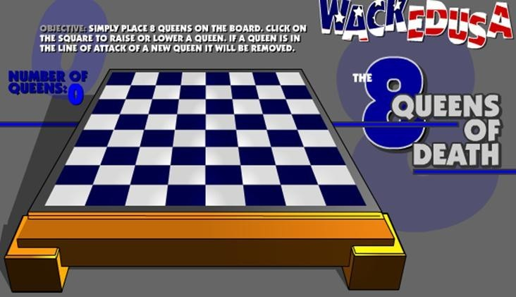

# 递归解决八皇后问题
八皇后问题，是一个古老而著名的问题，是回溯算法的典型案例。该问题是国际西洋棋棋手马克斯·贝瑟尔于1848 年提出： **在 8×8 格的国际象棋上摆放八个皇后，使其不能互相攻击，即：任意两个皇后都不能处于同一行、同一列或同一斜线上，问有多少种摆法(92)。**



## 解决思路分析
1.	第一个皇后先放第一行第一列
2.	第二个皇后放在第二行第一列、然后判断是否 OK， 如果不 OK，继续放在第二列、第三列、依次把所有列都放完，找到一个合适
3.	继续第三个皇后，还是第一列、第二列……直到第 8 个皇后也能放在一个不冲突的位置，算是找到了一个正确解
4.	当得到一个正确解时，在栈回退到上一个栈时，就会开始回溯，即将第一个皇后，放到第一列的所有正确解， 全部得到.
5.	然后回头继续第一个皇后放第二列，后面继续循环执行 1,2,3,4 的步骤

## 代码实现
```java
  // 皇后个数
  private static final int MAX = 8;

  // 所有解决方案
	private List<int[]> solutions = new ArrayList<>();

	public List<int[]> getSolutions() {
		return this.solutions;
	}

	/**
	 * 解决方案,值为当前行所在的列索引
	 */
	private int[] solution = new int[MAX];

	/**
	 * 放置皇后
	 * @param queueIndex	当前皇后的索引
	 */
	private void pushQueue(int queueIndex) {
		if (queueIndex == (MAX + 1)) {
			// 最后一个已经放好
			solutions.add(solution.clone());
			return;
		}

		// 依次放入皇后
		for (int i = 0; i < MAX; i++) {
			// 将当前皇后放入该行第一列
			int currentRowNo = queueIndex - 1;
			solution[currentRowNo] = i;

			if (!isConflict(queueIndex)) {
				// 不冲突,放置下一个皇后
				pushQueue(queueIndex + 1);
			} else {
				// 冲突，将当前皇后移至下一列
				continue;
			}
		}
	}

	/**
	 * 判断当前放置的皇后是否导致冲突
	 * @param queueIndex	当前皇后索引
	 * @return				true-有冲突
	 * 						false-无冲突
	 */
	private boolean isConflict(int queueIndex) {
		int currentRowNo = queueIndex - 1;
		for (int i = 0; i < currentRowNo; i++) {
			// 是否在同一列
			boolean columnNoEquals = solution[i] == solution[currentRowNo];
			// 是否在同一行
			boolean rowNoEquals = false;
			// 是否在同一斜线上
			boolean isDiagonal =
					Math.abs(currentRowNo - i) == Math.abs(solution[currentRowNo] - solution[i]);

			if (columnNoEquals || rowNoEquals || isDiagonal) {
				return true;
			}
		}
		return false;
	}
```
