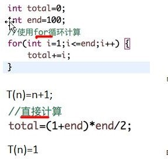
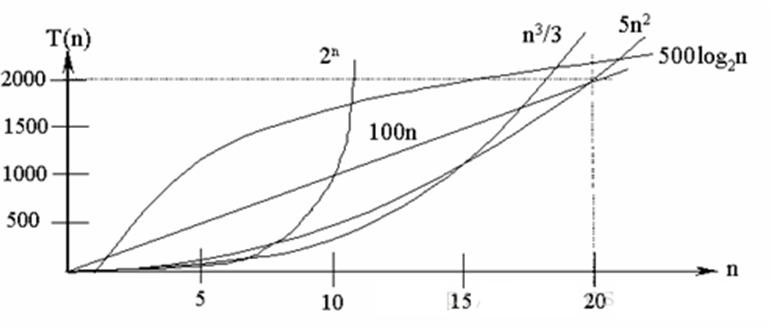
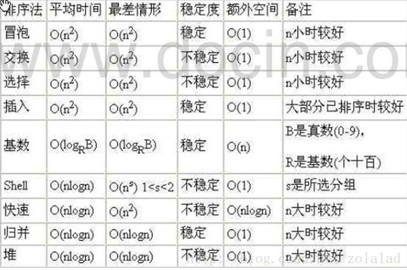

# 算法时间复杂度
---
## 时间频度
一个算法花费的时间与算法中语句的执行次数成正比例，哪个算法中语句执行次数多，它花费时间就多。 **一个算法中的语句执行次数称为语句频度或时间频度。** 记为 T(n)。

* 举例说明
  比如计算 1-100 所有数字之和,  我们设计两种算法：
  

**其中，在计算时间复杂度时可以忽略如下几项：**
* 忽略常数项
* 忽略低次项
* 忽略系数

## 时间复杂度
一般情况下， **算法中的基本操作语句的重复执行次数是问题规模 n 的某个函数**  ，用 T(n)表示，若有某个辅助函数 f(n)，使得当 n 趋近于无穷大时，T(n) / f(n) 的极限值为不等于零的常数，则称 f(n)是 T(n)的同数量级函数。记作 **`T(n)=Ｏ( f(n) )`** ，称Ｏ( f(n) ) 为算法的渐进时间复杂度，简称时间复杂度。

T(n) 不同，但时间复杂度可能相同。 如：T(n)=n²+7n+6 与 T(n)=3n²+2n+2 它们的 T(n) 不同，但时间复杂度相同，都为 O(n²)。

计算时间复杂度的方法：
1.	用常数 1 代替运行时间中的所有加法常数 T(n)=n²+7n+6	=> T(n)=n²+7n+1
2.	修改后的运行次数函数中，只保留最高阶项 T(n)=n²+7n+1 => T(n) = n²
3.	去除最高阶项的系数 T(n) = n² => T(n) = n² => O(n²)

## 常见的时间复杂度
1. 常数阶 **o(1)**
2. 对数阶 **o(log2n)**
3. 线性阶 **o(n)**
4. 线性对数阶 **o(nlog2n)**
5. 平方阶 **o(n^2)**
6. 立方阶 **o(n^3)**
7. k次方阶 **o(n^k)**
8. 指数阶 **o(2^n)**

常见时间复杂度对应的图

1.	常见的算法时间复杂度由小到大依次为： **`Ο(1)＜Ο(log2n)＜Ο(n)＜Ο(nlog2n)＜Ο(n2)＜Ο(n3)＜ Ο(nk)  ＜ Ο(2n) `** ，随着问题规模 n 的不断增大，上述时间复杂度不断增大，算法的执行效率越低
2.	从图中可见，我们应该尽可能避免使用指数阶的算法

## 平均时间复杂度和最坏时间复杂度
平均时间复杂度是指所有可能的输入实例均以等概率出现的情况下，该算法的运行时间。

最坏情况下的时间复杂度称最坏时间复杂度。 **一般讨论的时间复杂度均是最坏情况下的时间复杂度** 。这样做的原因是：最坏情况下的时间复杂度是算法在任何输入实例上运行时间的界限，这就保证了算法的运行时间不会比最坏情况更长。

平均时间复杂度和最坏时间复杂度是否一致，和算法有关(如图:)。

