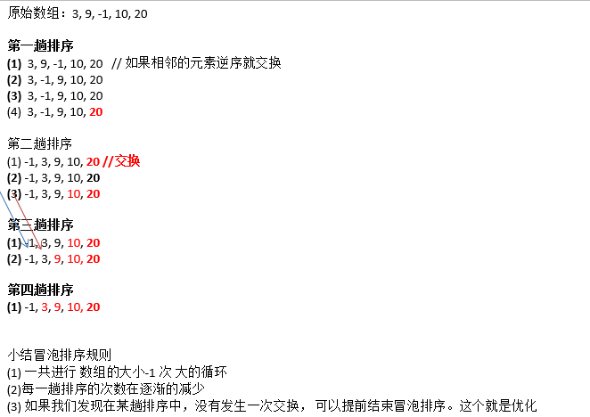

# 冒泡排序

---
## 基本介绍

冒泡排序（Bubble Sorting）的基本思想是：通过对待排序序列从前向后（从下标较小的元素开始）, **依次比较相邻元素的值，若发现逆序则交换** ，使值较大的元素逐渐从前移向后部，就象水底下的气泡一样逐渐向上冒。

优化：
因为排序的过程中，各元素不断接近自己的位置， **如果一趟比较下来没有进行过交换，就说明序列有序** ，因此要在排序过程中设置一个标志 flag 判断元素是否进行过交换。从而减少不必要的比较。

---
## 图解


---
## 代码实现
```java
/**
 * 冒泡排序
 * @param array 数组
 */
public static void sort(int[] array) {
	// 进行n-1次冒泡的过程
	for (int i = 0; i < array.length - 1; i++) {
		// 冒泡
		boolean isExchange = false;
		for (int j = 0; j < array.length - 1; j++) {
			int current = array[j];
			int next = array[j + 1];
			// 交换位置
			if (current > next) {
				array[j + 1] = current;
				array[j] = next;
				isExchange = true;
			}
		}

		// 未交换位置,证明已经排好序
		if (!isExchange) {
			break;
		}
	}
}
```
