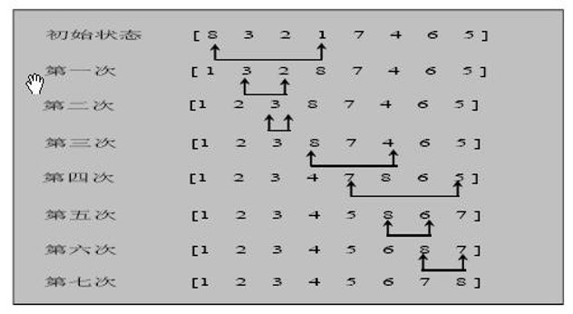
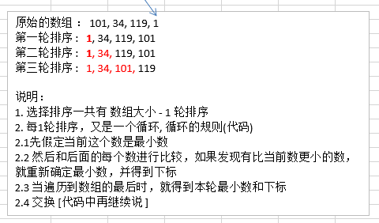

# 选择排序
---
## 定义
选择式排序也属于内部排序法，是从欲排序的数据中， **按指定的规则选出某一元素，再依规定交换位置后达到排序的目的。**

---
## 思路分析
选择排序（select sorting）也是一种简单的排序方法。它的基本思想是：
1. 第一次从 arr[0]~arr[n-1]中选取最小值， 与 arr[0]交换
2. 第二次从 arr[1]~arr[n-1]中选取最小值，与 arr[1]交换，
3. 第三次从 arr[2]~arr[n-1]中选取最小值，与 arr[2] 交换，
4. …，
5. 第 i 次从 arr[i-1]~arr[n-1]中选取最小值，与 arr[i-1]交换，
6. …,
7. 第 n-1 次从 arr[n-2]~arr[n-1]中选取最小值， 与 arr[n-2]交换，总共通过 n-1 次，得到一个按排序码从小到大排列的有序序列。

---
## 图解




---
## 代码实现
```java
/**
 * 使用选择排序对数组进行排序
 * @param array	数组
 */
public static void sort(int[] array) {
	for (int i = 0; i < array.length - 1; i++) {
		// 找到最小值
		int minNum = array[i];
		int minNumIndex = i;
		for (int j = i + 1; j < array.length; j++) {
			// 当前数<最小数，重置最小数和最小数索引
			if (array[j] < minNum) {
				minNum = array[j];
				minNumIndex = j;
			}
		}

		// 将最小值放到和第i个位置的值交换位置
		if (i != minNumIndex) {
			array[minNumIndex] = array[i];
			array[i] = minNum;
		}
	}

}
```
