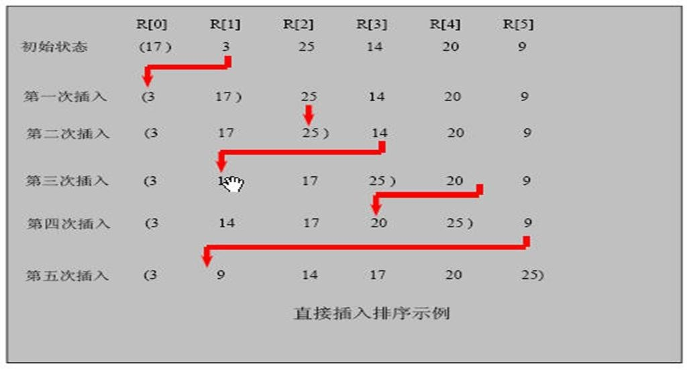

# 插入排序
---
## 基本介绍
### 定义
插入式排序属于内部排序法，是对于 **欲排序的元素以插入的方式找寻该元素的适当位置** ，以达到排序的目的。

### 思想
插入排序（Insertion Sorting）的基本思想是： **把 n 个待排序的元素看成为一个有序表和一个无序表** ， **开始时有序表中只包含一个元素，无序表中包含有 n-1 个元素** ，排序过程中每次从无序表中取出第一个元素，把它的排序码依次与有序表元素的排序码进行比较，将它插入到有序表中的适当位置，使之成为新的有序表。

### 图解


---
## 代码实现
```java
public static void insertSort(int[] array) {
	// 共进行n-1轮,从第2个元素开始
	for (int i = 1; i < array.length; i++) {
		// 插入的位置
		int insertIndex = i;
		// 插入的值
		int insertValue = array[insertIndex];
		// 保证数组不越界&&插入的值<前一个的值
		while (insertIndex > 0 && insertValue < array[insertIndex - 1]) {
			// 将前一个数字后移
			array[insertIndex] = array[insertIndex - 1];
			// 插入位置向前移动
			insertIndex--;
		}

		// 找到插入的位置,放置insertValue到此位置
		if (array[insertIndex] != insertValue) {
			array[insertIndex] = insertValue;
		}
	}
}
```
