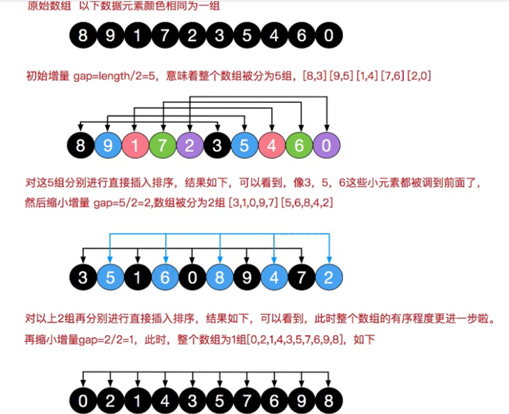

# 希尔排序
---
## 插入排序的问题
数组 `arr = {2,3,4,5,6,1}`  这时需要插入的数 **1(最小)**,  这样的过程是：
```
{2,3,4,5,6,6}
{2,3,4,5,5,6}
{2,3,4,4,5,6}
{2,3,3,4,5,6}
{2,2,3,4,5,6}
{1,2,3,4,5,6}
```
**结论: 当需要插入的数是较小的数时，后移的次数明显增多，对效率有影响。**

---
## 希尔排序基本介绍
### 定义
希尔排序是希尔（Donald Shell）于 1959 年提出的一种排序算法。 **希尔排序也是一种插入排序** ，它是简单插入排序经过改进之后的一个更高效的版本，也称为 **缩小增量排序** 。

### 基本思想
希尔排序是把记录按下标的一定 **增量分组** ，**对每组使用直接插入排序算法排序**；随着增量逐渐减少，每组包含的关键词越来越多，当 **增量减至1** 时，整个文件恰被分成一组，算法便终止。

### 图解


---
## 代码实现
### 交换法
```java
/**
 * 希尔排序(交换方式)
 * @param array		数组
 */
public static void sortByExchange(int[] array) {
	// d为增量,当增量=1时，结束
	for (int d = array.length / 2; d >= 1; d /= 2) {
		// 对[d,d+1,....n]进行直接插入排序
		// d之前的数是有序的(只有1个数)
		for (int i = d; i < array.length; i++) {
			// i代表当前要插入的数的index,(i-d)代表要插入的数的上一个数
			for (int j = i - d; j >= 0; j -= d) {
				// 如果前者大于后者，则交换位置
				if (array[j] > array[j + d]) {
					int temp = array[j];
					array[j] = array[j + d];
					array[j + d] = temp;
				}
			}
		}
	}
}
```

### 移动法
```java
/**
 * 希尔排序(移动方式)
 * @param array		数组
 */
public static void sortByMove(int[] array) {
	// d为增量,当增量=1时，结束
	for (int d = array.length / 2; d >= 1; d /= 2) {
		// 对[d,d+1,....n]进行直接插入排序
		// d之前的数是有序的(只有1个数)
		for (int i = d; i < array.length; i++) {
			// i代表当前要插入的数的index,(i-d)代表要插入的数的上一个数
			int insertedNumber = array[i];
			int j = i - d;
			for (; j >= 0; j -= d) {
				// 如果当前数大于要插入的数，则后移当前数
				if (array[j] > insertedNumber) {
					array[j + d] = array[j];
				} else {
					break;
				}
			}
			// 待插入的位置
			array[j + d] = insertedNumber;
		}
	}
}
```
