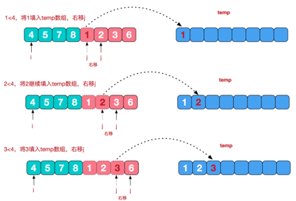

# 归并排序
---
## 基本介绍
归并排序（MERGE-SORT）是利用归并的思想实现的排序方法，该算法采用经典的 **分治（divide-and-conquer） 策略** （分治法将问题分(divide)成一些 **小的问题然后递归求解** ，而治(conquer)的阶段则将分的阶段得到的各答案"修补"在一起，即分而治之)。

---
## 图解





---
## 代码实现
```java
/**
 * 归并排序
 * @param array			数组
 * @param left			数组最左边索引
 * @param right			数组最右边索引
 * @param tempArray		临时数组
 */
public static void mergeSort(int[] array, int left, int right, int[] tempArray) {
	// left=right,只剩下一个元素,不需要再分
	if (left >= right) {
		return;
	}

	int middle = (left + right) / 2;
	// 向左递归分解
	mergeSort(array, left, middle, tempArray);
	// 向右递归分解
	mergeSort(array, middle + 1, right, tempArray);

	// 合并
	merge(array, left, middle, right, tempArray);
}

/**
 * 合并阶段
 * @param array		原始数组
 * @param left		合并的第一个数组的左索引
 * @param middle	合并的两个数组的中间索引
 * @param right		合并的第二个数组的右索引
 * @param tempArray	临时数组
 */
public static void merge(int[] array, int left, int middle, int right, int[] tempArray) {
	// 将两个数组按照顺序移动到临时数组中，直到一个数组移动完毕
	int array1Index = left;
	int array2Index = middle + 1;
	int tempArrayIndex = 0;
	while (array1Index <= middle && array2Index <= right) {
		// 数组1当前元素 <= 数组2当前元素,移动数组1当前元素到临时数组
		if (array[array1Index] <= array[array2Index]) {
			tempArray[tempArrayIndex] = array[array1Index];
			array1Index += 1;
			tempArrayIndex += 1;
		} else {
			// 数组1当前元素 > 数组2当前元素,移动数组2当前元素到临时数组
			tempArray[tempArrayIndex] = array[array2Index];
			array2Index += 1;
			tempArrayIndex += 1;
		}
	}

	// 将未移动完毕的数组拷贝到临时数组中
	while (array1Index <= middle) {
		// 数组1未移动完成
		tempArray[tempArrayIndex] = array[array1Index];
		array1Index += 1;
		tempArrayIndex += 1;
	}
	while (array2Index <= right) {
		// 数组2未移动完成
		tempArray[tempArrayIndex] = array[array2Index];
		array2Index += 1;
		tempArrayIndex += 1;
	}

	// 将临时数组拷贝到原始数组中
	tempArrayIndex = 0;
	while (left <= right) {
		array[left] = tempArray[tempArrayIndex];
		tempArrayIndex += 1;
		left += 1;
	}
}
```
